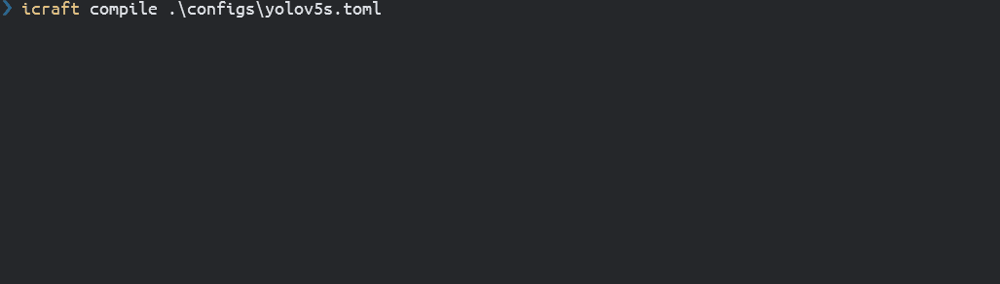
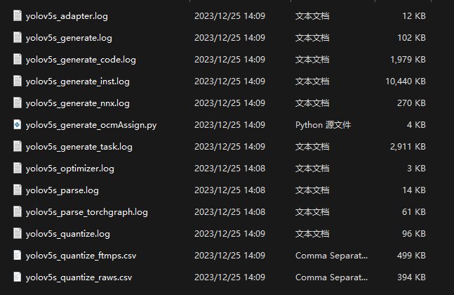
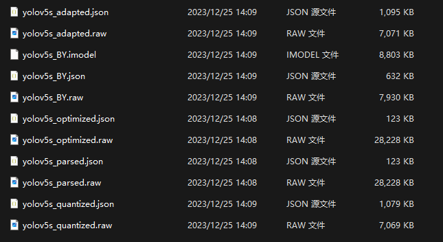

# 编译


如上图所示，Icraft的编译过程包含以下四个步骤，每个步骤对应一个组件：


- 解析 (parse) : 将框架上的模型文件转换为Icraft的中间层。
- 优化 (optimize) : 执行一系列Pass，对解析后的网络结构或算子属性进行变换，以优化性能或匹配硬件。
- 量化 (quantize) : 执行一系列Pass，将浮点网络模型转换为定点模型，以匹配硬件加速器。
- 适配 (adapt) : 执行一系列Pass，对量化后的网络结构或算子属性进行变换，以优化性能或匹配硬件。
- 指令生成 (generate) : 执行一系列Pass，将NPU支持加速的的算子转换为相应的指令序列，以在NPU上执行。

Icraft提供了CLI和API两种接口来支持用户完成以上过程。


## 一 命令行接口
### 1.1 调用方法

Icraft提供了CLI命令 `icraft` ，其调用方法如下所示：

**Icraft CLI 命令格式**
```
icraft <command> [<config file>] [–<key> <value>]…
```

其中 `command` 表示要执行的功能命令，当前支持的编译相关的命令如下：

| 功能 | 命令 |
| --- | --- |
| parse | 解析 |
| optimize | 优化 |
| quantize | 量化 |
| adapt | 适配 |
| generate | 指令生成 |
| compile | 编译，根据配置文件依次执行解析、优化、量化、适配和指令生成四个过程 |

例如，指令生成的命令行调用方法为 `icraft generate [<config file>] [--<key> <value>]...`

### 1.2 参数配置

CLI命令 `icraft` 的参数可以在配置文件中指定，也可以通过命令行参数 `--<key> <value>` 的方式指定。

CLI命令 `icraft` 的配置文件为 `toml` 格式。以 ``yolov5s` 的编译配置为例，其配置文件内容如下

PPyoloe_crn_s.toml
``` toml
[parse]
net_name = "yolov5s"
framework = "pytorch"
inputs = [ 1, 512, 960, 3]
inputs_layout = "NHWC"
pre_method = "nop"
pre_scale = [ 255.0, 255.0, 255.0]
pre_mean = [ 0.0, 0.0, 0.0]
channel_swap = [ 2, 1, 0]
network = "./models/YoloV5/yolov5s-v2.0-(512x960).pt"
jr_path = "./json&raw/"
frame_version = "1.6"

[optimize]
target = "BUYI"
json = "./json&raw/yolov5s_parsed.json"
raw = "./json&raw/yolov5s_parsed.raw"
jr_path = "./json&raw/"
debug = true

[quantize]
forward_mode = "image"
saturation = "kld"
forward_dir = "./images/datasets/yolov5s"
forward_list = "./images/pic_lists/pic_list_yolov5s.txt"
names_file = "./names/coco.names"
bits = 8
json = "./json&raw/yolov5s_optimized.json"
raw = "./json&raw/yolov5s_optimized.raw"
jr_path = "./json&raw/"
per = "tensor"
target = "buyi"

[adapt]
target = "BUYI"
json = "./json&raw/yolov5s_quantized.json"
raw = "./json&raw/yolov5s_quantized.raw"
jr_path = "./json&raw/"
debug = true

[generate]
json = "./json&raw/yolov5s_adapted.json"
raw = "./json&raw/yolov5s_adapted.raw"
jr_path = "./json&raw/"
log_path = "./logs/"

```

如上所示， 在toml文件中，方括号括起来的部分，比如 `[parse]` 和 `[generate]` 等表示一个小节， icraft使用一个小节来配置一个命令。小节的名称，即 `parse` 和 `generate` 等表示被配置的命令，小节中使用 `=` 表达的键值对表示该命令的参数的键和值。例如，当执行 `icraft parse yolov5s.toml` 时， `icraft` 会使用 `[parse]` 这一小节的键值对来配置 `parse` 命令。


除了使用配置文件外，CLI命令 `icraft` 还支持直接使用命令行来指定参数，比如上文中的 `icraft parse yolov5s.toml` ，等价于以下命令：

``` toml
icraft parse                                        \
--net_name  yolov5s                                 \
--framework  pytorch                                \
--inputs  1,512,960,3                               \
--inputs_layout NHWC                                \
--pre_method nop                                    \
--pre_scale 255.0,255.0,255.0                       \
--pre_mean 0.0,0.0,0.0                              \
--channel_swap 2,1,0                                \
--network ./models/YoloV5/yolov5s-v2.0-(512x960).pt \
--jr_path "./json&raw/"                             \
--frame_version 1.6

```

CLI命令还支持配置文件和命令行参数混用，在混用时，命令行参数中的配置将覆盖配置文件中的同名参数，比如 `icraft parser yolov5s.toml --pre_method nop` 会将配置文件中的 `pre_method` 改为 `resize` 。

备注：
`compile` 命令需要根据配置文件中各个命令的配置依次调用 `parse` , `optimize` , `quantize` , `adapt` , `generate` 等过程，因此不支持使用命令行来指定参数。

## 二 API接口

当前各编译组件尚不支持API调用，敬请期待…


## 三 编译示例
### 3.1 文件结构
```
.
├───configs
├───images
│   ├───datasets
│   │   └───coco
│   │       ├───JPEGImages
│   │       └───labels
│   └───pic_lists
└───models
    └───YoloV5
```

编译示例的文件结构如下所示，各个文件夹的内容如下：

- configs: 存放编译配置文件 `yolov5s.toml` ， 用于整个编译过程的配置
- images:  存放数据集图片以及表示图片列表的文本文件，用于量化校准过程的输入
- models： 存放框架模型文件，比如YoloV5文件夹下存放了该示例使用的 `Yolov5s_640x640_traced.pt` 模型文件

### 3.2 编译流程
#### 使用 `compile` 命令编译

直接示例根文件夹下运行 `icraft compile ./configs/yolov5s.toml` ，编译过程如下：



#### 使用各组件命令分步骤编译

依次执行以下命令，即可以分步骤编译：


```
icraft parse ./configs/yolov5s.toml     #解析
icraft optimize ./configs/yolov5s.toml  #优化
icraft quantize ./configs/yolov5s.toml  #量化
icraft adapt ./configs/yolov5s.toml     #适配
icraft generate ./configs/yolov5s.toml  #生成

```

### 3.3 编译结果

编译成功后，会在根目录下生成 `.icraft` 文件夹和 `json&raw` 文件夹。


- `.icraft` 文件夹存放的是编译过程的日志或临时文件。如果编译出错，可以在 `.icraft/logs` 文件夹中获取各组件的详细日志信息。


在该示例中， `.icraft/logs/yolov5s` 路径下产生的日志文件如下：





备注:
同一个网络的日志文件在同一个文件夹中，其路径为 `.icraft/logs/{网络名}`, 在该文件夹下，日志文件的命名规则为 `{网络名}_{组件名}_xxx.log`。

- `json&raw` 文件夹存放的是编译产生的各阶段的中间层文件。接下来可以使用这些中间层文件进行仿真和运行等过程。
在该示例中， `json&raw` 路径下产生的中间层文件如下：





备注:
中间层文件的命名规则为 `{网络名}_{阶段}.json/raw` ，其中，JSON文件以文本形式保存了网络的结构信息，RAW文件以二进制格式保存了网络的参数信息。
---

