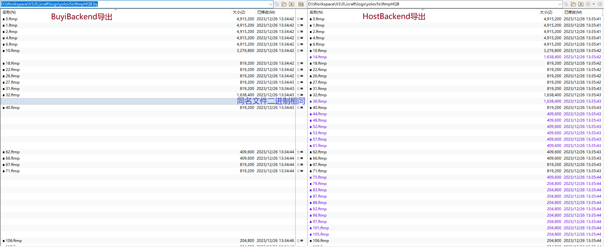
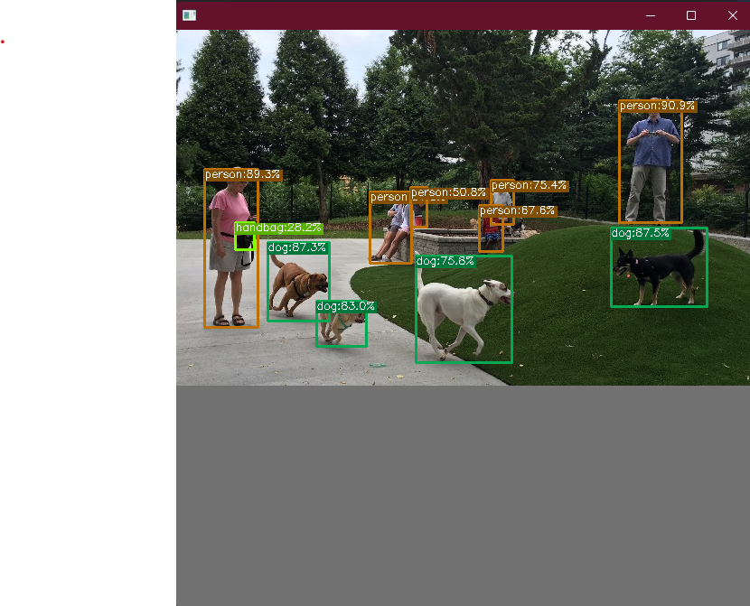

# 运行


智能计算平台中的硬件平台是FPAI的架构，其包含CPU、GPU、NPU和PL等计算资源。不同的计算资源对应着不同的后端。如上图所示，Icraft支持编译产生的任意阶段的中间层网络在不同的后端上运行。Icraft使用后端来表示不同的计算资源，不同的后端能够支持的算子类型和属性不同，当前实现的后端有 `HostBackend` 、 `BuyiBackend` 、 `ZG330Backend` ：


- `HostBackend` 对应着x86 CPU和Arm CPU等计算资源，其中x86 CPU支持所有的内置算子，Arm CPU仅支持 `add`、 `align_axis`、 `cast`、 `input`、 `multiply`、 `output`、 `prune_axis`、 `reorg`、 `reshape`、 `resize`、 `swap_order`、 `yolo`、 `region` 13个算子。
- `BuyiBackend` 对应着NPU和PL等计算资源， 只支持 `HardOp` 和  `Cast` 等利用NPU完成前向的算子；
- `ZG330Backend` 对应着NPU和PL等计算资源， 只支持 `HardOp` 和  `Cast` 等利用NPU完成前向的算子；


Icraft提供了CLI和API两种方式来完成中间层网络在不同后端上的运行。


## 一 命令行接口

任何运行时程序都务必在管理员权限下执行

Icraft提供了 `run` 命令来在指定的后端上运行一个中间层网络，和编译命令类似，该命令用法如下：

`icraft run [<config file>] [--<key> <value>]`

仍以 `yolov5s` 作为示例，我们在配置文件中添加 `run` 命令的配置项：
yolov5s.toml
```
[run]
json = "json&raw/yolov5s_BY.json"
raw = "json&raw/yolov5s_BY.raw"
input = "./images/test/test_640x640.jpg"
backends = "BY,socket://ql100aiu@192.168.125.148:9981;Host"
dump_format = "HQB"
log_io = true
```
以上配置各参数的意义如下：

- json: 网络的JSON文件，此处配置的是yolov5s指令生成后的中间层文件
- raw: 网络的RAW文件，和JSON文件要对应
- input: 网络前向的输入，此处配置了一张测试图片
- backends: 指定网络前向的后端，此处配置优先在在BuyiBackend上运行(设备的URL为 `socket://ql100aiu@192.168.125.148:9981` )，BuyiBackend不支持的算子，则在HostBackend上运行
- dump_format: 导出网络每一个算子的运算结果，支持的格式由三个字母表示：
  - 第一个字母表示排布，H表示硬件，S表示软件
  - 第二个字母表示数值，F表示浮点，Q表示定点
  - 第三个字母表示序列化形式，B表示二进制，T表示文本

>备注
>若一个Tensor原本的排布时H，那么可以转为S；若原本的数值为Q，那么可以转为F；
>反之，如果原本的排布为S，即使指定了导出格式为H，那么依然会导出S排布的数据；如果原本的数值为F，即使指定了导出格式为Q，那么依然会导出浮点数值。
- log_io: 记录每一个算子的输入输出信息


执行 `icraft run ./configs/yolov5s.toml` , 其结果如下：

`icraft run ./configs/yolov5s.toml`

```
  1[2023-12-26 13:34:41.461] [info] Device initialization successful, version information:
  2[2023-12-26 13:34:41.644] [info]        icore: FMSHBYV1-20200903
  3[2023-12-26 13:34:41.644] [info]        device: 101844d2
  4[2023-12-26 13:34:41.644] [info] Device Protocol: socket
  5[2023-12-26 13:34:41.644] [info] Device Name: ql100aiu
  6[2023-12-26 13:34:41.645] [info] Device Parameters:
  7Run [██████████████████████████████████████████████████ ] 100% [00m:11s]  Done!
  8
  9[12/26/23 13:34:53.178] [I] network wall:   0.0064 ms
 10[12/26/23 13:34:53.178] [I] opId: 0    opType: Input      Inputs:                                          Outputs: (-1,-1,-1,-1)
 11[12/26/23 13:34:53.178] [I] opId: 1    opType: Resize     Inputs: (-1,-1,-1,-1)                            Outputs: (1,640,640,3)
 12[12/26/23 13:34:53.179] [I] opId: 2    opType: SwapOrder  Inputs: (1,640,640,3)                            Outputs: (1,640,640,3)
 13[12/26/23 13:34:53.179] [I] opId: 3    opType: Add        Inputs: (1,640,640,3)+(1,1,1,3)                  Outputs: (1,640,640,3)
 14[12/26/23 13:34:53.179] [I] opId: 4    opType: Multiply   Inputs: (1,640,640,3)+(1,1,1,3)                  Outputs: (1,640,640,3)
 15[12/26/23 13:34:53.179] [I] opId: 295  opType: AlignAxis  Inputs: (1,640,640,3)                            Outputs: (1,640,640,4)
 16[12/26/23 13:34:53.179] [I] opId: 296  opType: Cast       Inputs: (1,640,640,4)                            Outputs: (1,1,640,640,4)
 17[12/26/23 13:34:53.179] [I] opId: 459  opType: HardOp     Inputs: (1,1,640,640,4)                          Outputs: (1,1,320,320,32)
 18[12/26/23 13:34:53.179] [I] opId: 460  opType: HardOp     Inputs: (1,1,320,320,32)                         Outputs: (1,2,160,160,32)
 19[12/26/23 13:34:53.179] [I] opId: 461  opType: HardOp     Inputs: (1,2,160,160,32)                         Outputs: (1,1,160,160,32)
 20[12/26/23 13:34:53.180] [I] opId: 462  opType: HardOp     Inputs: (1,1,160,160,32)                         Outputs: (1,1,160,160,32)
 21[12/26/23 13:34:53.180] [I] opId: 463  opType: HardOp     Inputs: (1,1,160,160,32)                         Outputs: (1,1,160,160,32)
 22[12/26/23 13:34:53.180] [I] opId: 519  opType: HardOp     Inputs: (1,1,160,160,32)+(1,1,160,160,32)        Outputs: (1,1,160,160,32)
 23[12/26/23 13:34:53.180] [I] opId: 464  opType: HardOp     Inputs: (1,2,160,160,32)                         Outputs: (1,1,160,160,32)
 24[12/26/23 13:34:53.180] [I] opId: 446  opType: HardOp     Inputs: (1,1,160,160,32)+(1,1,160,160,32)        Outputs: (1,2,160,160,32)
 25[12/26/23 13:34:53.180] [I] opId: 465  opType: HardOp     Inputs: (1,2,160,160,32)                         Outputs: (1,2,160,160,32)
 26[12/26/23 13:34:53.180] [I] opId: 466  opType: HardOp     Inputs: (1,2,160,160,32)                         Outputs: (1,4,80,80,32)
 27[12/26/23 13:34:53.180] [I] opId: 467  opType: HardOp     Inputs: (1,4,80,80,32)                           Outputs: (1,2,80,80,32)
 28[12/26/23 13:34:53.180] [I] opId: 468  opType: HardOp     Inputs: (1,2,80,80,32)                           Outputs: (1,2,80,80,32)
 29[12/26/23 13:34:53.180] [I] opId: 469  opType: HardOp     Inputs: (1,2,80,80,32)                           Outputs: (1,2,80,80,32)
 30[12/26/23 13:34:53.181] [I] opId: 520  opType: HardOp     Inputs: (1,2,80,80,32)+(1,2,80,80,32)            Outputs: (1,2,80,80,32)
 31[12/26/23 13:34:53.181] [I] opId: 470  opType: HardOp     Inputs: (1,2,80,80,32)                           Outputs: (1,2,80,80,32)
 32[12/26/23 13:34:53.181] [I] opId: 471  opType: HardOp     Inputs: (1,2,80,80,32)                           Outputs: (1,2,80,80,32)
 33[12/26/23 13:34:53.181] [I] opId: 521  opType: HardOp     Inputs: (1,2,80,80,32)+(1,2,80,80,32)            Outputs: (1,2,80,80,32)
 34[12/26/23 13:34:53.181] [I] opId: 472  opType: HardOp     Inputs: (1,4,80,80,32)                           Outputs: (1,2,80,80,32)
 35[12/26/23 13:34:53.181] [I] opId: 447  opType: HardOp     Inputs: (1,2,80,80,32)+(1,2,80,80,32)            Outputs: (1,4,80,80,32)
 36[12/26/23 13:34:53.181] [I] opId: 473  opType: HardOp     Inputs: (1,4,80,80,32)                           Outputs: (1,4,80,80,32)
 37[12/26/23 13:34:53.181] [I] opId: 474  opType: HardOp     Inputs: (1,4,80,80,32)                           Outputs: (1,8,40,40,32)
 38[12/26/23 13:34:53.181] [I] opId: 475  opType: HardOp     Inputs: (1,8,40,40,32)                           Outputs: (1,4,40,40,32)
 39[12/26/23 13:34:53.182] [I] opId: 476  opType: HardOp     Inputs: (1,4,40,40,32)                           Outputs: (1,4,40,40,32)
 40[12/26/23 13:34:53.182] [I] opId: 477  opType: HardOp     Inputs: (1,4,40,40,32)                           Outputs: (1,4,40,40,32)
 41[12/26/23 13:34:53.182] [I] opId: 522  opType: HardOp     Inputs: (1,4,40,40,32)+(1,4,40,40,32)            Outputs: (1,4,40,40,32)
 42[12/26/23 13:34:53.182] [I] opId: 478  opType: HardOp     Inputs: (1,4,40,40,32)                           Outputs: (1,4,40,40,32)
 43[12/26/23 13:34:53.182] [I] opId: 479  opType: HardOp     Inputs: (1,4,40,40,32)                           Outputs: (1,4,40,40,32)
 44[12/26/23 13:34:53.182] [I] opId: 523  opType: HardOp     Inputs: (1,4,40,40,32)+(1,4,40,40,32)            Outputs: (1,4,40,40,32)
 45[12/26/23 13:34:53.182] [I] opId: 480  opType: HardOp     Inputs: (1,4,40,40,32)                           Outputs: (1,4,40,40,32)
 46[12/26/23 13:34:53.182] [I] opId: 481  opType: HardOp     Inputs: (1,4,40,40,32)                           Outputs: (1,4,40,40,32)
 47[12/26/23 13:34:53.182] [I] opId: 524  opType: HardOp     Inputs: (1,4,40,40,32)+(1,4,40,40,32)            Outputs: (1,4,40,40,32)
 48[12/26/23 13:34:53.182] [I] opId: 482  opType: HardOp     Inputs: (1,8,40,40,32)                           Outputs: (1,4,40,40,32)
 49[12/26/23 13:34:53.183] [I] opId: 448  opType: HardOp     Inputs: (1,4,40,40,32)+(1,4,40,40,32)            Outputs: (1,8,40,40,32)
 50[12/26/23 13:34:53.183] [I] opId: 483  opType: HardOp     Inputs: (1,8,40,40,32)                           Outputs: (1,8,40,40,32)
 51[12/26/23 13:34:53.183] [I] opId: 484  opType: HardOp     Inputs: (1,8,40,40,32)                           Outputs: (1,16,20,20,32)
 52[12/26/23 13:34:53.183] [I] opId: 485  opType: HardOp     Inputs: (1,16,20,20,32)                          Outputs: (1,8,20,20,32)
 53[12/26/23 13:34:53.183] [I] opId: 486  opType: HardOp     Inputs: (1,8,20,20,32)                           Outputs: (1,8,20,20,32)
 54[12/26/23 13:34:53.183] [I] opId: 487  opType: HardOp     Inputs: (1,8,20,20,32)                           Outputs: (1,8,20,20,32)
 55[12/26/23 13:34:53.183] [I] opId: 525  opType: HardOp     Inputs: (1,8,20,20,32)+(1,8,20,20,32)            Outputs: (1,8,20,20,32)
 56[12/26/23 13:34:53.183] [I] opId: 488  opType: HardOp     Inputs: (1,16,20,20,32)                          Outputs: (1,8,20,20,32)
 57[12/26/23 13:34:53.183] [I] opId: 449  opType: HardOp     Inputs: (1,8,20,20,32)+(1,8,20,20,32)            Outputs: (1,16,20,20,32)
 58[12/26/23 13:34:53.183] [I] opId: 489  opType: HardOp     Inputs: (1,16,20,20,32)                          Outputs: (1,16,20,20,32)
 59[12/26/23 13:34:53.184] [I] opId: 490  opType: HardOp     Inputs: (1,16,20,20,32)                          Outputs: (1,8,20,20,32)
 60[12/26/23 13:34:53.184] [I] opId: 526  opType: HardOp     Inputs: (1,8,20,20,32)                           Outputs: (1,8,20,20,32)
 61[12/26/23 13:34:53.184] [I] opId: 527  opType: HardOp     Inputs: (1,8,20,20,32)                           Outputs: (1,8,20,20,32)
 62[12/26/23 13:34:53.184] [I] opId: 528  opType: HardOp     Inputs: (1,8,20,20,32)                           Outputs: (1,8,20,20,32)
 63[12/26/23 13:34:53.184] [I] opId: 450  opType: HardOp     Inputs: (1,8,20,20,32)+(1,8,20,20,32)+(1,8,20,20,32)+(1,8,20,20,32) Outputs: (1,32,20,20,32)
 64[12/26/23 13:34:53.184] [I] opId: 491  opType: HardOp     Inputs: (1,32,20,20,32)                          Outputs: (1,16,20,20,32)
 65[12/26/23 13:34:53.184] [I] opId: 492  opType: HardOp     Inputs: (1,16,20,20,32)                          Outputs: (1,8,20,20,32)
 66[12/26/23 13:34:53.184] [I] opId: 529  opType: HardOp     Inputs: (1,8,20,20,32)                           Outputs: (1,8,40,40,32)
 67[12/26/23 13:34:53.184] [I] opId: 451  opType: HardOp     Inputs: (1,8,40,40,32)+(1,8,40,40,32)            Outputs: (1,16,40,40,32)
 68[12/26/23 13:34:53.185] [I] opId: 493  opType: HardOp     Inputs: (1,16,40,40,32)                          Outputs: (1,4,40,40,32)
 69[12/26/23 13:34:53.185] [I] opId: 494  opType: HardOp     Inputs: (1,4,40,40,32)                           Outputs: (1,4,40,40,32)
 70[12/26/23 13:34:53.185] [I] opId: 495  opType: HardOp     Inputs: (1,4,40,40,32)                           Outputs: (1,4,40,40,32)
 71[12/26/23 13:34:53.185] [I] opId: 496  opType: HardOp     Inputs: (1,16,40,40,32)                          Outputs: (1,4,40,40,32)
 72[12/26/23 13:34:53.185] [I] opId: 452  opType: HardOp     Inputs: (1,4,40,40,32)+(1,4,40,40,32)            Outputs: (1,8,40,40,32)
 73[12/26/23 13:34:53.185] [I] opId: 497  opType: HardOp     Inputs: (1,8,40,40,32)                           Outputs: (1,8,40,40,32)
 74[12/26/23 13:34:53.185] [I] opId: 498  opType: HardOp     Inputs: (1,8,40,40,32)                           Outputs: (1,4,40,40,32)
 75[12/26/23 13:34:53.185] [I] opId: 530  opType: HardOp     Inputs: (1,4,40,40,32)                           Outputs: (1,4,80,80,32)
 76[12/26/23 13:34:53.185] [I] opId: 453  opType: HardOp     Inputs: (1,4,80,80,32)+(1,4,80,80,32)            Outputs: (1,8,80,80,32)
 77[12/26/23 13:34:53.185] [I] opId: 499  opType: HardOp     Inputs: (1,8,80,80,32)                           Outputs: (1,2,80,80,32)
 78[12/26/23 13:34:53.186] [I] opId: 500  opType: HardOp     Inputs: (1,2,80,80,32)                           Outputs: (1,2,80,80,32)
 79[12/26/23 13:34:53.186] [I] opId: 501  opType: HardOp     Inputs: (1,2,80,80,32)                           Outputs: (1,2,80,80,32)
 80[12/26/23 13:34:53.186] [I] opId: 502  opType: HardOp     Inputs: (1,8,80,80,32)                           Outputs: (1,2,80,80,32)
 81[12/26/23 13:34:53.186] [I] opId: 454  opType: HardOp     Inputs: (1,2,80,80,32)+(1,2,80,80,32)            Outputs: (1,4,80,80,32)
 82[12/26/23 13:34:53.186] [I] opId: 503  opType: HardOp     Inputs: (1,4,80,80,32)                           Outputs: (1,4,80,80,32)
 83[12/26/23 13:34:53.186] [I] opId: 504  opType: HardOp     Inputs: (1,4,80,80,32)                           Outputs: (1,4,40,40,32)
 84[12/26/23 13:34:53.186] [I] opId: 455  opType: HardOp     Inputs: (1,4,40,40,32)+(1,4,40,40,32)            Outputs: (1,8,40,40,32)
 85[12/26/23 13:34:53.186] [I] opId: 505  opType: HardOp     Inputs: (1,8,40,40,32)                           Outputs: (1,4,40,40,32)
 86[12/26/23 13:34:53.186] [I] opId: 506  opType: HardOp     Inputs: (1,4,40,40,32)                           Outputs: (1,4,40,40,32)
 87[12/26/23 13:34:53.186] [I] opId: 507  opType: HardOp     Inputs: (1,4,40,40,32)                           Outputs: (1,4,40,40,32)
 88[12/26/23 13:34:53.187] [I] opId: 508  opType: HardOp     Inputs: (1,8,40,40,32)                           Outputs: (1,4,40,40,32)
 89[12/26/23 13:34:53.187] [I] opId: 456  opType: HardOp     Inputs: (1,4,40,40,32)+(1,4,40,40,32)            Outputs: (1,8,40,40,32)
 90[12/26/23 13:34:53.187] [I] opId: 509  opType: HardOp     Inputs: (1,8,40,40,32)                           Outputs: (1,8,40,40,32)
 91[12/26/23 13:34:53.187] [I] opId: 510  opType: HardOp     Inputs: (1,8,40,40,32)                           Outputs: (1,8,20,20,32)
 92[12/26/23 13:34:53.187] [I] opId: 457  opType: HardOp     Inputs: (1,8,20,20,32)+(1,8,20,20,32)            Outputs: (1,16,20,20,32)
 93[12/26/23 13:34:53.187] [I] opId: 511  opType: HardOp     Inputs: (1,16,20,20,32)                          Outputs: (1,8,20,20,32)
 94[12/26/23 13:34:53.187] [I] opId: 512  opType: HardOp     Inputs: (1,8,20,20,32)                           Outputs: (1,8,20,20,32)
 95[12/26/23 13:34:53.187] [I] opId: 513  opType: HardOp     Inputs: (1,8,20,20,32)                           Outputs: (1,8,20,20,32)
 96[12/26/23 13:34:53.187] [I] opId: 514  opType: HardOp     Inputs: (1,16,20,20,32)                          Outputs: (1,8,20,20,32)
 97[12/26/23 13:34:53.188] [I] opId: 458  opType: HardOp     Inputs: (1,8,20,20,32)+(1,8,20,20,32)            Outputs: (1,16,20,20,32)
 98[12/26/23 13:34:53.188] [I] opId: 515  opType: HardOp     Inputs: (1,16,20,20,32)                          Outputs: (1,16,20,20,32)
 99[12/26/23 13:34:53.188] [I] opId: 516  opType: HardOp     Inputs: (1,4,80,80,32)                           Outputs: (1,8,80,80,32)
100[12/26/23 13:34:53.188] [I] opId: 517  opType: HardOp     Inputs: (1,8,40,40,32)                           Outputs: (1,8,40,40,32)
101[12/26/23 13:34:53.188] [I] opId: 518  opType: HardOp     Inputs: (1,16,20,20,32)                          Outputs: (1,8,20,20,32)
102[12/26/23 13:34:53.188] [I] opId: 439  opType: Cast       Inputs: (1,8,80,80,32)                           Outputs: (1,80,80,256)
103[12/26/23 13:34:53.188] [I] opId: 440  opType: PruneAxis  Inputs: (1,80,80,256)                            Outputs: (1,80,80,255)
104[12/26/23 13:34:53.188] [I] opId: 441  opType: Cast       Inputs: (1,8,40,40,32)                           Outputs: (1,40,40,256)
105[12/26/23 13:34:53.188] [I] opId: 442  opType: PruneAxis  Inputs: (1,40,40,256)                            Outputs: (1,40,40,255)
106[12/26/23 13:34:53.189] [I] opId: 443  opType: Cast       Inputs: (1,8,20,20,32)                           Outputs: (1,20,20,256)
107[12/26/23 13:34:53.189] [I] opId: 444  opType: PruneAxis  Inputs: (1,20,20,256)                            Outputs: (1,20,20,255)
108[12/26/23 13:34:53.189] [I] opId: 147  opType: Output     Inputs: (1,80,80,255)+(1,40,40,255)+(1,20,20,255) Outputs:
109
110[irpc::port::client::tcp::deinit] socket fd closed

```


`icraft run` 首先会打印设备信息，然后执行网络的前向，打印进度条，最后打印每一层的IO信息，同时还会在 `.icraft/logs/yolov5s/ftmpHQB` 下保存每一个算子的输出特征图。


以上配置实现了在 `BuyiBackend` 上使用NPU来运行指令生成后的网络。除了 `BuyiBackend` 外， `HostBackend` 也能运行指令生成后的网络，即使用CPU对生成的NPU指令进行仿真。我们可以使用命令行来覆盖配置文件中的backends参数，以实现将以上网络在 `HostBackend` 上运行。


`icraft run .\configs\yolov5s.toml --backends Host`


以上命令也会在 `.icraft/logs/yolov5s/ftmpHQB` 下保存每一层的输出特征图，我们可以对比两次保存的特征图来检验运行结果是否正确。


>**备注**
>对于指令生成后的网络， 当在 `BuyiBackend` 上运行时，会对中间层的特征图进行OCM (片上存储) 优化，而被优化的中间层特征图不会被导出。因此在 `BuyiBackend` 导出的中间层特征图数量有可能会比  `HostBackend` 导出的少。
>
>在对比两次的结果时，只需要保证同名文件二进制相同即可。





## 二 API


Icarft-XRT提供了丰富的API接口（包括C++和Python）来帮助用户将编译生成的网络在指定的后端上运行。我们仍以指令生成后的yolov5s的中间层文件为例，分别使用C++ API和Python API将其在指定的后端上运行起来。


### 2.1 C++ API

Icraft支持并建议使用CMake来构建C++工程，以方便地依赖Icraft提供的各种库文件。比如我们新建一个文件夹 `code` ，然后在该文件夹中新建 `CMakeLists.txt` 文件，其内容如下：


code/CMakeLists.txt
```c++
cmake_minimum_required (VERSION 3.24)

project(Icraft-QuickStart LANGUAGES C CXX)

set(CMAKE_CXX_STANDARD 17)
set(CMAKE_CXX_STANDARD_REQUIRED TRUE)

set(CMAKE_EXPORT_COMPILE_COMMANDS TRUE)
set(CMAKE_COLOR_DIAGNOSTICS TRUE)

set(LIBRARY_OUTPUT_PATH ${CMAKE_BINARY_DIR})
set(EXECUTABLE_OUTPUT_PATH ${CMAKE_BINARY_DIR})

# 以下为MSVC的编译参数设置
add_compile_options("$<$<C_COMPILER_ID:MSVC>:/utf-8>")
add_compile_options("$<$<CXX_COMPILER_ID:MSVC>:/utf-8>")
add_compile_options("$<$<C_COMPILER_ID:MSVC>:/Zi>")
add_compile_options("$<$<CXX_COMPILER_ID:MSVC>:/Zi>")
add_compile_options("$<$<C_COMPILER_ID:MSVC>:/permissive->")
add_compile_options("$<$<CXX_COMPILER_ID:MSVC>:/permissive->")
add_link_options("$<$<C_COMPILER_ID:MSVC>:/INCREMENTAL:NO>")
add_link_options("$<$<CXX_COMPILER_ID:MSVC>:/INCREMENTAL:NO>")
add_link_options("$<$<C_COMPILER_ID:MSVC>:/DEBUG>")
add_link_options("$<$<CXX_COMPILER_ID:MSVC>:/DEBUG>")
add_link_options("$<$<AND:$<C_COMPILER_ID:MSVC>,$<CONFIG:Release>>:/OPT:REF>")
add_link_options("$<$<AND:$<CXX_COMPILER_ID:MSVC>,$<CONFIG:Release>>:/OPT:REF>")
add_link_options("$<$<AND:$<C_COMPILER_ID:MSVC>,$<CONFIG:Release>>:/OPT:ICF>")
add_link_options("$<$<AND:$<CXX_COMPILER_ID:MSVC>,$<CONFIG:Release>>:/OPT:ICF>")

# 添加可执行程序
add_executable(icraft-quickstart "")

# 添加源码文件
target_sources(icraft-quickstart PRIVATE
    main.cpp
)

# 查找Icraft的依赖库
find_package(Icraft-HostBackend REQUIRED)
find_package(Icraft-BuyiBackend REQUIRED)

# 链接Icraft的依赖库
target_link_libraries(icraft-quickstart PRIVATE Icraft::HostBackend Icraft::BuyiBackend)
```


然后在该文件夹下新建 `main.cpp` ，其内容如下：


code/main.cpp
``` c++
#include <icraft-xir/core/network.h>
#include <icraft-xrt/core/session.h>
#include <icraft-xrt/core/device.h>
#include <icraft-xrt/dev/host_device.h>
#include <icraft-backends/hostbackend/backend.h>
#include <icraft-backends/hostbackend/utils.h>
#include <icraft-backends/buyibackend/buyibackend.h>

#include "yolov5_post.h"

using namespace icraft::xir;
using namespace icraft::xrt;

int main(int argc, char* argv[]) {
    const char* GENERATED_JSON_FILE = "json&raw/yolov5s_BY.json";
    const char* GENERATED_RAW_FILE = "json&raw/yolov5s_BY.raw";
    const char* INPUT_IMAGE = "images/test/test_640x640.jpg";

    // 加载指令生成后的网络
    auto generated_network = Network::CreateFromJsonFile(GENERATED_JSON_FILE);
    generated_network.loadParamsFromFile(GENERATED_RAW_FILE);

    // 打开设备
    auto buyi_device = Device::Open("socket://ql100aiu@192.168.125.148:9981");

    // 创建Session
    auto session = Session::Create<BuyiBackend, HostBackend>(generated_network, { buyi_device,  HostDevice::Default() });
    session.apply();

    // 借助HostBackend的工具函数将输入图片转成Tensor
    auto input_tensor = icraft::hostbackend::utils::Image2Tensor(INPUT_IMAGE);
    // 前向
    auto output_tensors = session.forward({ input_tensor });

    // 后处理
    std::vector<float*> outputs_ptr = {
        (float*)output_tensors[0].data().cptr(),
        (float*)output_tensors[1].data().cptr(),
        (float*)output_tensors[2].data().cptr()
    };

    std::vector<Detection> final_detections = yolov5_post(outputs_ptr);

    for (auto&& d : final_detections) {
        fmt::print("box: x = {}, y = {}, h = {}, w = {}, confidence = {}\n", d.x, d.y, d.height, d.width, d.confidence);
    }
}

```

`code/yolov5_post.h` 中实现了yolov5s网络的后处理，此处不再赘述，请自行添加。


以上文件添加完成后，可以使用 `Visual Studio` 或 `Visual Studio Code` 等IDE(编辑器)打开该文件夹，编译该工程；也可以直接使用cmake的命令行实现编译。编译完成后，在 `json&raw` 的父文件夹中执行 `icraft-quickstart` 即可。


>**备注**：
>以上示例代码， `auto buyi_device = Device::Open("socket://ql100aiu@192.168.125.148:9981");` 中的URL `socket://ql100aiu@192.168.125.148:9981` 需要根据实际情况设置。


### 2.2 Python API
在使用Icraft的Python API之前，请先安装Icraft的Python扩展包 `icraft-3.0.0-cp38-none-win_amd64.whl` (Windows-X64) 或 `icraft-3.0.0-cp38-none-any.whl` (Linux-arm64)。


新建文件 `main.py` ，其内容如下：
``` python
from yolov5_post import *

from icraft.xir import *
from icraft.xrt import *
from icraft.host_backend import *
from icraft.buyibackend import *

GENERATED_JSON_FILE = "json&raw/yolov5s_BY.json"
GENERATED_RAW_FILE = "json&raw/yolov5s_BY.raw"
INPUT_IMAGE = "images/test/test_640x640.jpg"

# 加载指令生成后的网络
generated_network = Network.CreateFromJsonFile(GENERATED_JSON_FILE)
generated_network.loadParamsFromFile(GENERATED_RAW_FILE)

# 打开设备
buyi_device = Device.Open("socket://ql100aiu@192.168.125.148:9981")

# 创建Session
session = Session.Create([ BuyiBackend, HostBackend ], generated_network.view(0), [ buyi_device, HostDevice.Default() ])
session.apply()

# 调用HostBackend的辅助函数将图片转为Tensor
input_tensor = Image2Tensor(INPUT_IMAGE, -1, -1)
# 前向，获取输出
output_tensors = session.forward([ input_tensor ])

# 后处理，显示检测框
yolov5_post(output_tensors, INPUT_IMAGE)
```

以上代码用到了yolov5_post模块中的后处理函数 `yolov5_post` ，需要实现。新建 `yolov5_post.py` 文件，其内容如下：

yolov5_post.py

``` python
import torch
import numpy as np
import cv2
import time
import torchvision

_COLORS = np.array(
    [
        0.000, 0.447, 0.741,
        0.850, 0.325, 0.098,
        0.929, 0.694, 0.125,
        0.494, 0.184, 0.556,
        0.466, 0.674, 0.188,
        0.301, 0.745, 0.933,
        0.635, 0.078, 0.184,
        0.300, 0.300, 0.300,
        0.600, 0.600, 0.600,
        1.000, 0.000, 0.000,
        1.000, 0.500, 0.000,
        0.749, 0.749, 0.000,
        0.000, 1.000, 0.000,
        0.000, 0.000, 1.000,
        0.667, 0.000, 1.000,
        0.333, 0.333, 0.000,
        0.333, 0.667, 0.000,
        0.333, 1.000, 0.000,
        0.667, 0.333, 0.000,
        0.667, 0.667, 0.000,
        0.667, 1.000, 0.000,
        1.000, 0.333, 0.000,
        1.000, 0.667, 0.000,
        1.000, 1.000, 0.000,
        0.000, 0.333, 0.500,
        0.000, 0.667, 0.500,
        0.000, 1.000, 0.500,
        0.333, 0.000, 0.500,
        0.333, 0.333, 0.500,
        0.333, 0.667, 0.500,
        0.333, 1.000, 0.500,
        0.667, 0.000, 0.500,
        0.667, 0.333, 0.500,
        0.667, 0.667, 0.500,
        0.667, 1.000, 0.500,
        1.000, 0.000, 0.500,
        1.000, 0.333, 0.500,
        1.000, 0.667, 0.500,
        1.000, 1.000, 0.500,
        0.000, 0.333, 1.000,
        0.000, 0.667, 1.000,
        0.000, 1.000, 1.000,
        0.333, 0.000, 1.000,
        0.333, 0.333, 1.000,
        0.333, 0.667, 1.000,
        0.333, 1.000, 1.000,
        0.667, 0.000, 1.000,
        0.667, 0.333, 1.000,
        0.667, 0.667, 1.000,
        0.667, 1.000, 1.000,
        1.000, 0.000, 1.000,
        1.000, 0.333, 1.000,
        1.000, 0.667, 1.000,
        0.333, 0.000, 0.000,
        0.500, 0.000, 0.000,
        0.667, 0.000, 0.000,
        0.833, 0.000, 0.000,
        1.000, 0.000, 0.000,
        0.000, 0.167, 0.000,
        0.000, 0.333, 0.000,
        0.000, 0.500, 0.000,
        0.000, 0.667, 0.000,
        0.000, 0.833, 0.000,
        0.000, 1.000, 0.000,
        0.000, 0.000, 0.167,
        0.000, 0.000, 0.333,
        0.000, 0.000, 0.500,
        0.000, 0.000, 0.667,
        0.000, 0.000, 0.833,
        0.000, 0.000, 1.000,
        0.000, 0.000, 0.000,
        0.143, 0.143, 0.143,
        0.286, 0.286, 0.286,
        0.429, 0.429, 0.429,
        0.571, 0.571, 0.571,
        0.714, 0.714, 0.714,
        0.857, 0.857, 0.857,
        0.000, 0.447, 0.741,
        0.314, 0.717, 0.741,
        0.50, 0.5, 0
    ]
).astype(np.float32).reshape(-1, 3)

COCO_CLASSES = (
    "person",
    "bicycle",
    "car",
    "motorcycle",
    "airplane",
    "bus",
    "train",
    "truck",
    "boat",
    "traffic light",
    "fire hydrant",
    "stop sign",
    "parking meter",
    "bench",
    "bird",
    "cat",
    "dog",
    "horse",
    "sheep",
    "cow",
    "elephant",
    "bear",
    "zebra",
    "giraffe",
    "backpack",
    "umbrella",
    "handbag",
    "tie",
    "suitcase",
    "frisbee",
    "skis",
    "snowboard",
    "sports ball",
    "kite",
    "baseball bat",
    "baseball glove",
    "skateboard",
    "surfboard",
    "tennis racket",
    "bottle",
    "wine glass",
    "cup",
    "fork",
    "knife",
    "spoon",
    "bowl",
    "banana",
    "apple",
    "sandwich",
    "orange",
    "broccoli",
    "carrot",
    "hot dog",
    "pizza",
    "donut",
    "cake",
    "chair",
    "couch",
    "potted plant",
    "bed",
    "dining table",
    "toilet",
    "tv",
    "laptop",
    "mouse",
    "remote",
    "keyboard",
    "cell phone",
    "microwave",
    "oven",
    "toaster",
    "sink",
    "refrigerator",
    "book",
    "clock",
    "vase",
    "scissors",
    "teddy bear",
    "hair drier",
    "toothbrush",
)

def vis(img, boxes, scores, cls_ids, conf=0.5, class_names=None):

    for i in range(len(boxes)):
        box = boxes[i]
        cls_id = int(cls_ids[i])
        score = scores[i]
        if score < conf:
            continue
        x0 = int(box[0])
        y0 = int(box[1])
        x1 = int(box[2])
        y1 = int(box[3])

        color = (_COLORS[cls_id] * 255).astype(np.uint8).tolist()
        text = '{}:{:.1f}%'.format(class_names[cls_id], score * 100)
        txt_color = (0, 0, 0) if np.mean(_COLORS[cls_id]) > 0.5 else (255, 255, 255)
        font = cv2.FONT_HERSHEY_SIMPLEX

        txt_size = cv2.getTextSize(text, font, 0.4, 1)[0]
        cv2.rectangle(img, (x0, y0), (x1, y1), color, 2)

        txt_bk_color = (_COLORS[cls_id] * 255 * 0.7).astype(np.uint8).tolist()
        cv2.rectangle(
            img,
            (x0, y0 + 1),
            (x0 + txt_size[0] + 1, y0 + int(1.5*txt_size[1])),
            txt_bk_color,
            -1
        )
        cv2.putText(img, text, (x0, y0 + txt_size[1]), font, 0.4, txt_color, thickness=1)

    return img

def xywh2xyxy(x):
    # Convert nx4 boxes from [x, y, w, h] to [x1, y1, x2, y2] where xy1=top-left, xy2=bottom-right
    y = x.clone() if isinstance(x, torch.Tensor) else np.copy(x)
    y[..., 0] = x[..., 0] - x[..., 2] / 2  # top left x
    y[..., 1] = x[..., 1] - x[..., 3] / 2  # top left y
    y[..., 2] = x[..., 0] + x[..., 2] / 2  # bottom right x
    y[..., 3] = x[..., 1] + x[..., 3] / 2  # bottom right y
    return y

def box_iou(box1, box2, eps=1e-7):
    # https://github.com/pytorch/vision/blob/master/torchvision/ops/boxes.py
    """
    Return intersection-over-union (Jaccard index) of boxes.
    Both sets of boxes are expected to be in (x1, y1, x2, y2) format.
    Arguments:
        box1 (Tensor[N, 4])
        box2 (Tensor[M, 4])
    Returns:
        iou (Tensor[N, M]): the NxM matrix containing the pairwise
            IoU values for every element in boxes1 and boxes2
    """

    # inter(N,M) = (rb(N,M,2) - lt(N,M,2)).clamp(0).prod(2)
    (a1, a2), (b1, b2) = box1.unsqueeze(1).chunk(2, 2), box2.unsqueeze(0).chunk(2, 2)
    inter = (torch.min(a2, b2) - torch.max(a1, b1)).clamp(0).prod(2)

    # IoU = inter / (area1 + area2 - inter)
    return inter / ((a2 - a1).prod(2) + (b2 - b1).prod(2) - inter + eps)

def non_max_suppression(
        prediction,
        conf_thres=0.25,
        iou_thres=0.45,
        classes=None,
        agnostic=False,
        multi_label=False,
        labels=(),
        max_det=300,
        nm=0,  # number of masks
):
    """Non-Maximum Suppression (NMS) on inference results to reject overlapping detections

    Returns:
        list of detections, on (n,6) tensor per image [xyxy, conf, cls]
    """

    # Checks
    assert 0 <= conf_thres <= 1, f'Invalid Confidence threshold {conf_thres}, valid values are between 0.0 and 1.0'
    assert 0 <= iou_thres <= 1, f'Invalid IoU {iou_thres}, valid values are between 0.0 and 1.0'
    if isinstance(prediction, (list, tuple)):  # YOLOv3 model in validation model, output = (inference_out, loss_out)
        prediction = prediction[0]  # select only inference output

    device = prediction.device
    mps = 'mps' in device.type  # Apple MPS
    if mps:  # MPS not fully supported yet, convert tensors to CPU before NMS
        prediction = prediction.cpu()
    bs = prediction.shape[0]  # batch size
    nc = prediction.shape[2] - nm - 5  # number of classes
    xc = prediction[..., 4] > conf_thres  # candidates

    # Settings
    # min_wh = 2  # (pixels) minimum box width and height
    max_wh = 7680  # (pixels) maximum box width and height
    max_nms = 30000  # maximum number of boxes into torchvision.ops.nms()
    time_limit = 0.5 + 0.05 * bs  # seconds to quit after
    redundant = True  # require redundant detections
    multi_label &= nc > 1  # multiple labels per box (adds 0.5ms/img)
    merge = False  # use merge-NMS

    t = time.time()
    mi = 5 + nc  # mask start index
    output = [torch.zeros((0, 6 + nm), device=prediction.device)] * bs
    for xi, x in enumerate(prediction):  # image index, image inference
        # Apply constraints
        # x[((x[..., 2:4] < min_wh) | (x[..., 2:4] > max_wh)).any(1), 4] = 0  # width-height
        x = x[xc[xi]]  # confidence

        # Cat apriori labels if autolabelling
        if labels and len(labels[xi]):
            lb = labels[xi]
            v = torch.zeros((len(lb), nc + nm + 5), device=x.device)
            v[:, :4] = lb[:, 1:5]  # box
            v[:, 4] = 1.0  # conf
            v[range(len(lb)), lb[:, 0].long() + 5] = 1.0  # cls
            x = torch.cat((x, v), 0)

        # If none remain process next image
        if not x.shape[0]:
            continue

        # Compute conf
        x[:, 5:] *= x[:, 4:5]  # conf = obj_conf * cls_conf

        # Box/Mask
        box = xywh2xyxy(x[:, :4])  # center_x, center_y, width, height) to (x1, y1, x2, y2)
        mask = x[:, mi:]  # zero columns if no masks

        # Detections matrix nx6 (xyxy, conf, cls)
        if multi_label:
            i, j = (x[:, 5:mi] > conf_thres).nonzero(as_tuple=False).T
            x = torch.cat((box[i], x[i, 5 + j, None], j[:, None].float(), mask[i]), 1)
        else:  # best class only
            conf, j = x[:, 5:mi].max(1, keepdim=True)
            x = torch.cat((box, conf, j.float(), mask), 1)[conf.view(-1) > conf_thres]

        # Filter by class
        if classes is not None:
            x = x[(x[:, 5:6] == torch.tensor(classes, device=x.device)).any(1)]

        # Apply finite constraint
        # if not torch.isfinite(x).all():
        #     x = x[torch.isfinite(x).all(1)]

        # Check shape
        n = x.shape[0]  # number of boxes
        if not n:  # no boxes
            continue
        x = x[x[:, 4].argsort(descending=True)[:max_nms]]  # sort by confidence and remove excess boxes

        # Batched NMS
        c = x[:, 5:6] * (0 if agnostic else max_wh)  # classes
        boxes, scores = x[:, :4] + c, x[:, 4]  # boxes (offset by class), scores
        i = torchvision.ops.nms(boxes, scores, iou_thres)  # NMS
        i = i[:max_det]  # limit detections
        if merge and (1 < n < 3E3):  # Merge NMS (boxes merged using weighted mean)
            # update boxes as boxes(i,4) = weights(i,n) * boxes(n,4)
            iou = box_iou(boxes[i], boxes) > iou_thres  # iou matrix
            weights = iou * scores[None]  # box weights
            x[i, :4] = torch.mm(weights, x[:, :4]).float() / weights.sum(1, keepdim=True)  # merged boxes
            if redundant:
                i = i[iou.sum(1) > 1]  # require redundancy

        output[xi] = x[i]
        if mps:
            output[xi] = output[xi].to(device)
        if (time.time() - t) > time_limit:
            break  # time limit exceeded

    return output

def make_grid(anchors, nx=20, ny=20, i=0):
    shape = 1, 3, ny, nx, 2  # grid shape
    y, x = torch.arange(ny), torch.arange(nx)
    # if check_version(torch.__version__, '1.10.0'):  # torch>=1.10.0 meshgrid workaround for torch>=0.7 compatibility
    #     yv, xv = torch.meshgrid(y, x, indexing='ij')
    # else:
    yv, xv = torch.meshgrid(y, x)
    grid = torch.stack((xv, yv), 2).expand(shape) - 0.5  # add grid offset, i.e. y = 2.0 * x - 0.5
    anchor_grid = anchors[i].view((1, 3, 1, 1, 2)).expand(shape)
    return grid, anchor_grid

def yolov5_post(output_tensors, input_image):
    conf_thres = 0.25
    iou_thres = 0.45
    stride = [8, 16, 32]
    anchors = torch.tensor([[[10,13], [16,30], [33,23]], [[30,61], [62,45], [59,119]], [[116,90], [156,198], [373,326]]])

    outputs = []
    outputs.append(torch.tensor(np.asarray(output_tensors[0])).reshape(1,80,80,255).permute(0,3,1,2).contiguous())
    outputs.append(torch.tensor(np.asarray(output_tensors[1])).reshape(1,40,40,255).permute(0,3,1,2).contiguous())
    outputs.append(torch.tensor(np.asarray(output_tensors[2])).reshape(1,20,20,255).permute(0,3,1,2).contiguous())

    # 后处理
    z = []
    grid = [torch.zeros(1)] * 3
    anchor_grid = [torch.zeros(1)] * 3

    for i in range(3):
        bs, _ , ny, nx = outputs[i].shape
        outputs[i] = outputs[i].view(bs, 3, 85, ny, nx).permute(0, 1, 3, 4, 2).contiguous()

        grid[i], anchor_grid[i] = make_grid(anchors, nx, ny, i)
        y = outputs[i].sigmoid()
        y[..., 0:2] = (y[..., 0:2] * 2 + grid[i]) * stride[i]  # xy
        y[..., 2:4] = (y[..., 2:4] * 2) ** 2 * anchor_grid[i]  # wh
        z.append(y.view(bs, -1, 85))

    pred = torch.cat(z, 1)  #torch.size([1, 25200, 85])

    # NMS
    pred = non_max_suppression(pred, conf_thres, iou_thres, classes=None, agnostic=False, max_det=1000)

    # 结果显示
    img_raw = cv2.imread(input_image)
    det = pred[0]
    ratio = min(640 / img_raw.shape[0], 640 / img_raw.shape[1])
    det[:, :4] /= ratio
    result_image = vis(img_raw, boxes=det[:,:4], scores=det[:,4], cls_ids=det[:,5], conf=conf_thres, class_names=COCO_CLASSES)
    cv2.imshow(" ", result_image)
    cv2.waitKey()
```


在 `json&raw` 的父文件夹中运行 `python main.py` ，网络运行结束后，会弹出窗口显示最终的检测结果，如下：





>**备注**
>以上示例代码， `buyi_device = Device.Open("socket://ql100aiu@192.168.125.148:9981")` 中的URL `socket://ql100aiu@192.168.125.148:9981` 需要根据实际情况设置。

---

