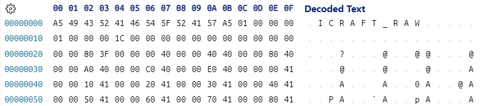

                  
  
# Icraft XIR

为了和老的 `IR` 做区分和兼容， `IR` 升级之后需要有一个别的名字或者命名空间。
因此取名 `XIR` ， `X` 一般用来表示可扩展的（ `eXtensible` ）的意思，正好表达了其特性

`XIR` 和老的 `IR` 的相同之处是保留了 `Network` 、 `Operation` 和 `Data` 的概念不变，以及 `Json&Raw` 的序列化格式不变。
除了以上相同的地方，剩下的都不相同

说到底， `XIR` 的本质需求也是为了表达数据、算子和网络，因此我们从一个例子开始，看看它是如何快速的构建一个网络的

## 一 网络构建

```cpp
using namespace icraft::xir;

//　定义网络的名称、前端框架和框架版本
auto network = Network("whatever", Framework::PYTORCH, "v1.9");

// 构造网络的输入
auto input_type = TensorType(FloatType::FP32(), { 1, 416, 416, 3 }, Layout::NHWC());
auto input = Input(input_type);
network.addOp(input);

// 添加Conv2d算子
auto weight_type = TensorType(FloatType::FP32(), { 3, 3, 3, 16 }, Layout::HWIO());
auto weight = Params(weight_type);
auto conv2d = Conv2d(input[0], weight, NullOpt, 1, 1, 1);
network.addOp(conv2d);

// 添加Relu算子
auto relu = ReLU(conv2d[0]);
network.addOp(relu);

//添加MaxPool2d算子
auto max_pool2d = MaxPool2d(relu[0], 3, 2, 1, 1);
network.addOp(max_pool2d);

//构造输出
auto output = Output(max_pool2d[0]);
network.addOp(output);

std::cout << std::setw(4) << network;
```

以上代码的输出如下：

```cpp
{
   "_type_key": "icraft::xir::Network",
   "framework_kind": "PYTORCH",
   "framework_version": "v1.9",
   "icraft_version": "v0.0.0",
   "icraft_xir_version": "3.6.2.82",
   "name": "whatever",
   "ops": [
      {
            "_type_key": "icraft::xir::Input",
            "compile_target": "@hostt",
            "inputs": [],
            "name": "",
            "op_id": 0,
            "outputs": [
               {
                  "_type_key": "icraft::xir::Value",
                  "dtype": {
                        "_type_key": "icraft::xir::TensorType",
                        "element_dtype": "@fp(32)",
                        "layout": "@layout(NHWC)",
                        "merged_distrs": [],
                        "shape": [
                           1,
                           416,
                           416,
                           3
                        ]
                  },
                  "mtype": "@hostm",
                  "name": "",
                  "tags": {},
                  "v_id": 0
               }
            ],
            "tags": {}
      },
      {
            "_type_key": "icraft::xir::Conv2d",
            "compile_target": "@hostt",
            "cut_scale": "@scales([axis=-1])",
            "dilation_height": 1,
            "dilation_width": 1,
            "groups": 1,
            "inputs": [
               {
                  "_type_key": "icraft::xir::Value",
                  "dtype": {
                        "_type_key": "icraft::xir::TensorType",
                        "element_dtype": "@fp(32)",
                        "layout": "@layout(NHWC)",
                        "merged_distrs": [],
                        "shape": [
                           1,
                           416,
                           416,
                           3
                        ]
                  },
                  "mtype": "@hostm",
                  "name": "",
                  "tags": {},
                  "v_id": 0
               },
               {
                  "_allow_no_data": false,
                  "_type_key": "icraft::xir::Params",
                  "dtype": {
                        "_type_key": "icraft::xir::TensorType",
                        "element_dtype": "@fp(32)",
                        "layout": "@layout(HWIO)",
                        "merged_distrs": [],
                        "shape": [
                           3,
                           3,
                           416,
                           16
                        ]
                  },
                  "mtype": "@hostm",
                  "name": "",
                  "tags": {},
                  "v_id": 1
               }
            ],
            "name": "",
            "op_id": 1,
            "outputs": [
               {
                  "_type_key": "icraft::xir::Value",
                  "dtype": {
                        "_type_key": "icraft::xir::TensorType",
                        "element_dtype": "@fp(32)",
                        "layout": "@layout(NHWC)",
                        "merged_distrs": [],
                        "shape": [
                           1,
                           416,
                           416,
                           16
                        ]
                  },
                  "mtype": "@hostm",
                  "name": "",
                  "tags": {},
                  "v_id": 2
               }
            ],
            "pad_bottom": 1,
            "pad_left": 1,
            "pad_right": 1,
            "pad_top": 1,
            "padding_mode": "ZEROS",
            "stride_height": 1,
            "stride_width": 1,
            "tags": {}
      },
      {
            "_type_key": "icraft::xir::ReLU",
            "alpha": 0.0,
            "compile_target": "@hostt",
            "inputs": [
               {
                  "_type_key": "icraft::xir::Value",
                  "dtype": {
                        "_type_key": "icraft::xir::TensorType",
                        "element_dtype": "@fp(32)",
                        "layout": "@layout(NHWC)",
                        "merged_distrs": [],
                        "shape": [
                           1,
                           416,
                           416,
                           16
                        ]
                  },
                  "mtype": "@hostm",
                  "name": "",
                  "tags": {},
                  "v_id": 2
               }
            ],
            "max_value": "inf",
            "name": "",
            "op_id": 2,
            "outputs": [
               {
                  "_type_key": "icraft::xir::Value",
                  "dtype": {
                        "_type_key": "icraft::xir::TensorType",
                        "element_dtype": "@fp(32)",
                        "layout": "@layout(NHWC)",
                        "merged_distrs": [],
                        "shape": [
                           1,
                           416,
                           416,
                           16
                        ]
                  },
                  "mtype": "@hostm",
                  "name": "",
                  "tags": {},
                  "v_id": 3
               }
            ],
            "tags": {},
            "threshold": 0.0
      },
      {
            "_type_key": "icraft::xir::MaxPool2d",
            "compile_target": "@hostt",
            "dilation_height": 1,
            "dilation_width": 1,
            "inputs": [
               {
                  "_type_key": "icraft::xir::Value",
                  "dtype": {
                        "_type_key": "icraft::xir::TensorType",
                        "element_dtype": "@fp(32)",
                        "layout": "@layout(NHWC)",
                        "merged_distrs": [],
                        "shape": [
                           1,
                           416,
                           416,
                           16
                        ]
                  },
                  "mtype": "@hostm",
                  "name": "",
                  "tags": {},
                  "v_id": 3
               }
            ],
            "name": "",
            "op_id": 3,
            "outputs": [
               {
                  "_type_key": "icraft::xir::Value",
                  "dtype": {
                        "_type_key": "icraft::xir::TensorType",
                        "element_dtype": "@fp(32)",
                        "layout": "@layout(NHWC)",
                        "merged_distrs": [],
                        "shape": [
                           1,
                           208,
                           208,
                           16
                        ]
                  },
                  "mtype": "@hostm",
                  "name": "",
                  "tags": {},
                  "v_id": 4
               }
            ],
            "pad_bottom": 1,
            "pad_left": 1,
            "pad_right": 1,
            "pad_top": 1,
            "pool_height": 3,
            "pool_width": 3,
            "stride_height": 2,
            "stride_width": 2,
            "tags": {}
      },
      {
            "_type_key": "icraft::xir::Output",
            "compile_target": "@hostt",
            "inputs": [
               {
                  "_type_key": "icraft::xir::Value",
                  "dtype": {
                        "_type_key": "icraft::xir::TensorType",
                        "element_dtype": "@fp(32)",
                        "layout": "@layout(NHWC)",
                        "merged_distrs": [],
                        "shape": [
                           1,
                           208,
                           208,
                           16
                        ]
                  },
                  "mtype": "@hostm",
                  "name": "",
                  "tags": {},
                  "v_id": 4
               }
            ],
            "name": "",
            "op_id": 4,
            "outputs": [],
            "tags": {}
      }
   ],
   "params_bytes": 0,
   "params_md5": "d41d8cd98f00b204e9800998ecf8427e",
   "tags": {}
}
```

## 二 序列化和反序列化

## 2.1 输出流

`XIR` 中的任何数据结构都可以通过输出流输出对应的 `Json` 字符串，就像上例中输出网络那样

```cpp
std::cout << input_type << std::endl;
std::cout << weight << std::endl;
std::cout << std::setw(4) << max_pool2d << std::endl;
```

以上代码的输出如下：

```cpp
{"_type_key":"icraft::xir::TensorType","element_dtype":"@fp(32)","layout":"@layout(NHWC)","merged_distrs":[],"shape":[1,416,416,3]}
{"_allow_no_data":false,"_type_key":"icraft::xir::Params","dtype":{"_type_key":"icraft::xir::TensorType","element_dtype":"@fp(32)","layout":"@layout(HWIO)","merged_distrs":[],"shape":[3,3,416,16]},"mtype":"@hostm","name":"","tags":{},"v_id":1}
{
   "_type_key": "icraft::xir::MaxPool2d",
   "compile_target": "@hostt",
   "dilation_height": 1,
   "dilation_width": 1,
   "inputs": [
      {
            "_type_key": "icraft::xir::Value",
            "dtype": {
               "_type_key": "icraft::xir::TensorType",
               "element_dtype": "@fp(32)",
               "layout": "@layout(NHWC)",
               "merged_distrs": [],
               "shape": [
                  1,
                  416,
                  416,
                  16
               ]
            },
            "mtype": "@hostm",
            "name": "",
            "tags": {},
            "v_id": 3
      }
   ],
   "name": "",
   "op_id": 3,
   "outputs": [
      {
            "_type_key": "icraft::xir::Value",
            "dtype": {
               "_type_key": "icraft::xir::TensorType",
               "element_dtype": "@fp(32)",
               "layout": "@layout(NHWC)",
               "merged_distrs": [],
               "shape": [
                  1,
                  208,
                  208,
                  16
               ]
            },
            "mtype": "@hostm",
            "name": "",
            "tags": {},
            "v_id": 4
      }
   ],
   "pad_bottom": 1,
   "pad_left": 1,
   "pad_right": 1,
   "pad_top": 1,
   "pool_height": 3,
   "pool_width": 3,
   "stride_height": 2,
   "stride_width": 2,
   "tags": {}
}
```

可以看出，默认输出的是紧凑的 `Json` 字符串，添加 `std::setw(4)` 可以把 `Json` 字符串格式化

## 2.2 输出文件

同样的， `XIR` 中的任何数据结构都可以序列化的文件，但是一般我们只会序列化网络，因此这里只讲网络的序列化

和老的 `IR` 一样， `XIR` 使用 `.json` 文件存储网络的结构，使用 `.params` 文件存储网络的参数。
为了示例以上二者的序列化，我们给上例中 `conv2d` 算子的 `weights` 初始化一些数据，然后将网络序列化到文件

```cpp
//　定义网络的名称、框架和框架版本
auto network = Network("whatever", Framework::PYTORCH, "v1.9");

// 构造网络的输入
auto input_type = TensorType(FloatType::FP32(), { 1, 416, 416, 3 }, Layout::NHWC());
auto input = Input(input_type);
network.addOp(input);

// 添加Conv2d算子
auto weight_type = TensorType(FloatType::FP32(), { 3, 3, 3, 16 }, Layout::HWIO());
auto weight = Params(weight_type).fill<float>([](size_t i) { return (float)i; }); // 初始化参数
auto conv2d = Conv2d(input[0], weight, NullOpt, 1, 1, 1);
network.addOp(conv2d);

// 添加Relu算子
auto relu = ReLU(conv2d[0]);
network.addOp(relu);

//添加MaxPool2d算子
auto max_pool2d = MaxPool2d(relu[0], 3, 2, 1, 1);
network.addOp(max_pool2d);

//构造输出
auto output = Output(max_pool2d[0]);
network.addOp(output);

//序列化到文件
network.dumpJsonToFile("./whatever.json");
network.dumpParamsToFile("./whatever.params");
network.dumpMSGToFile("./whatever.imodel");
network.dumpFlatToFile("./whatever.fb");
```

上例中使用的 `fill` 方法将 `weight` 初始化为从 `0` 开始的整数。
最后分别调用网络的 `dumpJsonToFile` 和 `dumpParamsToFile` 将网络结构和参数序列化到对应的文件

`.json` 文件中的内容和之前通过输出流打印的一致，而 `.raw` 文件中的内容如下：



可以看出，相比于老 `IR` 的 `raw` 文件， `XIR` 添加了魔数 `\xA5ICRAFT_RAW\xA5` ，增强对文件的识别性

备注

`v2.0.0` 版本新增了 `msgpack` 序列化方式：该方式使用一个文件同时记录网络结构和参数，相比 `Json&Raw` 加载更快，但消耗内存更多

`v3.7.0` 版本新增了 `flatbuffers` 序列化方式：该方式全面优于 `msgpack`

## 2.3 反序列化

`XIR` 的反序列化分为两步，首先从 `Json` 文件创建一个 `Network` 对象，然后该对象从 `Raw` 文件中加载参数即可

```cpp
auto net = Network::CreateFromJsonFile("./whatever.json");
net.loadParamsFromFile("./whatever.raw")

auto net2 = Network::CreateFromMSGFile("./whatever.imodel");
auto net3 = Network::CreateFromFlatFile("./whatever.fb");

auto loaded_conv2d = net.getOpById(1);
auto loaded_weight = loaded_conv2d->inputs[1].cast<Params>();

if (std::memcmp(loaded_weight.data<float>(), weight.data<float>(), weight.storageBytes()) == 0) {
   fmt::print("weights loaded validate pass\n");
}
else {
   fmt::print("weights loaded validate error\n");
}
```

以上代码输出： `weights loaded validate pass`

## 2.4 惰性加载

`loadParamsFromFile` 会将所有的参数从文件中加载到内存，这会给嵌入式设备的内存大小带来很大的压力。
因此 `XIR` 提供了  `lazyLoadParamsFromFile` 的方法惰性加载参数以节省内存

上例改为惰性加载如下：

```cpp
auto net = Network::CreateFromJsonFile("./whatever.json");
net.lazyLoadParamsFromFile ("./whatever.raw");

auto loaded_conv2d = net.getOpById(1);
auto loaded_weight = loaded_conv2d->inputs[1].cast<Params>();

if (std::memcmp(loaded_weight.data<float>(), weight.data<float>(), weight.storageBytes()) == 0) {
   fmt::print("weights loaded validate pass\n");
}
else {
   fmt::print("weights loaded validate error\n");
}
```

以上代码输出： `weights loaded validate pass`

可以看出，使用惰性加载无需任何额外的心智负担，只需要换一个加载参数的 `API` 即可

## 三 数据类型

## 3.1 MemType

`MemType` 表达了存储的类型，即数据存储在什么地方。目前从 `MemType` 派生了以下几个存储类型：

- 
`HostMem`：表示数据存储在 `Host` 上，其字符串表达为 `hostm`

- 
`OnChipMem`：表示数据存储在 `OCM` 上，其字符串表达为 `ocm(x)` ，其中 `x` 表示地址

- 
`ExternalMem`：表示数据存储在 `ETM``上，其字符串表达为 ``etm(x)` ，其中 `x` 表示地址

- 
`ChunkMem`：表示基于 `Chunk` 的虚拟内存，其字符串表达为 `chunk(id@offset)`，其中 `id` 表示 `ID`， `offset` 表示偏移

比如我们将开头例子中的 `input_type` 改为在不同的 `MemType` 上构造：

```cpp
TensorType ttype(FloatType::FP32(), { 1, 416, 416, 3 }, Layout::NHWC());

// 默认为HostMem
Value etm_value(ttype);

// 构造OCM上的Value
Value ocm_value(ttype, OnChipMem(1234));

// 构造ETM上的TensorType
FloatImm etm_flt(3.14, ExternalMem(5678));

// 构造临时放置于虚拟内存上的Params
Params params("params", ttype, ChunkMem(1234, 100));

std::cout << std::setw(4) << etm_value << std::endl;
std::cout << std::setw(4) << ocm_value << std::endl;
std::cout << std::setw(4) << etm_flt << std::endl;
std::cout << std::setw(4) << params << std::endl;
```

以上代码的输出如下：

```cpp
{
   "_type_key": "icraft::xir::Value",
   "dtype": {
      "_type_key": "icraft::xir::TensorType",
      "element_dtype": "@fp(32)",
      "layout": "@layout(NHWC)",
      "merged_distrs": [],
      "shape": [
            1,
            416,
            416,
            3
      ]
   },
   "mtype": "@hostm",
   "name": "",
   "tags": {},
   "v_id": -10579
}
{
   "_type_key": "icraft::xir::Value",
   "dtype": {
      "_type_key": "icraft::xir::TensorType",
      "element_dtype": "@fp(32)",
      "layout": "@layout(NHWC)",
      "merged_distrs": [],
      "shape": [
            1,
            416,
            416,
            3
      ]
   },
   "mtype": "@ocm(1234)",
   "name": "",
   "tags": {},
   "v_id": -10580
}
3.14
{
   "_allow_no_data": false,
   "_type_key": "icraft::xir::Params",
   "dtype": {
      "_type_key": "icraft::xir::TensorType",
      "element_dtype": "@fp(32)",
      "layout": "@layout(NHWC)",
      "merged_distrs": [],
      "shape": [
            1,
            416,
            416,
            3
      ]
   },
   "mtype": "@chunk(1234@100)",
   "name": "params",
   "tags": {},
   "v_id": -10581
}
```

## 3.2 DataType

## 3.2.1 普通类型

顾名思义， `DataType` 表达了数据的类型。目前从 `DataType` 派生了以下几个数据类型：

- 
`ScalarType`：表示标量类型，是所有标量类型的基类

- 
`IntegerType`：表示整型类型，可以表达任意位数的有符号和无符号整型，字符串表达为 `sint(x)` 或 `uint(x)` ，其中 `x` 表示位数

- 
`FloatType`：表示浮点类型，可以表达 `IEEE` 标准中的几种浮点类型，字符串从表达为 `fp(x)` 或 `bf(x)`，其中 `x` 表示位数

- 
`TensorType`：表示张量类型，包含 `element_dtype`、 `shape` 、 `layout` 和 `chann_distr` 等属性

```cpp
// 一些IntegerType
auto sint8 = IntegerType::SInt8();
auto sint64 = IntegerType::SInt64();
auto uint12 = IntegerType::UInt(12);

std::cout << "sint8: " << sint8 << std::endl;
std::cout << "sint64: " << sint64 << std::endl;
std::cout << "uint12: " << uint12 << std::endl;

// 一些FloatType
auto fp32 = FloatType::FP32();
auto bf16 = FloatType::BF16();

std::cout << "fp32: " << fp32 << std::endl;
std::cout << "bf16: " << bf16 << std::endl;

// 一些TensorType
auto ttype = TensorType(IntegerType::SInt64(), {1024}, Layout::NHWC());

std::cout << std::setw(4) << ttype << std::endl;
```

以上示例代码构造了一些常见的数据类型，其输出如下：

```cpp
sint8: "@sint(8)"
sint64: "@sint(64)"
uint12: "@uint(12)"
fp32: "@fp(32)"
bf16: "@bf(16)"
{
   "_type_key": "icraft::xir::TensorType",
   "element_dtype": "@sint(64)",
   "layout": "@layout(NHWC)",
   "merged_distrs": [],
   "shape": [
      1024
   ]
}
```

**维度分布之MergedAxisDistr:**

`MergedAxisDistr` 表示任意多个维度融合的分布，比如一个 `Tensor` 的 `shape` 为 `[1,2,3,3,32]` ，那么可以使用 `MergedAxisDistr` 描述 `[1,4]` 两个维度融合后 `64` 个元素是否有效。
其使用掩码来表示元素是否有效，掩码的数量和通元素相同。当掩码为 `1` 时表示该通道有效，为0表示无效。

`MergedAxisDistr` 有两个属性：

- 
`merged_axis`：表示被融合的维度索引列表，比如 `[1,4]`

- 
`valid_mask：` 一个布尔数组表示每个元素是否有效

`MergedAxisDistr` 提供了以下方法来设置和访问有效/无效通道：

- 
`append` :追加通道，可以设置追加的通道是否有效

- 
`setValid`：标记 `[start, end)` 范围内有效

- 
`setUnvalid`：标记 `[start, end)` 范围内无效

- 
`validSections`：获取所有的有效片段，返回有效片段的 `vector` ，其中每个元素为一个 `pair` ，表示 `[pair.first, pair.second)` 范围是有效的

- 
`unvalidSections`：获取所有的无效片段，返回无效片段的 `vector` ，其中每个元素为一个 `pair` ，表示 `[pair.first, pair.second)` 范围是无效的

- 
`allChannSections`：获取所有的片段，返回表示片段的 `vector` ，其中每个元素为一个 `tuple` ，  `tuple` 的三个元素分别表示该片段的 `[开始, 结束)` 以及是否有效

- 
`totalValidNum`：获取所有有效元素数

- 
`totalUnvalidNum`：获取所有无效元素数

- 
`totalNum`：获取所有元素数

- 
`isValid`：检查指定索引的元素是否有效

`MergedAxisDistr` 使用 `merged_distr([2, 3]:{u:[0, 100), v:[100, 1024)})` 的形式来序列化，其中 `[2, 3]` 表示被融合的维度索引， `v` 表示 `valid` ， `u` 表示 `unvalid` 。

**TensorType使用 MergedAxisDistr 数组即 Array<MergedAxisDistr> merged_distrs 来表示所有融合维度的分布。TensorType可以使用以下方法操作融合维度分布：**

- 
`createAddMergedDistr`: 创建并添加维度分布，如果维度已经存在则抛出异常

- 
`getMergedDistr`：获取指定的融合维度分布

- 
`mutateMergedDistr`：调整指定的融合维度分布，如果不存在则抛出异常

具体的使用示例如下：

```cpp
// 构造一个MergedAxisDistr，绑定第2,3维度，默认所有掩码都为true
     auto axis_distr = MergedAxisDistr({ 2,3 }, 1024);

     // 设置通道[0, 100]为无效
     axis_distr.setUnvalid(0, 100);
     std::cout << std::setw(4) << axis_distr << std::endl;
     // 设置通道[1000, 1023]为无效
     axis_distr.setUnvalid(1000, 1023);
     std::cout << std::setw(4) << axis_distr << std::endl;
     //设置通道888为无效
     axis_distr.setUnvalid(888, 888);
     std::cout << std::setw(4) << axis_distr << std::endl;

     axis_distr.append(256, false);
     auto other = Array<bool>(128, true);
     axis_distr.append(other);
     std::cout << std::setw(4) << axis_distr << std::endl;

     // 获取所有的通道片段
     auto all_sections = axis_distr.allSections();

     // 打印通道片段
     for (auto&& [s, e, v] : all_sections) {
             fmt::print("[{}, {}): is_valid({})\n", s, e, v);
     }

// 创建一个TensorType，其默认融合维度分布为空
     auto host_ttype = TensorType(FloatType::FP32(), { 1, 2, 416, 416, 32 }, Layout::NHWC());
     REQUIRE(host_ttype->merged_distrs.size() == 0);

     // 创建并添加一个融合维度分布，指定维度为[1, 4]
// 创建后host_ttype的merged_distrs添加一个MergedAxisDistr
// 其merged_axis为[1, 4]，总共有64(2*32)个掩码，所有掩码都为true
     auto axis_distr3 = host_ttype.createAddMergedDistr({1, 4});
     // 上面的方法会返回被创建的MergedAxisDistr引用，我们可以操作它
     REQUIRE(axis_distr3.isValid(31));
     axis_distr3.setUnvalid(2, 3);
     REQUIRE(!axis_distr3.isValid(2));

     // 获取指定维度的分布，如果指定的融合维度不存在则返回NullOpt
     // 存在则返回对应的Optional<MergedAxisDistr>
     auto axis_distr4 = host_ttype.getMergedDistr({1, 4});
     REQUIRE(axis_distr3 == axis_distr4.value());

     // 不存在则返回NullOpt
     auto axis_distr5 = host_ttype.getMergedDistr({ 2, 3 });
     REQUIRE(!axis_distr5.has_value());

     // 修改指定的维度分布，不存在会抛出异常
     host_ttype.mutateMergedDistr({1, 4}, 0, 32, false);
     REQUIRE(!axis_distr3.isValid(31));

     // 再创建一个融合维度分布，创建后host_ttype有两个分布
     auto axis_distr6 = host_ttype.createAddMergedDistr({ 2, 3 });
     REQUIRE(host_ttype->merged_distrs.size() == 2);

     std::cout << std::setw(4) << host_ttype << std::endl;
```

以上示例输出如下：

```cpp
"merged_distr([2, 3]:{u:[0, 100), v:[100, 1024)})"
"merged_distr([2, 3]:{u:[0, 100), v:[100, 1000), u:[1000, 1023), v:[1023, 1024)})"
"merged_distr([2, 3]:{u:[0, 100), v:[100, 1000), u:[1000, 1023), v:[1023, 1024)})"
"merged_distr([2, 3]:{u:[0, 100), v:[100, 1000), u:[1000, 1023), v:[1023, 1024), u:[1024, 1280), v:[1280, 1408)})"

[0, 100): is_valid(false)
[100, 1000): is_valid(true)
[1000, 1023): is_valid(false)
[1023, 1024): is_valid(true)
[1024, 1280): is_valid(false)
[1280, 1408): is_valid(true)

axis_distr1:1408 "merged_distr([2, 3]:{u:[0, 100), v:[100, 1000), u:[1000, 1023), v:[1023, 1024), u:[1024, 1280), v:[1280, 1408)})"

{
   "_type_key": "icraft::xir::TensorType",
   "element_dtype": "fp(32)",
   "layout": "layout(NHWC)",
   "merged_distrs": [
      "merged_distr([1, 4]:{u:[0, 32), v:[32, 64)})",
      "merged_distr([2, 3]:{v:[0, 173056)})"
   ],
   "mtype": "hostm",
   "shape": [
      1,
      2,
      416,
      416,
      32
   ]
}
```

## 3.2.2 量化类型

`Icraft` 的量化涉及到的概念比较多，有两个方面的原因：
其一是 `Icraft` 采用了先归一化再量化的方式，引入了归一化的概念和表达；
其二是后端硬件对 `scale` 的支持不同，比如布衣支持的是 \(m×2^{-exp}\) ，而诸葛支持的是 `BF16`

为了表达清楚以上这些概念， `XIR` 的引入了以下量化相关的类型：

- 

**BaseQuantizedType：所有量化相关类型的基类，也是 ScalarType 的子类，即所有量化的类型表达的都是标量。它具有两个属性，也是所有量化相关类型需要明确的：**

- 
`storage_dtype`：存储类型，即量化的目标类型

- 
`expressed_dtype`：表达类型，即数据的原始类型

- 

**CalibratedType：表示校准后的数据类型，除了以上两个基本属性外，还表达了一些校准信息：**

- 
`min`：统计的最小值

- 
`max`：统计的最大值

- 
`sat`：统计的饱和点

- 

**NormalizedType：表示归一化后的数据类型，除了基本属性外，主要表达归一化系数：**

- 
`normratio`：归一化系数

- 

**QuantizedType：表示量化后的数据类型，除了基本属性外，主要表达 scale:**

- 
`scale`：量化的缩放因子

- 
`NormalizedQuantizedType`：表示采用归一化量化的数据类型，同时表达了 `normratio` 和 `scale`

上面两种量化类型的 `scale` 属性都是 `QuantizedScale` 类型，该类型表示量化缩放因子。
目前只派生了一个子类  `ExpQuantizedScaleNode` ，表示 \(m×2^{-exp}`形式的 ``scale`\) ，其字符串表达为 `exp_scale(<m, exp>, origin_scale)`

下面是一些量化相关类型的示例：

```cpp
// Calibrated
auto calibrated_sint8 = CalibratedType(-3.6, 4.8, 4.7, IntegerType::SInt8());
auto calibrated_bf16 = CalibratedType(-3.6, 4.8, 4.7, FloatType::BF16());

std::cout << "calibrated_sint8: " << std::setw(4) << calibrated_sint8 << std::endl;
std::cout << "calibrated_bf16: " << std::setw(4) << calibrated_bf16 << std::endl;

// Normalized
auto normalized_sint16 = NormalizedType({ 1.1, 2.2, 3.3 }, IntegerType::SInt16());
auto normalized_ttype = TensorType(normalized_sint16, { 1024 }, Layout::NHWC());

std::cout << "normalized_ttype: " << std::setw(4) << normalized_ttype << std::endl;

// Quantized
auto quant_sint16 = NormalizedQuantizedType(
   normalized_sint16,
   ExpQuantizedScaleArray({ 3, 4 }, { 3, 4 }, { 0.377, 0.27 })
);

std::cout << "quant_sint16: " << std::setw(4) << quant_sint16 << std::endl;
```

以上代码的输出为：

```cpp
calibrated_sint8: {
   "_type_key": "icraft::xir::CalibratedType",
   "expressed_dtype": "@fp(32)",
   "max": [
      4.8
   ],
   "min": [
      -3.6
   ],
   "sat": [
      4.7
   ],
   "storage_dtype": "@sint(8)"
}
calibrated_bf16: {
   "_type_key": "icraft::xir::CalibratedType",
   "expressed_dtype": "@fp(32)",
   "max": [
      4.8
   ],
   "min": [
      -3.6
   ],
   "sat": [
      4.7
   ],
   "storage_dtype": "@bf(16)"
}
normalized_ttype: {
   "_type_key": "icraft::xir::TensorType",
   "element_dtype": {
      "_type_key": "icraft::xir::NormalizedType",
      "expressed_dtype": "@fp(32)",
      "normratio": "@norm_ratios([axis=-1]1.1,2.2,3.3)",
      "storage_dtype": "@sint(16)"
   },
   "layout": "@layout(NHWC)",
   "merged_distrs": [],
   "shape": [
      1024
   ]
}
quant_sint16: {
   "_type_key": "icraft::xir::NormalizedQuantizedType",
   "expressed_dtype": "@fp(32)",
   "normratio": "@norm_ratios([axis=-1]1.1,2.2,3.3)",
   "scale": "@exp_scales([axis=-1]3/3/0.377,4/4/0.27)",
   "storage_dtype": "@sint(16)",
   "zero_points": []
}
```

## 3.3 TargetType

`TargetType` 表示算子的编译目标类型，目前从 `TargetType` 派生了以下几个编译目标类型：

- 
`HostTarget`：表示算子的编译目标为 `Host`

- 
`FPGATarget`：表示算子的编译目标为 `FPGA`

- 
`CustomTarget`：表示算子的编译目标为自定义

- 
`BuyiTarget`：表示算子的编译目标为布衣架构的加速器

- 
`ZhugeTarget`：表示算子的编译目标为诸葛架构的加速器

## 四 Layout

对于老的 `IR` 来说， `Layout` 是个老生常谈的话题，究其原因是因为对其没有一个明确的定义。
而且原来的 `Format` 表达能力不够，新加的 `BYLayout` 含义比较隐晦，所以经常引起讨论。

`XIR` 中明确定义 `Layout` 是对 `TensorType` 的 `shape` 属性的诠释，即 `Layout` 诠释了 `Tensor` 中每一维的含义。
比如对于一个四维张量来说， `layout=NHWC` 说明了它的最后一维表示通道，这对于卷积等算子的实现是必不可少的

`XIR` 中 `Layout` 的设计致力于诠释一切(关心的)维度，而避免使用 `BYLayout` 这种隐晦的表达

`Layout` 使用单个字符表示的坐标轴来解释 `Tensor` 的每一维是什么意义，目前有效的坐标轴为 `"NHWDCIO*nhwdcio"`

备注

`NHWDCIO` 分别表示 `Batch` 、高度、宽度、深度、通道、输入(通道)、输出(通道)

其中大写字母表示没被划分或划分后的 `Tile` 数量的坐标轴，小写字母表示做了划分后的单位坐标轴，后面跟数字表示单位长度， `*` 表示不关心的坐标轴。
例如 `NCHWc32,OIHWi32o32，N**Cc4` 等都是有效的表达

如果我们想要获取 `NCHW` 和 `NHWC` 这两种排布通道上的大小，那么需要判断其 `Layout` 是 `NCHW` 时取第二维，是 `NHWC` 取最后一维。
一般情况下，我们可能不关心一个张量的具体排布是什么，只想知道某个坐标轴的大小，这时可以使用 `TensorType` 的 `getAxis` 方法，比如 `getAxis(’C’)` 就能获取通道数量。

以下是 `Layout` 的一些使用示例：

```cpp
auto layout1 = Layout::NCHW();
auto layout2 = Layout::OIHW();
auto layout3 = Layout::Init().N().H().C().D();
auto layout4 = Layout::Init().N().X().X().D();
auto layout5 = Layout::Init().N().X(2).D().d(32).n(4);

auto layout6 = Layout::NHWC();
auto layout7 = Layout("NC**c32");

std::cout << "layout1: " << std::setw(4) << layout1 << std::endl;
std::cout << "layout2: " << std::setw(4) << layout2 << std::endl;
std::cout << "layout3: " << std::setw(4) << layout3 << std::endl;
std::cout << "layout4: " << std::setw(4) << layout4 << std::endl;
std::cout << "layout5: " << std::setw(4) << layout5 << std::endl;

std::cout << "layout6.C: " << std::setw(4) << layout6.getIndexOf('C') << std::endl;
std::cout << "layout7.c: " << std::setw(4) << layout7.getIndexOf('c') << std::endl;
```

以上代码的输出为：

```cpp
layout1: "@layout(NCHW)"
layout2: "@layout(OIHW)"
layout3: "@layout(NHCD)"
layout4: "@layout(N**D)"
layout5: "@layout(N**Dd32n4)"
layout6.C:    3
layout7.c:    4
```

## 五 算子

算子是 `XIR` 中的基本单位，具有输入和输出，以及一系列属性

## 5.1 算子的声明

整个 `XIR` 都采用了数据和逻辑分离的方式来实现，因此定义一个算子需要分别定义它的数据类和逻辑类。
在数据类型中定义算子的属性，而在逻辑类中定义一些方法

以卷积为例，其定义如下：

```
// 数据类使用OpNodeBase以CRTP的方式派生
// 然后使用ICRAFT_DECLARE_ATTRS和ICRAFT_ATTR_FIELD声明属性
// ICRAFT_ATTR_FIELD宏可以设置属性的默认值，上下边界和描述
class Conv2dNode : public OpNodeBase<Conv2dNode> {
   public:
      int64_t stride_width;         ///< 卷积滑动宽度，默认为1
      int64_t stride_height;        ///< 卷积滑动高度，默认为1
      int64_t pad_top;              ///< 卷积上方Pad，默认为0
      int64_t pad_bottom;           ///< 卷积下方Pad，默认为0
      int64_t pad_left;             ///< 卷积左方Pad，默认为0
      int64_t pad_right;            ///< 卷积右方Pad，默认为0
      int64_t dilation_width;       ///< 卷积膨胀宽度，默认为1
      int64_t dilation_height;      ///< 卷积膨胀高度，默认为1
      int64_t groups;               ///< 卷积分组数量，默认为1

      ICRAFT_DECLARE_ATTRS(Conv2dNode) {
         ICRAFT_ATTR_FIELD(stride_width).set_default(1).set_lower_bound(1);
         ICRAFT_ATTR_FIELD(stride_height).set_default(1).set_lower_bound(1);
         ICRAFT_ATTR_FIELD(pad_top).set_default(0).set_lower_bound(0);
         ICRAFT_ATTR_FIELD(pad_bottom).set_default(0).set_lower_bound(0);
         ICRAFT_ATTR_FIELD(pad_left).set_default(0).set_lower_bound(0);
         ICRAFT_ATTR_FIELD(pad_right).set_default(0).set_lower_bound(0);
         ICRAFT_ATTR_FIELD(dilation_width).set_default(1).set_lower_bound(1);
         ICRAFT_ATTR_FIELD(dilation_height).set_default(1).set_lower_bound(1);
         ICRAFT_ATTR_FIELD(groups).set_default(1);
      }
};

// 逻辑类使用OpBase以CRTP的方式派生，主要定义了一些构造函数
// 需要指定其对应的数据类Conv2dNode
// 逻辑类可以看做是数据类的一个智能指针或者引用
class Conv2d : public OpBase<Conv2d, Conv2dNode> {
   public:
      /** 默认构造函数 */
      Conv2d() = default;

      Conv2d(
         Value input,
         Value weights,
         Optional<Value> bias,
         int64_t stride_width,
         int64_t stride_height,
         int64_t pad_top,
         int64_t pad_bottom,
         int64_t pad_left,
         int64_t pad_right,
         int64_t dilation_width,
         int64_t dilation_height,
         int64_t groups = 1
      );

      Conv2d(
         Value input,
         Value weights,
         Optional<Value> bias,
         int64_t stride,
         int64_t pad_top_bottom,
         int64_t pad_left_right,
         int64_t dilation,
         int64_t groups = 1
      ) : Conv2d(
         input,
         weights,
         bias,
         stride,
         stride,
         pad_top_bottom,
         pad_top_bottom,
         pad_left_right,
         pad_left_right,
         dilation,
         dilation,
         groups
      ) {}

      Conv2d(
         Value input,
         Value weights,
         Optional<Value> bias,
         int64_t stride,
         int64_t pad,
         int64_t dilation,
         int64_t groups = 1
      ) : Conv2d(
         input,
         weights,
         bias,
         stride,
         pad,
         pad,
         dilation,
         groups
      ) {}
};
```

## 5.2 属性的声明和检查

每一个算子的属性都需要使用宏 `ICRAFT_ATTR_FIELD` 来声明，同时可以设置属性的一些参数，包括：

- 
`set_default`：设置属性的默认值

- 
`set_lower_bound`：设置属性的下边界

- 
`set_upper_bound`：设置属性的上边界

- 
`set_describe`：设置属性的描述

每一个算子都实现了 `validate` 方法，其中默认的实现是检查算子的属性以及符合设置的边界条件。
该方法可以在算子实现中被覆盖实现，比如我们为 `Conv2d` 添加覆盖实现：

```cpp
class Conv2dNode : public OpNodeBase<Conv2dNode> {
public:
   virtual void validate() const override {

      // 检查：Operation通用检查
      OperationNode::validate();

      // 检查：算子的输入是否大于等于2
      ICRAFT_CHECK(this->inputs.size() >= 2);
   }
}
```

## 5.3 OpTrait

`OpTrait` 表达了算子的一些特质，帮助我们更方便正确的描述算子，以及为算子添加一些功能和检查。

目前只定义了以下 `OpTrait`：

- 
`IsActivate`，标记算子是激活算子

`OperationNode` 提供了一些方法来判断算子是否混入了以上 `OpTrait` :

- 
`isActivate`: 检查算子是否是激活算子，即是否具有特质 `IsActivate`

示例如下：

```cpp
TEST_CASE("op_trait", "[op]") {
   auto input_type = TensorType(FloatType::FP32(), { 1, 32, 32, 3 }, Layout("NHWC"));
   auto input = Input(input_type);

   Operation reshape = Reshape(input[0], { 1, 3072 }, Layout("NC"));
   auto split = Split(reshape[0], {1536, 1536});
   auto relu = ReLU(split[0]);
   auto prelu = PReLU(split[1], Params::Init());
   auto softmax = Softmax(prelu);
   auto region = Region(prelu, 0, 0, 0, 0, 0, 0, 0, {});

   auto flatten = Operation::Create("whatever::Flatten", "../x64/Debug/whatever_Flatten.dll");
   flatten.setAttr("unused", Array<int64_t>{ 1, 2, 3, 4 });
   flatten.addInput(relu);

   REQUIRE(relu->isActivate());
   REQUIRE(prelu->isActivate());
   REQUIRE(!input->isActivate());
}
```

## 5.4 类型推断

为了简化构建网络的逻辑， `XIR` 为算子引入了类型推断。

在定义算子时可以为特定的后端注册类型推断函数，还是以 `Conv2d` 为例：

```cpp
ICRAFT_REGISTER_OP_NODE(Conv2dNode)
.set_tinfer<Conv2dNode, HostTarget>([](const auto* op) {
   op->validate();  // 首先检查是否合法，检查过后以下所有推断逻辑都默认算子参数合法
   auto input = op->inputs[0];
   auto input_dtype = input.dtype();
   auto input_n = input_dtype.getDim(0);
   auto input_h = input_dtype.getDim(1);
   auto input_w = input_dtype.getDim(2);
   auto input_c = input_dtype.getDim(3);

   auto weights = op->inputs[1];
   auto weights_dtype = weights.dtype();
   auto weights_h = weights_dtype.getDim(0);
   auto weights_w = weights_dtype.getDim(1);
   auto weights_i = weights_dtype.getDim(2);
   auto weights_o = weights_dtype.getDim(3);

   auto output_n = input_n;
   int64_t ouput_h = ((input_h + op->pad_top + op->pad_bottom - op->dilation_height * (weights_h - 1) - 1)
      / (float)op->stride_height) + 1ull;
   int64_t ouput_w = ((input_w + op->pad_left + op->pad_right - op->dilation_width * (weights_w - 1) - 1)
      / (float)op->stride_width) + 1ull;
   auto output_c = weights_o;

   auto output_dtype = TensorType(
      input_dtype->element_dtype,
      { output_n, ouput_h, ouput_w,  output_c },
      input_dtype->layout,
      input_dtype->mtype
   );

   return Array<TensorType>{ output_dtype };
});
```

如果一个算子注册了类型推断函数，那么添加算子时就不用关心算子的输出了，比如开头的例子：

```cpp
... ...

// 添加Conv2d算子
auto weight_type = TensorType(FloatType::FP32(), { 3, 3, 3, 16 }, Layout::HWIO());
auto weight = Params(weight_type);
auto conv2d = Conv2d(input[0], weight, NullOpt, 1, 1, 1);
network.addOp(conv2d);   // addOp时会自动调用类型推断函数来添加算子的输出

... ...
```

当然，如果没有类型推断也是可以构建网络的，上例要改为：

```cpp
... ...

// 添加Conv2d算子
auto weight_type = TensorType(FloatType::FP32(), { 3, 3, 3, 16 }, Layout::HWIO());
auto weight = Params(weight_type);
auto conv2d = Conv2d(input[0], weight, NullOpt, 1, 1, 1);
auto output_type = TensorType(FloatType::FP32(), { 1, 416, 416, 16 }, Layout::NHWC());
conv2d.inferResults(output_type);
network.addOp(conv2d);

... ...
```

## 5.5 特别说明

`XIR` 的算子定义和老的 `IR` 相比有以下几点不同：

- 
`Input` 算子只表达网络的入口，不再承担前处理的表达。可以把网络认为是一个函数，而 `Input` 算子是它的参数声明。
前处理由额外的算子来表达，比如 `Multiply` 和 `Add` 分别实现 `PreScale` 和 `PreMean` ,
而原来的 `preprocessor` 用 `Resize` 算子来实现， `channswap` 由 `SwapOrder` 算子来实现

- 
同样的 `Output` 算子只表达网络的出口，相当于函数的返回值

- 
`Conv2d` 的 `weight` 和 `bias` 作为算子的输入而不是属性，统一了原来的 `Conv2dFtmp` 和 `Conv2dConst`

- 
`Matmul` 同上，另外不再支持 `InnerProduct` ，其可以由 `Matmul` 实现

- 
同样的， `Multiply` 有两个输入，可以是 `Value` 或 `Params` ，统一了 `MultiplyFtmp` 和 `MultiplyConst`

- 
`Eltwise` 去除了原来实现中对量化后 `normratio` （即 `qt_normratio` 和 `scale` ）的表达，量化的表达可以通过改变 `alpha` 和 `beta` 的值和数据类型来实现。
`alpha` 和 `beta` 被定义为 `ScalarImm` 类型，量化前使用 `FloatImm` 来表达，量化后使用 `IntImm` 来表达，其 `dtype` 为 `NormalizedQuantizedType`

以此类推，我们尽量不在算子的属性中定义量化相关的东西。否则随着后端的增加，我们要不断添加不同后端的量化表示，不利于扩展和维护。

## 5.6 自定义算子

请参考 第8章《自定义算子》部分

## 六 索引

- 
[索引](genindex.md)

- [C++ API reference](_cppapi/api_root.md)

- [Python API reference](_autosummary/xir.md)

                