# Icraft Adapter

## 一 整体介绍

### 1.1 Icraft编译流程中的优化与适配

Icraft Adapter是 Icraft的编译模块之一，主要负责根据神经网络模型的结构进行图优化和根据硬件后端的特点对神经网络模型进行适配与调整。

模型在被Icraft编译时，会经过解析（parser）,优化（optimize）,量化（quantize）,适配（adapte）和指令生成（codegen）五个阶段，然后产生基于BUYI后端的离线模型。
这五个阶段由不同的ICraft模块负责，Icraft Adapter负责其中的优化阶段（optimize）和适配阶段（adapte）阶段，这两个阶段分别由Optimizer和Adapter两个子组件完成。
从用户的角度来看，用户可以通过在toml中配置Optimizer和Adapter的参数启动这两个组件；也可以通过命令行来单独启动一个组件，具体用法请见第二章节使用说明。

### 1.2 功能概述

Icraft Adapter的主要功能有二：1、优化神经网络模型的结构，提高网络运行效率（优化） 2、适配神经网络模型到Icraft的硬件后端（适配）。
其中优化主要由Optimizer子组件完成，适配主要由Adapter子组件完成。子组件内提供了多种不同类型的优化选项，并设置了开关接口，用户可以自主配置这些选项。
除此之外，为了方便用户和开发者，Icraft Adapter还提供了自定义优化接口，用户可以按照提供的规则根据自己的需求设计优化方法，自主的优化网络结构，详见第三章。

#### 1.2.1 优化类型

Icraft Adapter组件内的优化选项根据其特点可以分为以下几类，组件内每个Pass所属的优化类型见第四章表4-1。

##### 1. 算子替换

算子替换即将神经网络模型内一些执行效率较低或者硬件后端不支持的算子替换为计算效率高或硬件支持的算子，
如将内积算子替换为卷积算子，除算子等效替代为乘算子。该过程是等效的，一般认为不存在误差。

##### 2. 算子融合

算子融合即将一些在推理过程中可以合并执行的算子融合，达到减少算子，加快网络运行速度的目的。
如合并多个相连的reshape算子；合并移位(transpose)和矩阵乘算子；合并卷积（Conv2d）和批归一化（BatchNorm2d）算子。
这种合并在大部分情况下是完全等效的，如合并多个相连的Reshape算子；但是也存在一些不完全等效的情况，如合并卷积（Conv2d）和批归一化（BatchNorm2d）算子时，
融合前后算子输出的特征图会有极细微的数值差别，一般认为不影响神经网络的推理精度，如有需要可以通过开关接口关闭该类pass。

##### 3. 算子消除

算子消除即消除神经网络模型内没有实际意义的算子，如输入输出完全一致的reshape算子，尺寸和步长均为1\*1的pool算子等。这种算子可以在算法框架内实现，但是在实际推理中是毫无意义的，因此将其消除。
这种消除是完全等效的，仅消除完全没有意义的算子，一般认为不存在误差。

##### 4. 排布优化

排布优化即根据神经网络内数据流特点调整神经网络的局部结构，使之适配硬件的数据流，提高计算效率。
这种优化会改变网络结构，但是不会改变特征图数值，一般认为不存在误差。

##### 5. 硬件适配

硬件适配即根据Icraft的硬件后端需求，从结构上修改神经网络模型内算子，以在硬件上高效运行。
这种适配仅修改算子结构，不修改算子参数，不改变特征图数值，一般认为不存在误差。

#### 1.2.2 开关接口

Icraft Adapter提供了开关接口以方便用户根据自身需求调整优化策略。用户可以根据章节四的表4-1的功能分类说明，
在toml文件内通过配置命令参数的方式在Icraft原有优化选项的基础上添加或关闭优化选项，详见章节二的2.2节。

#### 1.2.3 自定义优化接口

自定义优化功能的使用需要开发者有一定的C++编程基础并对Icraft有一些了解。
依赖该接口，用户可以根据XIR用户手册中的规则自主开发优化功能并将其插入到Optimizer或Adapter组件内对网络进行针对性的优化。
详细的开发流程见章节三 自定义Pass的实现与使用。

### 1.3 组件结构与工作流程

作为Icraft Adapter的子组件，Optimizer和Adapter的结构基本一致，均由可执行程序（\*.exe）和若干动态链接库（\*.dll）组成。
每个动态链接库内都保存了一个优化功能函数，Icraft称之为Pass，即一个dll对应一个Pass，一个Pass对应一个优化功能。
大多数Pass的功能相互独立，少数Pass的功能会有相互依赖，或冲突（Icraft内置Pass不存在冲突），详细的Pass关系见表4-1。

在工作时，Optimizer和Adapter的工作流程基本一致。在组件启动后，可执行程序（exe）会循环调用Pass列表（由配置文件和命令参数共同生成）内的的Pass，
每个Pass会根据特定规则在神经网络模型内匹配可优化的结构并进行优化。当Pass列表被循环执行到网络结构不再变化时，说明网络结构已无优化空间，循环执行结束。
循环执行结束后，exe还会调用一些只能单次执行的Pass（针对后端实现，不可配置），当这些Pass执行完毕后，组件结束工作，输出经过优化或适配的模型。

## 二、使用说明

本章节主要介绍Optimizer和Adapter组件使用时的参数如何配置，以及应用示例。

### 2.1 参数配置

安装完成后如需单独通过CLI调用，参数说明参见下表：

icraft-optimizer/icraft-adapter参数说明表[#](#id372 "此表格的永久链接")

| 参数名称 | 数据格式 | 说明 |
| --- | --- | --- |
| json | string | 表示icraft模型json文件的路径，通常与raw（参数文件）配合使用。 |
| raw | string | 表示icraft模型raw文件的路径，通常与json（参数文件）配合使用。 |
| jr\_path | string | 表示本组件输出的模型文件的存放路径 |
| log\_path | string | 可选，表示本组件执行过程输出的log文件的存放路径，省略则放到默认路径”./.icraft/logs/”下 |
| pass\_on | string | 可选，表示需要打开的pass，该pass需要放在./icraft/icraft\_cli/bin目录下 |
| pass\_off | string | 可选，表示需要关闭的pass，该pass需要放在./icraft/icraft\_cli/bin目录下 |
| custom\_config | string | 可选，在该参数下配置custom\_config文件的路径，在该文件内可以向硬算子或其他pass传入相应的参数，custom\_config的配置方式见硬算子手册 |

#### 2.1.1 参数配置示例

以在当工程目录下配置模型的toml文件编译模型为例，optimizer和adapter的参数配置如下（SamplePass为Pass名称示例，并不真实存在）：

```
 [parse]
 ……
 ……

[optimize]
target = "BUYI"
json = "./sample/sample_parsed.json"
raw = "./sample/sample_parsed.raw"
jr_path = "./sample/"
log_path = "./sample/optimize"
pass_on = "SamplePass"
pass_off = "NegitaveSampePass"

[quantize]
……
……

[adapt]
target = "BUYI"
json = "./sample/sample_quantized.json"
raw = "./sample/sample_quantized.raw"
jr_path = "./sample/"
log_path = “./sample/adapt”
pass_on = "SamplePass"
no_integral = true

[generate]
……
……
```

配置完毕后，在命令行输入 `icraft compile ./sample.toml` 即可启动编译，Optimizer和Adapter会在合适的时机自动运行。
注意，Optimizer的InputfoldPass在使用时需要配置pass\_on和custom\_config,其编译的toml文件示例如下：

```
 [parse]
 ……
 ……

[optimize]
target = "BUYI"
json = "./sample/sample_parsed.json"
raw = "./sample/sample_parsed.raw"
jr_path = "./sample/"
log_path = "./sample/optimize"
pass_on = "icraft.InputfoldPass"
custom_config = "./sample_custom_config.toml"

[quantize]
……
……

[adapt]
……
……

[generate]
……
……
```

InputfoldPass的custom\_config文件的配置示例如下：

```
 [OtherOp]
 ……
 ……

[InputFold]
Meaningful_id = "0;1" #不希望被折叠的输入索引，以分号隔开
IfmsPath = "./0.png;./1.png;./2.png;./3.png" #网络的所有输入，以分号隔开；或配置成一个txt，其中包括网络的所有输入：IfmsPath = "./input.txt"

[OtherOp]
……
……
```

InputfoldPass的input.txt的配置示例如下：

```
./0.png
./1.png
./2.png
./3.png
```

在命令行里单独使用Optimizer或Adapter时，其参数配置如下：

```
C://Icraft//CLI//bin//icraft-optimize.exe --json ./sample/sample_parsed.json --raw ./sample/sample_parsed.raw --log_path ./sample/optimize --jr_path ./sample --target BUYI

C://Icraft//CLI//bin//icraft-adapt.exe --json ./sample/sample_quantized.json --raw ./sample/sample_quantized.raw --log_path ./sample/adapt --jr_path ./sample --target BUYI
```

#### 2.1.2 参数配置说明

Optimizer和Adapter组件的配置在使用时
必须配置的参数有：
神经网络模型编译的目标后端 “–target”： 一般配置为“BUYI”；
json文件路径 “–json”：可以配置为相对路径，也可以配置为绝对路径；
raw文件路径 “–raw”：可以配置为相对路径，也可以配置为绝对路径；
组件输出模型的保存路径 “–jr\_path”：可以配置为相对路径，也可以配置为绝对路径。

Optimizer和Adapter组件可选的配置参数有：
组件输出的log信息的保存路径 “–log\_path” ，可以配置为相对路径，也可以配置为绝对路径；
用户额外打开的Pass “–pass\_on” ，该选项后跟随需要打开的Pass名称；
仅执行用户额外打开的Pass “–no\_integral” 带有此命令表示true，不需要时删除该命令即可；
用户自行关闭的Pass “–pass\_off”，该选项后跟随需要打开的Pass名称；
custom\_op pass的配置文件路径“–custom\_config”，编译时无需配置，custom\_op并非本组件的自定义优化，详情请移步custom op开发手册。

### 2.2 Pass的开启与关闭

Optimizer和Adapter内优化Pass的开启与关闭均通过pass\_on与pass\_off和no\_integral实现。通过pass\_on开启Pass后，Pass会被加入到Pass列表里被循环执行，直到模型的循环优化结束。
pass\_on与pass\_of可以配置一个pass或多个pass开启或关闭。需要注意的是：Optimizer和Adaptetr支持同时开启Pass和关闭Pass，但是不能同时开启和关闭同一个Pass。示例如下：

开启或关闭单个pass：

```
[optimize]
……
pass_on = "SamplePass"
pass_off = "NegativeSamplePass"
……
```

开启或关闭多个pass：

```
[adapt]
……
pass_on = "SamplePass;Sample1Pass;Sample2Pass"
pass_off = "NegativeSamplePass;NegativeSample1Pass;NegativeSample2Pass"
……
```

### 2.3 部分报错说明

Optimizer和Adapter在运行时不可避免地会报错退出，因此Adapter提供了错误码机制，针对不同类型的错误提供不同的错误码和说明，
方便用户解决和反馈问题。下表是Adapter的错误码说明。

## 三、自定义Pass的实现与使用（进阶内容）

自定义Pass的开发与使用需要开发者有一定的C++编程基础并对Icraft有一定的了解。

### 3.1 功能介绍

Icraft Adapter的优化与适配功能都被封装在一个个独立的Pass内。所以Icraft Adapter支持用户根据自己的需求自主开发Pass对网络进行优化，
用户自主开发的Pass可以通过pass\_on接口部署到Optimizer或Adapter组件内运行。此处推荐用户将自主开发的Pass部署到Optimizer组件内运行，
在optimize阶段，Icraft编译的模型与pytorch等框架下的模型数据排布基本保持一致，便于实现和调试；
adapt阶段模型的数据排布相比原模型差异已经较大，需要对Icraft后端有较深的理解才能顺利实现优化，因此不推荐在Adapter阶段部署自主开发的Pass。

### 3.2 实现方法说明与示例

#### 3.2.1 消除无效的AvgPool算子原理分析

以消除模型内无效的平均池化算子的功能为例说明Pass的开发流程。
首先要从算法层面拆解问题，消除无效的平均池化算子可以分为两步：第一步，找到无效的平均池化算子，第二步，从网络中删除该算子并将其前后算子连接起来，还原数据流。

对于第一步，需要先确定无效的平均池化算子的特点，然后才能找到该算子。对于池化算子来说，当其池化核的尺寸为1\*1，且其步长也为1时，可以认为该算子是无效的。
因为此时池化核在特征图上会逐点滑过并且每次只采样一个点取平均值，所以其计算结果还是该点的值。

确定无效的平均池化算子的特点后，可以使用Icraft-XIR提供的接口在网络中自动找到符合这些特点的算子。参见Icraft-XIR用户手册。

对于第二步，需要先获取该算子的前序算子（producer）与后续算子（consumer），然后将前序算子的输出连接到后续算子的输入上，
最后将该无效的平均池化算子从网络中删除，完成优化。这些操作也需要使用XIR提供的接口，参见Icraft-XIR用户手册。

#### 3.2.2 接口与数据结构

参见XIR用户手册

#### 3.2.3 开发流程与Demo工程

自定义Pass的开发使用CMake工具，因此首先需要配置CMake环境，编写CMakelist.txt。

CMake工程环境搭建完成后，即可在工程的cpp内根据XIR用户手册实现相应的功能。Icraft Demo内提供了消除模型内无效的平均池化算子的实现Demo，可以参考此工程实现。

实现功能并完成编译后，需要将编译完成的自定义Pass的动态链接库文件（\*.dll）放到 `C:\\Icraft\\CLI\\bin` 目录下，
然后在编译模型的toml文件内或命令行参数中配置pass\_on,以Pass名为RemoveAvgpoolPass为例，配置pass\_on时需要的参数如下。

```
[optimize]
……
pass_on = "RemoveAvgpoolPass"
……
```

如果用户希望仅执行自定义pass（不推荐），可以在pass\_on下配置 `no_integral = true` 以仅执行单个pass。

#### 3.2.4 说明

1. 如基于Demo工程开发自定义Pass，只需要修改Demo工程的CMakeList.txt添加Pass和在 `./source/` 路径下添加自定义Pass的代码与CMakeList，不需要也不推荐修改 `./source/Icraft-Adapter` 和 `./source/include` 路径下的代码。
2. 自定义Pass开启后，Icraft并不能保证该Pass做出的优化符合Icraft后端的要求，因此Icraft有可能会因为不支持用户实现的结构而抛出异常，如果希望继续深入探究，可参考报错组件对应的用户手册和XIR用户手册。

## 四、Pass功能说明

本章节分为两部分，第一部分是Icraft Adapter内置Pass的功能梳理列表，用户可以根据该表配置优化Pass的开启与关闭。第二部分是是Icraft Adapter内置Pass的介绍与功能示意图，用户可根据这部分内容深入了解优化的实现原理。

### 4.1 Icraft Adapter内置Pass列表

表4-1[#](#id373 "此表格的永久链接")

| Pass名称 | 所属组件 | 功能类型 | 精度影响 | Pass关联 | 网络关联 | 功能简述 |
| --- | --- | --- | --- | --- | --- | --- |
| icraft.ConvertBigKernel2SmallKernelPass | Optimizer | 硬件适配 | 不影响精度 | 后序Pass：icraft.TurnOpOrderPass | 无 | 把硬件不支持的大卷积核拆分为支持的小卷积核 |
| icraft.ConvertDivideScalar2MultiplyPass | Optimizer | 算子替换 | 不影响精度 | 独立 | 无 | 将除常数算子等效替换为乘法算子 |
| icraft.ConvertInnerProduct2Conv2dPass | Optimizer | 算子替换 | 不影响精度 | 独立 | 无 | 将内积算子替换为卷积算子，提高运行效率 |
| icraft.ConvertMultiplyAdd2BatchnormPass | Optimizer | 算子融合 | 不影响精度 | 独立 | 无 | 将乘常数-加常数的结构等效替换为批归一化，减少算子，提高运行效率 |
| icraft.ConvertSlice2SplitPass | Optimizer | 算子替换 | 不影响精度 | 独立 | 无 | 将切分同一个特征图的同一个外部维度的多个slice替换为split实现 |
| icraft.ConvertSqueeze2ReshapePass | Optimizer | 算子替换 | 不影响精度 | 独立 | 无 | 用Reshape算子替代Squeeze算子，简化后端实现 |
| icraft.ConvertUnstackPass | Optimizer | 算子替换 | 不影响精度 | 独立 | 无 | 用split+reshape替换unstack算子，简化后端实现 |
| icraft.ConvertUpsampleBili2NearestPass | Optimizer | 算子替换 | 不影响精度 | 独立 | 无 | 用最邻近插值算子替代特定的无意义的双线性插值算子，提高计算速度。 |
| icraft.DemergeTransposePass | Optimizer | 硬件适配 | 不会影响精度 | 独立 | 无 | 将一次转移特征图多个维度的Transpose拆分为级联的每次只转移两个维度的transpose |
| icraft.MergeBatchnormConv2dPass | Optimizer | 算子融合 | 会影响精度 | 独立 | 无 | 将批归一化在前，卷积在后的结构融合为一个卷积，由于卷积pad的存在，融合后的算子输出相比融合前的算子输出的图像边缘会有变化，在高精度场景下可关闭。 |
| icraft.MergeConv2dBatchnormPass | Optimizer | 算子融合 | 会影响精度 | 独立 | 无 | 将卷积在前，批归一化在后的结构融合为一个卷积，由于参数融合时的浮点数计算误差，融合后算子的输出相比融合前会有数值上的差异，在高精度场景下可关闭。该误差是计算顺序上的浮点误差，但是如下场景对精度影响较大：1）合并算子造成weight的分布变化，导致量化效果不佳；2）ettrack类，前一帧的输出作为下一帧的输入，浮点误差在逐张图片间放大，导致精度损失。 |
| icraft.MergeBatchnormMatmulPass | Optimizer | 算子融合 | 不会影响精度 | 独立 | 无 | 将批归一化在前，矩阵乘在后的结构融合为一个卷积，由于矩阵乘没有pad，所以不存在图像边缘的数值变化，不影响精度。 |
| icraft.MergeMulConst2InnerProductPass | Optimizer | 算子融合 | 不会影响精度 | 独立 | 无 | 将乘（常数）算子与矩阵乘算子相连的结构融合为一个矩阵乘，减少算子数量，减少运行时间。 |
| icraft.MergeMultipleConcatPass | Optimizer | 算子融合 | 不会影响精度 | 独立 | 无 | 将多个级联的concat算子合并为一个concat算子，减少算子数量，减少运行时间。 |
| icraft.MergeMultipleReshapePass | Optimizer | 算子融合 | 不会影响精度 | 独立 | 无 | 将多个级联的Reshape算子合并为一个Reshape算子，减少算子数量，减少运行时间。 |
| icraft.MergeMultipleSlicePass | Optimizer | 算子融合 | 不会影响精度 | 独立 | 无 | 将多个级联的且只切分同一维度的slice算子合并为一个slice算子，减少算子数量，减少运行时间。 |
| icraft.MergeMultipleTransposePass | Optimizer | 算子融合，算子消除 | 不会影响精度 | 独立 | 无 | 对于多个相连的transpose，如果最后一个transpose的输出与第一个transpose的输入特征图完全一致，予以消除；如果最后一个transpose的输出与第一个transpose的输入特征图仅交换了两个相邻的维度，则合并为一个transpose |
| icraft.MergeMultipleTranspose1Pass | Optimizer | 算子消除 | 不会影响精度 | 独立 | 无 | 将与同一张特征图相连的，交换的维度也完全一致的多个并行的transpose合并到一个transpose内。 |
| icraft.MergeMultiply2Conv2dPass | Optimizer | 算子融合 | 不会影响精度 | 独立 | 无 | 将连接在卷积后的乘法算子融合至卷积内，减少算子数量，减少运行时间。 |
| icraft.MergeTranspose2InnerProductPass | Optimizer | 算子融合 | 不会影响精度 | 独立 | 无 | 将InnerProduct前一些特定的Transpose融合至InnerProduct内，减少算子数量，减少运行时间。 |
| icraft.ModifyMatmulDimPass | Optimizer | 适配硬件 | 不会影响精度 | 独立 | 无 | 通过插入reshape算子调整矩阵乘算子的输入特征图的形状，以符合硬件对矩阵乘的定义。 |
| icraft.OpParamConstraintBYPass | Optimizer | 适配硬件 | 不会影响精度 | 独立 | 无 | 根据后端情况划分模型内算子的编译后端，并对一些算子进行参数检查。 |
| icraft.OptimizeTransposeEfficiencyPass | Optimizer | 排布优化 | 不会影响精度 | 独立 | 无 | 根据后端特点调整Transpose算子的输入输出特征图形状，提高计算速度。 |
| icraft.PreMethodOps2Conv2dPass | Optimizer | 算子消除 | 不会影响精度 | 独立 | 无 | 消除ChannelSwap/PreMean/PreScale对应的前处理算子，提高计算速度。 |
| icraft.RemoveUselessAvgpoolPass | Optimizer | 算子消除 | 不会影响精度 | 独立 | 无 | 消除没有意义的Avgpool算子 |
| icraft.RemoveUselessMaxpoolPass | Optimizer | 算子消除 | 不会影响精度 | 独立 | 无 | 消除没有意义的Maxpool算子 |
| icraft.RemoveUselessConcatPass | Optimizer | 算子消除 | 不会影响精度 | 独立 | 无 | 消除没有意义的仅有一个输入且没有拼接其他参数的Concat算子 |
| icraft.RemoveUselessReshapePass | Optimizer & Adapter | 算子消除 | 不会影响精度 | 独立 | 无 | 消除没有意义的输入输出完全一致的Reshape算子 |
| icraft.RemoveUselessSlicePass | Optimizer | 算子消除 | 不会影响精度 | 独立 | 无 | 消除没有意义的输入输出完全一致的Slice算子 |
| icraft.RemoveUselessSplitPass | Optimizer | 算子消除 | 不会影响精度 | 独立 | 无 | 消除没有意义的输入输出完全一致的Split算子 |
| icraft.RemoveUselessTranspose1Pass | Optimizer | 算子消除 | 不会影响精度 | 独立 | 无 | 消除连接在Reshape前面和后面，但是结构的输入和输出特征图的通道维度没有改变的两个Transpose。 |
| icraft.RemoveUselessTransposePass | Optimizer && Adapter | 算子替换 | 不会影响精度 | 独立 | 无 | 使用Reshape替代执行效率低的Transpose，提高算子执行效率。 |
| icraft.ReplaceAvgpoolParamPass | Optimizer | 硬件适配 | 会影响精度 | 独立 | 无 | Icraft后端仅支持count\_include\_pad参数为true，对于false的情况会替换为true，这种替换对精度会有影响，在高精度场景可关闭。 |
| icraft.TuningPadPass | Optimizer | 硬件适配 | 不会影响精度 | 独立 | 无 | 根据卷积，avg\_pool2d。maxpool算子的pad参数和输入ftmp的值调整卷积的pad值，自动纠正卷积核内pad的设置错误。 |
| icraft.TurnDimFreeOpLocationPass | Optimizer | 排布优化 | 不会影响精度 | 独立 | 无 | 优化速度,将layout不敏感的算子前的reshape/transpose移到后边，以消除这些transpose和reshape |
| icraft.TurnOpOrderPass | Optimizer | 排布优化 | 不会影响精度 | 前序Pass：icraft.ConvertBigKernel2SmallKernelPass； | 无 | 优化内存占用，将网络内的加法树改为菊花链的结构。 |
| icraft.SetNetworkOutputLayoutPass | Adapter | 兼容设计 | 不会影响精度 | icraft.BuyiLayoutPass | 无 | 设置网络的输出layout。 |
| icraft.SplitUpsamplePass | Optimizer | 适配硬件 | 会影响精度，align corner参数为True，不会影响精度，为False时特征图数据会有差异，在高精度场景下可关闭。 | 独立 | 无 | 拆分上采样倍数（W\_times或H\_times大于22的）Upsample为多个级联的Upsample，具体约束见4.2节。 |
| icraft.SplitLayernormPass | Optimizer | 适配硬件 | 不会影响精度 | 独立 | 无 | 拆分layernorm为fpga后端的layernorm算子和multiply算子，add算子 |
| icraft.ExpandInputPass | Optimizer | 适配硬件 | 不会影响精度 | 后序Pass：icraft.SplitExpandPass | 无 | 根据乘，加，矩阵乘等算子的定义扩充输入特征图或输入参数的维度 |
| icraft.SplitEinsumPass | Optimizer | 算子替换 | 不影响精度 | 独立 | 无 | 根据Einsum算子中equation的描述，将该算子拆分为reshape、transpose、matmul等细粒度算子 |
| icraft.SplitExpandPass | Optimizer | 适配硬件 | 不会影响精度 | 前序Pass：icraft.ExpandInputPass | 无 | 根据Expand算子的后端实现特点，将一次扩充多个维度的Expand拆分为每次扩充一个维度的多个级联的Expand算子 |
| icraft.ConvertDimFreeOpLayoutPass | Optimizer | 排布优化 | 不会影响精度 | 后序Pass：MergeMultipleTransposePass； | 跟随网络：SEResNet34 | 构造可消除的Transpose |
| icraft.TurnTransposeOrderPass | Optimizer | 排布优化 | 不会影响精度 | 后序Pass：MergeMultipleTransposePass | 跟随网络：shufflenetv2，sjznet，nafnet16 | 将乘，加，concat算子后的transpose向前移动，与前边的Transpose合并 |
| icraft.DetrMergeTransposePass | Optimizer | 硬件适配 | 不会影响精度 | 独立 | 跟随网络：Detr | 将网络内的transpose-reshape-transpose结构优化为reshape-transpose，优化数据排布 |
| icraft.ConvertChannelShuffle2Conv2dPass | Optimizer | 算子替换 | 不会影响精度 | 独立 | 跟随网络：mindspore-shufflenetv2，FastestDet | 将该网络内用transpose等算子实现的channelshuffle替换为卷积，提高网络运行速度。 |
| icraft.InputfoldPass | Optimizer | 算子消除 | 不会影响精度 | 独立 | 跟随网络：detr | 该pass用于折叠网络的常量输入，精简网络的计算量。需要注意的是：该pass默认不打开，用户需要通过pass\_on参数打开该pass；该pass需要配置参数，用于指定哪些输入为常量和对应的常量输入。参见 [InputfoldPass使用示例](#icraft-inputfoldpass) |
| icraft.AddCopy2noInsOpPass | Adapter | 硬件适配 | 不会影响精度 | 独立 | 无 | 在连续的无指令算子之间加入指令 |
| icraft.BuyiLayoutPass | Adapter | 硬件适配 | 不会影响精度 | 独立 | 无 | 将模型中的每个算子适配至Icraft后端。 |
| icraft.ConvertSplit2SlicePass | Adapter | 硬件适配 | 不会影响精度 | 独立 | 无 | 将切分特征图内部维度的split算子用slice实现。 |
| icraft.CopyFtmpPass | Adapter | 硬件适配 | 不会影响精度 | 独立 | 无 | 在连续的split，concat之间复制ftmp，适配后端。 |
| icraft.ConvertPixelShuffle2TransposePass | Adapter | 硬件适配 | 不会影响精度 | 独立 | 无 | 适配网络，将pixelshuffle转成硬件支持的transpose |
| icraft.OptimizeCReshapeEfficiencyPass | Adapter | 硬件适配 | 不会影响精度 | 相对独立（需要在DemergeTransposePass前执行） | 无 | 将先交换面与通道再reshape通道的结构转为先reshape面再交换面与通道或者将先将通道reshape为两维再将拆分的两维调整到前面的结构转为先将需要拆分的维度转到倒数第二维，再进行拆分 |
| icraft.MergeTranspose2MatmulPass | Adapter | 硬件适配 | 不会影响精度 | 相对独立（需要在DemergeTransposePass前执行） | 无 | 将特定的reshape和transpose merge到matmul的参数重排中，避免一些复杂的reshape操作 |
| icraft.ConvertConv2d2MatmulPass | Adapter | 硬件适配 | 不会影响精度 | 独立 | 无 | 将(stride\_w=kw>=15&&stride\_h=kh>=15)且无pad/dilation的卷积转换为matmul，以提高性能 |
| icraft.PostProcessReshapeLayoutPass | Adapter | 硬件适配 | 不会影响精度 | 前序Pass：BuyiLayoutPass | 无 | 将reshape\_layout产生的用于去除无效通道的伪conv2d与后续的matmul合并，以提高性能 |
| icraft.PostProcessSpecialConv2dPass | Adapter | 硬件适配 | 不会影响精度 | 前序Pass：BuyiLayoutPass | 无 | 将concat\_layout、split\_layout、conv2d\_layout中添加的搬移通道的conv2d合并到前面或后面的普通卷积中，减小网络计算量，以提高性能 |
| icraft.SplitCompareSeqPass | Optimizer | 算子替换 | 不会影响精度 | 无 | 无 | 将和tensor作比较的compare算子拆分为add和和0作比较的算子 |
| icraft.SplitConv3DSeqPass, icraft.ConvertNorm3d2Norm2dPass，icraft.ConvertPool3d2Pool2dPass, icraft.ConvertPad3d2Pad2dPass | Optimizer | 算子替换 | 不会影响精度 | 无 | 无 | 将3D的卷积，norm，池化，Pad 转为2d的卷积，norm，池化，Pad 实现。 |
| icraft.ConvertMean2AvgpoolPass | Optimizer | 算子替换 | 不会影响精度 | 无 | 无 | 优化mean算子的执行方式，如果四维输入对h和w做计算，或者三维输入（NCD）对D做计算，均下降为avgpool；其余情况下降到transpose+matmul实现；提升性能。 |
| icraft.DeepOptimizeTransDataSeqPass | Optimizer | 算子替换 | 不会影响精度 | 无 | 无 | 在optimizer阶段对transpose和reshape跑仿真并比较ifm和ofm，如果ifm和ofm的数据一致则用reshape算子替换掉这些transpose和reshape。 |

未使用Pass的列表，该列表内的Pass功能已过时或存在硬件不支持的情况，因此不加入到Icraft内。

表4-2[#](#id374 "此表格的永久链接")

| Pass名称 | 所属组件 | 功能类型 | 精度影响 | Pass关联 | 功能简述 |
| --- | --- | --- | --- | --- | --- |
| icraft.AddCopy2LayernormPass | Adapter | 硬件适配 | 不影响精度 | 独立 | 在layernorm前插入copy以适配layernorm硬算子的实现 |
| icraft.ConvertBigPool2SmallPoolPass | Optimizer | 硬件适配 | 不影响精度 | 独立 | 把硬件不支持的大池化核拆分为支持的小池化核 |
| icraft.ConvertTranspose2Conv2dPass | Optimizer | 算子替换 | 不影响精度 | 独立 | 把reshape-transpose-reshape构造的channelshuffle转成卷积实现 |
| icraft.ConvertTranspose2PixelShufflePass | Optimizer | 算子替换 | 不影响精度 | 独立 | 适配网络，把reshape-transpose-reshape搭的pixelshuffle转成pixelshuffle算子 |
| icraft.MergeAdd2Conv2dPass | Optimizer | 算子融合 | 由于pad的存在，conv2d前的add合并时会影响精度 | 独立 | 将Add算子合并到卷积算子的bias参数内， |
| icraft.MergeTranspose2CastPass | Optimizer | 算子融合 | 不会影响精度 | 独立 | 在网络的输入阶段，Transpose与cast相连再与matmul相连时，cast可以实现transpose的功能，故合并以减少算子。 |
| icraft.OptimizeLayoutPass | Optimizer | 排布优化 | 不会影响精度 | 独立 | 根据后端特点调整layernorm算子前的特征图形状，提高计算速度。 |
| icraft.SplitPixelShufflePass | Optimizer | 硬件适配 | 不会影响精度 | 独立 | 测试网络时写的简单的拆分pixelshuffle的Pass |
| icraft.TurnOpOrder1Pass | Optimizer | 硬件适配 | 不会影响精度 | 为某个网络定制的，具体哪个网络没找到 | 调整conv2d-concat的结构，将原来由concat合并的两个卷积分支拆分回两个分支以便于后续的算子融合等优化 |

### 4.2 Icraft Adapter内置Pass功能介绍

#### icraft.ConvertBigKernel2SmallKernelPass

##### 模型实例：

（SOEnet）

##### 功能描述：

该Pass的功能是将硬件不能支持的大尺寸的卷积核划分成多个小尺寸的硬件可支持的卷积核，

##### 限制条件：

卷积核的（（kernel\_height-1）\*dilation\_height + 1）\*（（kernel\_width-1）\*dilation\_width + 1）相乘大于2048时，进行拆分

##### 功能类型：

见表4-1

##### Pass关联性:

见表4-1

##### 结构变化：

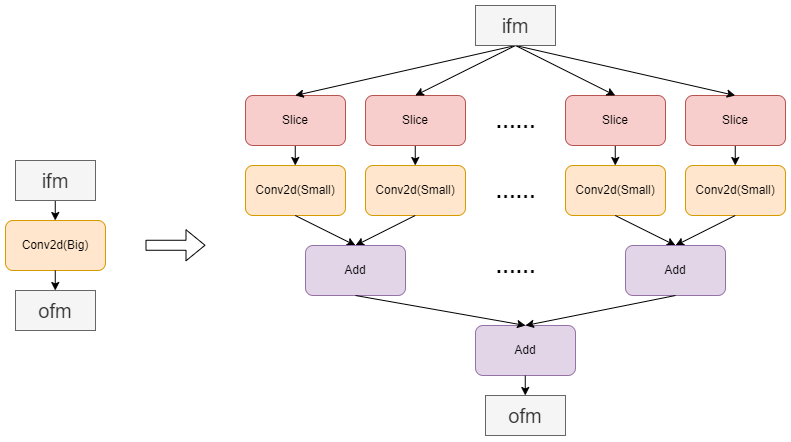

#### icraft.ConvertDivideScalar2MultiplyPass

##### 模型实例：

Detr

##### 功能描述：

将除常数算子转为乘法算子，通过乘除数的倒数实现。

##### 限制条件：

除算子的除数为常数。

##### 功能类型：

见表4-1

##### Pass关联性:

见表4-1

##### 结构变化：

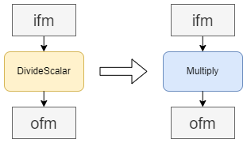

#### icraft.ConvertInnerProduct2Conv2dPass

##### 模型实例：

略

##### 功能描述：

将除常数算子转为乘法算子，通过乘除数的倒数实现。

##### 限制条件：

除算子的除数为常数。

##### 功能类型：

见表4-1

##### Pass关联性:

见表4-1

##### 结构变化：

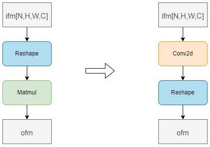

#### icraft.ConvertMultiplyAdd2BatchnormPass

##### 模型实例：

A2net

##### 功能描述：

将相连的乘-加结构转为一个batchnorm算子实现。

##### 限制条件：

乘和加算子的输入特征图（ifm）的维度为四维，且另一个输入为参数（weights）。

##### 功能类型：

见表4-1

##### Pass关联性:

见表4-1

##### 结构变化：


#### icraft.ConvertSlice2SplitPass

##### 模型实例：

nafnet16,shufflenetv2,……

##### 功能描述：

将连接在同一张ftmp上的两个slice转成一个split实现

##### 限制条件：

slice切分的维度需要是该ftmp的外围维度，如ftmp形状为[1,1,2,224,224,3]时，slice切分的维度只能是第三维或第六维

##### 功能类型：

见表4-1

##### Pass关联性:

见表4-1

##### 结构变化：

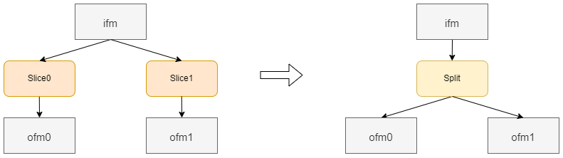

#### icraft.ConvertSqueeze2ReshapePass

##### 模型实例：

shufflenetv2,……

##### 功能描述：

将squeeze转为reshape实现

##### 限制条件：

略

##### 功能类型：

见表4-1

##### Pass关联性:

见表4-1

##### 结构变化：


#### icraft.ConvertUnstackPass

##### 模型实例：

##### 功能描述：

将unstack转为split + reshape实现

##### 限制条件：

略

##### 功能类型：

见表4-1

##### Pass关联性:

##### 结构变化：

Before:


After:

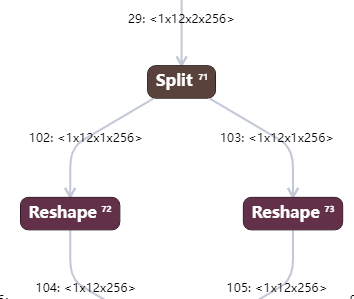

#### icraft.ConvertUpsampleBili2NearestPass

##### 模型实例：

略

##### 功能描述：

将原图尺寸为1\*1的双线性插值上采样转为最邻近插值实现，加快计算

##### 限制条件：

上采样算子的输入特征图尺寸为1\*1

##### 功能类型：

见表4-1

##### Pass关联性:

见表4-1

##### 结构变化：

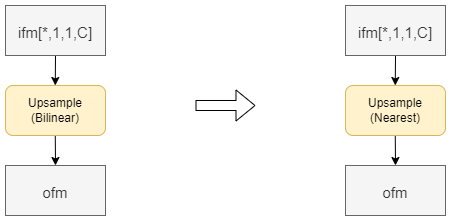

#### icraft.DemergeTransposePass

##### 模型实例：

略

##### 功能描述：

根据icraft后端的要求，将重排多个维度（多于2个）的transpose拆分为多个级联的仅重排两个维度的transpose，或重排通道维度时，重拍到通道的维度必须先移动到与通道维相邻的位置
，本pass仅在Optimizer循环结束后执行一次，且拆分条件与MergeMultipleTransposePass不重叠，因此两个pass不会发生冲突。

##### 限制条件：

transpose算子重拍的维度超过两个，或transpose到了通道维度，

##### 功能类型：

见表4-1

##### Pass关联性:

见表4-1

##### 结构变化：


#### icraft.MergeBatchnormConv2dPass

##### 模型实例：

略

##### 功能描述：

将批归一化在前，卷积在后的结构融合为一个卷积，由于卷积pad的存在，融合后的算子输出相比融合前的算子输出的图像边缘会有变化，在高精度场景下可关闭。

##### 限制条件：

batchnorm在前，conv2d在后，会有精度损失。

##### 功能类型：

见表4-1

##### Pass关联性:

见表4-1

##### 结构变化：


#### icraft.MergeConv2dBatchnormPass

##### 模型实例：

略

##### 功能描述：

将卷积在前，批归一化在后的结构融合为一个卷积，由于浮点参数的融合计算存在误差，融合后算子的输出相比融合前有很微小的差异，在高精度场景下可关闭。

##### 限制条件：

conv2d在前，batchnorm在后，会有细微的精度损失。

##### 功能类型：

见表4-1

##### Pass关联性:

见表4-1

##### 结构变化：

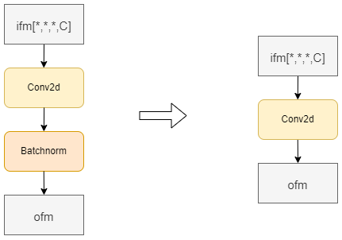

#### icraft.MergeBatchnormMatmulPass

##### 模型实例：

略

##### 功能描述：

将批归一化在前，矩阵乘在后的结构融合为一个矩阵乘，由于浮点参数的融合计算存在误差，融合后算子的输出相比融合前有很微小的差异，在高精度场景下可关闭。

##### 限制条件：

Batchnorm在前，Matmul在后；batchnorm的输入特征图形状为四维，会有细微的精度损失。

##### 功能类型：

见表4-1

##### Pass关联性:

见表4-1

##### 结构变化：

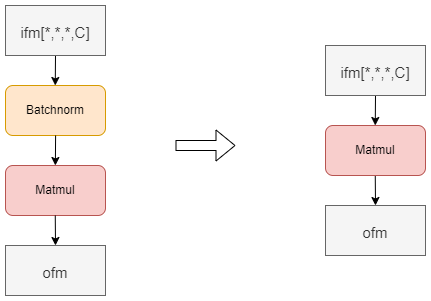

#### icraft.MergeMulConst2InnerProductPass

##### 模型实例：

略

##### 功能描述：

将乘算子在前，矩阵乘在后的结构融合为一个矩阵乘。

##### 限制条件：

乘算子的输入之一必须为参数（weights），矩阵乘的输入之一也须为参数（weights）

##### 功能类型：

见表4-1

##### Pass关联性:

见表4-1

##### 结构变化：

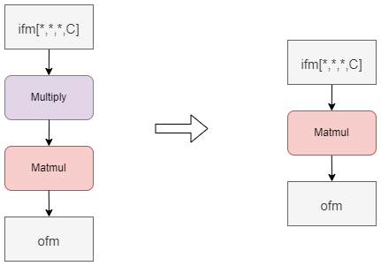

#### icraft.MergeMultipleConcatPass

##### 模型实例：

略

##### 功能描述：

将多个级联的concat合并为一个concat实现。

##### 限制条件：

级联内的concat的输出必须只连接在下一个concat上，每个concat拼接的维度必须一致

##### 功能类型：

见表4-1

##### Pass关联性:

见表4-1

##### 结构变化：

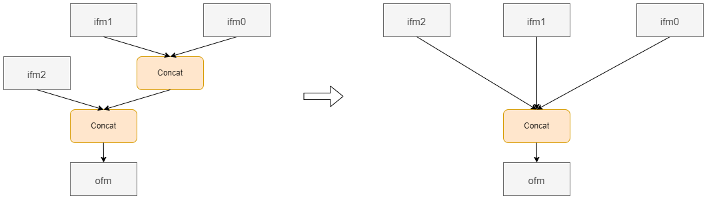

#### icraft.MergeMultipleReshapePass

##### 模型实例：

略

##### 功能描述：

将多个级联的reshape合并为一个reshape实现。

##### 限制条件：

级联内的reshape的输出必须只连接在下一个reshape上

##### 功能类型：

见表4-1

##### Pass关联性:

见表4-1

##### 结构变化：


#### icraft.MergeMultipleSlicePass

##### 模型实例：

略

##### 功能描述：

将多个级联的Slice合并为一个slice实现。

##### 限制条件：

级联内的slice的输出必须只连接在下一个slice上，每个slice仅切分一个维度且切分的维度一致

##### 功能类型：

见表4-1

##### Pass关联性:

见表4-1

##### 结构变化：

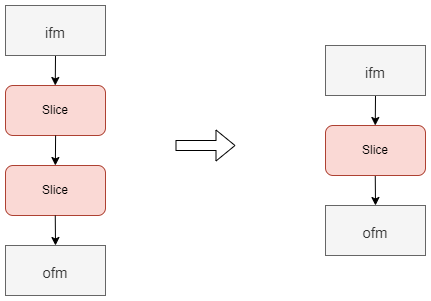

#### icraft.MergeMultipleTransposePass

##### 模型实例：

略

##### 功能描述：

对于多个相连的transpose，如果最后一个transpose的输出与第一个transpose的输入特征图完全一致，予以消除；如果最后一个transpose的输出与第一个transpose的输入特征图仅交换了两个相邻的维度，则合并为一个transpose

##### 限制条件：

合并后特征图维度交换要满足以下任意一个条件，才能合并：
合并后输入输出ftmp没有维度变化
合并后输出ftmp相比输入仅有两个维度交换，且都不在通道维度
合并后输出ftmp相比输入ftmp仅交换了通道维度和通道维度的相邻维度（-1和-2维）

##### 功能类型：

见表4-1

##### Pass关联性:

见表4-1

##### 结构变化：

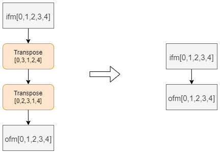
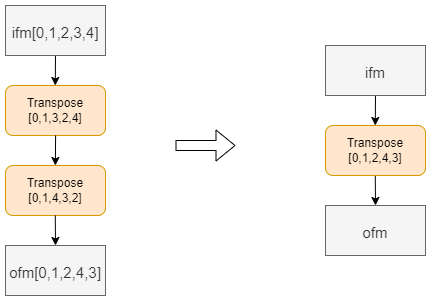

#### icraft.MergeMultipleTranspose1Pass

##### 模型实例：

略

##### 功能描述：

将与同一张特征图相连的，交换的维度也完全一致的多个并行的transpose合并到一个transpose内。

##### 限制条件：

各transpose的输入特征图相同，交换的维度也相同

##### 功能类型：

见表4-1

##### Pass关联性:

见表4-1

##### 结构变化：


#### icraft.MergeMultiply2Conv2dPass

##### 模型实例：

ResNet34\_C1\_Pad

##### 功能描述：

将连接在卷积后的乘法算子融合至卷积内

##### 限制条件：

乘法的输入之一为参数，且卷积的输出仅与乘算子相连

##### 功能类型：

见表4-1

##### Pass关联性:

见表4-1

##### 结构变化：


#### icraft.MergeTranspose2InnerProductPass

##### 模型实例：

略

##### 功能描述：

将transpose-reshape-matmul结构中，符合条件的transpose合并至matmul中。

##### 限制条件：

transpose算子的ifm经过transpose后，被transpose的维度在reshape算子中被合并到通道维度（ftmp的最后一维）。

##### 功能类型：

见表4-1

##### Pass关联性:

见表4-1

##### 结构变化：

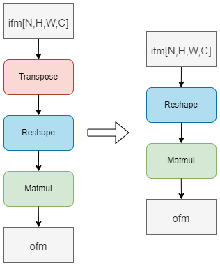

#### icraft.ModifyMatmulDimPass

##### 模型实例：

Superglue

##### 功能描述：

通过插入reshape算子调整矩阵乘算子的输入特征图的形状，以符合硬件对矩阵乘的定义。

##### 限制条件：

matmul的某个输入特征图形状不符合矩阵乘的定义

##### 功能类型：

见表4-1

##### Pass关联性:

见表4-1

##### 结构变化：

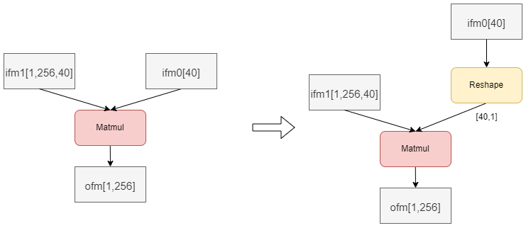

#### icraft.OpParamConstraintBYPass

##### 模型实例：

略

##### 功能描述：

根据后端情况划分模型内算子的编译后端，并对一些算子进行参数检查。

##### 限制条件：

略

##### 功能类型：

见表4-1

##### Pass关联性:

见表4-1

##### 结构变化：

略

#### icraft.OptimizeTransposeEfficiencyPass

##### 模型实例：

略

##### 功能描述：

根据后端特点调整Transpose算子的输入输出特征图形状，提高计算速度。

##### 限制条件：

ifm内transpose算子交换的维度后边的维度值为1，且后边的维度不参与重排。

##### 功能类型：

见表4-1

##### Pass关联性:

见表4-1

##### 结构变化：


#### icraft.RemoveUselessAvgpoolPass

##### 模型实例：

略

##### 功能描述：

删除无意义的avgpool算子

##### 限制条件：

avgpool的stride width = 1，stride height = 1，pool\_width = 1，pool\_height = 1

##### 功能类型：

见表4-1

##### Pass关联性:

见表4-1

##### 结构变化：

略

#### icraft.RemoveUselessMaxpoolPass

##### 模型实例：

略

##### 功能描述：

删除无意义的Maxpool算子

##### 限制条件：

Maxpool的stride width = 1，stride height = 1，pool\_width = 1，pool\_height = 1，dilation\_width = 1，dilation\_height = 1

##### 功能类型：

见表4-1

##### Pass关联性:

见表4-1

##### 结构变化：

略

#### icraft.RemoveUselessConcatPass

##### 模型实例：

略

##### 功能描述：

删除无意义的Concat算子

##### 限制条件：

concat算子的输入仅有一个，没有其他输入

##### 功能类型：

见表4-1

##### Pass关联性:

见表4-1

##### 结构变化：

略

#### icraft.RemoveUselessReshapePass

##### 模型实例：

略

##### 功能描述：

消除没有意义的输入输出完全一致的Reshape算子

##### 限制条件：

reshape算子的输入和输出特征图完全一致

##### 功能类型：

见表4-1

##### Pass关联性:

见表4-1

##### 结构变化：

略

#### icraft.RemoveUselessSlicePass

##### 模型实例：

略

##### 功能描述：

消除没有意义的输入输出完全一致的Slice算子

##### 限制条件：

slice算子的输入和输出特征图完全一致

##### 功能类型：

见表4-1

##### Pass关联性:

见表4-1

##### 结构变化：

略

#### icraft.RemoveUselessSplitPass

##### 模型实例：

略

##### 功能描述：

消除没有意义的输入输出完全一致的split算子

##### 限制条件：

split算子的输入和输出特征图完全一致

##### 功能类型：

见表4-1

##### Pass关联性:

见表4-1

##### 结构变化：

略

#### icraft.RemoveUselessTranspose1Pass

##### 模型实例：

略

##### 功能描述：

消除连接在Reshape算子的前面和后面，但是整个结构的输入和输出特征图的通道维度没有改变的两个Transpose。

##### 限制条件：

transpose-reshape-transpose结构的输入和输出特征图的通道维度没有改变

##### 功能类型：

见表4-1

##### Pass关联性:

见表4-1

##### 结构变化：


#### icraft.RemoveUselessTransposePass

##### 模型实例：

略

##### 功能描述：

使用Reshape替代执行效率低的Transpose，提高算子执行效率。

##### 限制条件：

transpose的ifm里被移动的维度是连续的。

##### 功能类型：

见表4-1

##### Pass关联性:

见表4-1

##### 结构变化：

略

#### icraft.ReplaceAvgpoolParamPass

##### 模型实例：

略

##### 功能描述：

Icraft后端仅支持count\_include\_pad参数为true，对于false的情况会替换为true，这种替换对精度会有影响，在高精度场景可关闭。

##### 限制条件：

avgpool算子的count\_include\_pad参数为true

##### 功能类型：

见表4-1

##### Pass关联性:

见表4-1

##### 结构变化：

略

#### icraft.TuningPadPass

##### 模型实例：

略

##### 功能描述：

根据卷积，avg\_pool2d。maxpool算子的pad参数和输入ftmp的值调整卷积的pad值，自动纠正卷积核内pad的设置错误。

##### 限制条件：

卷积，avg\_pool2d。maxpool的参数和ifm shape不满足以下条件：
ofm\_height = (ifm\_height + pad\_top + pad\_bottom - dilation\_height\*(kernel\_height - 1) - 1)/stride\_height + 1;
ofm\_width = (ifm\_width + pad\_left + pad\_right - dilation\_width\*(kernel\_width - 1) - 1)/stride\_width + 1;

##### 功能类型：

见表4-1

##### Pass关联性:

见表4-1

##### 结构变化：

略

#### icraft.TurnDimFreeOpLocationPass

##### 模型实例：

略

##### 功能描述：

优化速度,将layout不敏感的算子前的reshape/transpose移到后边，以消除这些transpose和reshape

##### 限制条件：

layout不敏感的算子，如激活类算子，乘，加算子

##### 功能类型：

见表4-1

##### Pass关联性:

见表4-1

##### 结构变化：

略

#### icraft.TurnOpOrderPass

##### 模型实例：

略

##### 功能描述：

优化内存占用，将网络内的加法树改为菊花链的结构。

##### 限制条件：

网络中存在加法树结构

##### 功能类型：

见表4-1

##### Pass关联性:

见表4-1

##### 结构变化：


#### icraft.SetNetworkOutputLayoutPass

##### 模型实例：

略

##### 功能描述：

用于配置网络输出ftmp的layout。该pass是为了解决版本间网络输出layout不兼容的问题而设计的，用户在部署网络过程中，如果对网络的输出layout有特定的要求，即可通过该pass进行配置。该pass接受用户的传参，参数以toml文件形式通过custom\_config来传参，接口参数：

##### 限制条件：

* index：不支持负数，且满足网络输出范围；
* format：用于配置指定输出的layout，要求满足layout的格式要求，且layout的维度数量必须与原layout维度数量一致。

##### 功能类型：

见表4-1

##### Pass关联性:

见表4-1

##### 结构变化：

无

#### icraft.SplitUpsamplePass

##### 模型实例：

略

##### 功能描述：

拆分上采样倍数过大是Upsample为多个级联的Upsample。

##### 限制条件：

1. Upsample的倍数W\_times或H\_times大于22
2. 拆分之后每一级的W\_times或H\_times都小于22
3. align corner为True时不存在误差，align corner为false时，在拼接的边界上会存在数值差异。

##### 功能类型：

见表4-1

##### Pass关联性:

见表4-1

##### 结构变化：

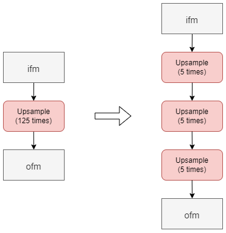

#### icraft.SplitLayernormPass

##### 模型实例：

略

##### 功能描述：

拆分layernorm为fpga后端的layernorm算子和multiply算子，add算子

##### 限制条件：

略

##### 功能类型：

见表4-1

##### Pass关联性:

见表4-1

##### 结构变化：


#### icraft.ExpandInputPass

##### 模型实例：

略

##### 功能描述：

根据乘，加，矩阵乘等算子的定义扩充输入特征图或输入参数的维度

##### 限制条件：

乘，加，矩阵乘等算子的两个输入特征图shape不匹配

##### 功能类型：

见表4-1

##### Pass关联性:

见表4-1

##### 结构变化：

略

#### icraft.SplitEinsumPass

##### 模型实例：

##### 功能描述：

将einsum根据equation的描述转换为reshape、transpose、matmul、multiply等算子

##### 限制条件：

暂不支持sum、dot、求迹、求对角元

##### 功能类型：

见表4-1

##### Pass关联性:

##### 结构变化：

Einsum算子的变换有多种形式，下面以matmul功能示意
Before:

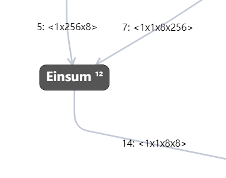

After:


#### icraft.SplitExpandPass

##### 模型实例：

略

##### 功能描述：

icraft Expand算子每次只能扩充一个维度，因此本pass将一次扩充多个维度的Expand拆分为每次扩充一个维度的多个级联的Expand算子

##### 限制条件：

Expand算子的ofm相比ifm扩充了多个维度

##### 功能类型：

见表4-1

##### Pass关联性:

见表4-1

##### 结构变化：

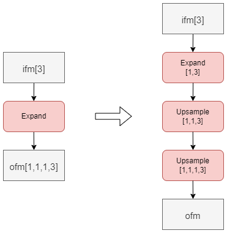

#### icraft.SplitStackPass

##### 模型实例：

##### 功能描述：

将stack转为reshape + concat实现

##### 限制条件：

略

##### 功能类型：

见表4-1

##### Pass关联性:

##### 结构变化：

Before:

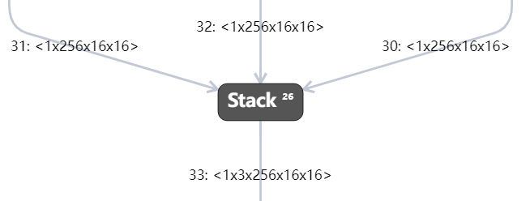

After:

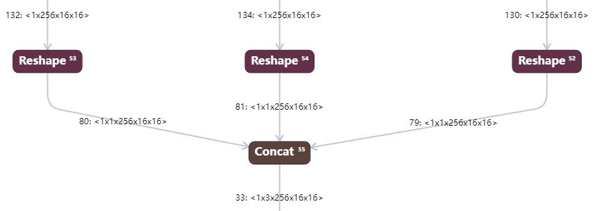

#### icraft.ConvertDimFreeOpLayoutPass

##### 模型实例：

略

##### 功能描述：

在add multiply concat前后插入transpose以构造可以消除的transpose

##### 限制条件：

add multiply concat与transpose相连，且transpose的输出仅连接到add multiply concat算子上，没有其他输出

##### 功能类型：

见表4-1

##### Pass关联性:

见表4-1

##### 结构变化：


#### icraft.TurnTransposeOrderPass

##### 模型实例：

略

##### 功能描述：

将add multiply concat之后的transpose向前移动，以与其之前的transpose合并

##### 限制条件：

transpose的输出连接且仅连接到add multiply concat上，在add，multiply和concat的输出连接在另一个transpose上。

##### 功能类型：

见表4-1

##### Pass关联性:

见表4-1

##### 结构变化：

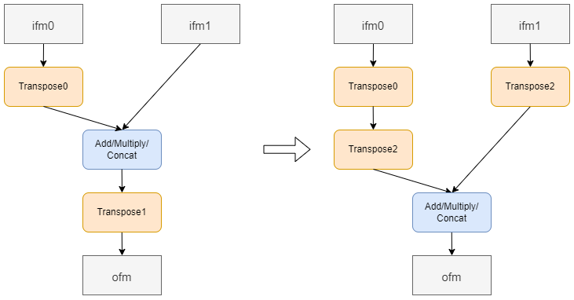

#### icraft.DetrMergeTransposePass

##### 模型实例：

Detr

##### 功能描述：

将transpose-reshape-transpose结构中的transpose全部消除

##### 限制条件：

1.reshape算子不修改通道维度
2.最后一个transpose的dim参数为[2,0,1]

##### 功能类型：

见表4-1

##### Pass关联性:

见表4-1

##### 结构变化：

略

#### icraft.ConvertChannelShuffle2Conv2dPass

##### 模型实例：

略

##### 功能描述：

将用小算子搭出来的channelshuffle结构转成一个卷积实现

##### 限制条件：

跟随网络mindspore-shufflenetv2，且结构必须符合示意图所示结构

##### 功能类型：

见表4-1

##### Pass关联性:

见表4-1

##### 结构变化：


#### icraft.AddCopy2noInsOpPass

##### 模型实例：

略

##### 功能描述：

根据后端设计，在无指令算子之间插入copy算子以适配硬件

##### 限制条件：

网络中存在两个相连的的无指令算子，如concat，split，reshpe。

##### 功能类型：

见表4-1

##### Pass关联性:

见表4-1

##### 结构变化：

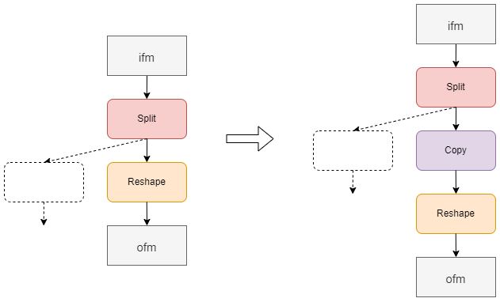

#### icraft.BuyiLayoutPass

##### 模型实例：

略

##### 功能描述：

将模型中的每个算子适配至Icraft后端。

##### 限制条件：

无，每个算子都要适配

##### 功能类型：

见表4-1

##### Pass关联性:

见表4-1

##### 结构变化：

略

#### icraft.ConvertSplit2SlicePass

##### 模型实例：

略

##### 功能描述：

将切分特征图内部维度的split算子用slice实现。

##### 限制条件：

拆分为slice的split切分的维度必须为内部维度，如[1,1,2,24,48,128],当split切分第四维[24],或第五维[48]时，就需要拆分为slice。

##### 功能类型：

见表4-1

##### Pass关联性:

见表4-1

##### 结构变化：

略

#### icraft.ConvertPixelShuffle2TransposePass

##### 模型实例：

略

##### 功能描述：

将pixelshuffle算子用transpose实现

##### 限制条件：

略

##### 功能类型：

见表4-1

##### Pass关联性:

见表4-1

##### 结构变化：

略

#### icraft.InputfoldPass

##### 模型实例：

detr

##### 功能描述：

该pass用于折叠网络的常量输入，精简网络的计算量。需要注意的是：

* 该pass默认不打开，用户需要通过pass\_on参数打开该pass；
* 该pass需要配置参数，用于指定哪些输入为常量和对应的常量输入。

##### 限制条件：

InputfoldPass的custom\_config文件的配置示例如下：

```
 [OtherOp]
 ……
 ……

[InputFold]
Meaningful_id = "0;1" #不希望被折叠的输入索引，以分号隔开
IfmsPath = "./0.png;./1.png;./2.png;./3.png" #网络的所有输入，以分号隔开；或配置成一个txt，其中包括网络的所有输入：IfmsPath = "./input.txt"

[OtherOp]
……
……
```

InputfoldPass的input.txt的配置示例如下：

#### icraft.SplitCompareSeqPass

##### 模型实例：

略

##### 功能描述：

拆分比较算子为Add + 比较算子（同0比较），以方便后端实现

##### 限制条件：

略

##### 功能类型：

见表4-1

##### Pass关联性:

见表4-1

##### 结构变化：

ifm -> compare(tensor) ->ofm >> ifm -> add -> compare(0) -> ofm

#### icraft.SplitConv3DSeqPass(icraft.ConvertNorm3d2Norm2dPass)

##### 模型实例：

略

##### 功能描述：

合并3d卷积算子和3dbatchnorm算子，拆分3dnorm算子为2dnorm算子，拆分3d卷积算子为多层级联的conv2d和Add

##### 限制条件：

略

##### 功能类型：

见表4-1

##### Pass关联性:

见表4-1

##### 结构变化：

略

#### icraft.ConvertPool3d2Pool2dPass, icraft.ConvertPad3d2Pad2dPass

##### 模型实例：

略

##### 功能描述：

拆分3D pool算子为多层级联的2d pool算子， 3D Pad算子同理。

##### 限制条件：

略

##### 功能类型：

见表4-1

##### Pass关联性:

见表4-1

##### 结构变化：

略

#### icraft.ConvertMean2AvgpoolPass

##### 模型实例：

略

##### 功能描述：

优化mean算子的执行方式，如果四维输入对h和w做计算，或者三维输入（NCD）对D做计算，均下降为avgpool；其余情况下降到transpose+matmul实现；提升性能。

##### 限制条件：

略

##### 功能类型：

见表4-1

##### Pass关联性:

见表4-1

##### 结构变化：

略

#### icraft.DeepOptimizeTransDataSeqPass

##### 模型实例：

略

##### 功能描述：

在optimizer阶段在网络中对包含transpose和reshape的片段进行仿真并比较结果，如果ifm和ofm相同则删除这些无用的transpose和reshape算子，或替换为一个reshape算子。

##### 限制条件：

略

##### 功能类型：

见表4-1

##### Pass关联性:

见表4-1

##### 结构变化：

略

#### icraft.yolotransfomer\_MergeMatmulDimPass

##### 模型实例：

略

##### 功能描述：

用于yolotransformer网络，增大该网络内的matmul的tile，提高其计算效率。

##### 限制条件：

略

##### 功能类型：

见表4-1

##### Pass关联性:

见表4-1

##### 结构变化：

略

#### icraft.MergePad2Conv2dPass

##### 模型实例：

略

##### 功能描述：

用于将conv2d前的pad合并到conv2d内，可以减少网络的算子数量，提升网络的计算速度。

##### 限制条件：

略

##### 功能类型：

见表4-1

##### Pass关联性:

见表4-1

##### 结构变化：

略

```
./0.png
./1.png
./2.png
./3.png
```

##### 功能类型：

见表4-1

##### Pass关联性:

见表4-1

##### 结构变化：

略
