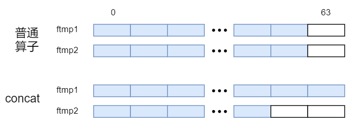
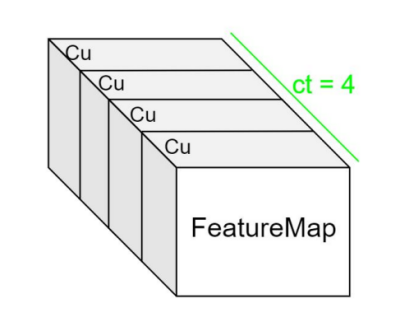

# Icraft CodeGen

## 一 整体介绍

### 1.1 简介

Icraft CodeGen(指令生成组件，以下简称CodeGen或指令生成)是Icraft中位于量化器和适配器后的后端组件，主要负责将量化且适配后的模型转化为能在硬件上运行的指令。

#### 1.1.1 Icraft编译流程中的CodeGen

Icraft编译器的编译流程包括：解析》优化》量化》适配》指令生成。指令生成作为编译的最后一环，其输入来自适配器的输出，其作用在于将网络模型按算子或结构映射为能在AI加速核上运行的指令模型。

#### 1.1.2 CodeGen的不同架构简介

当前Icraft CodeGen支持两个架构：布衣架构和诸葛架构。其具体说明如下：
其中诸葛架构详见 [诸葛架构](#zhuge-label)
其中布衣架构详见 [布衣架构](#buyi-label)

## 二 使用说明

### 2.1 安装与依赖

Icraft编译器由应用程序和对应的依赖库构成，以安装包的形式提供给用户。用户在使用Icraft编译器前，需要先安装编译器安装包、第三方依赖库以及一些常见的自定义硬算子demo。
安装上述Icraft后即可使用icraft-generate实现指令生成的调用。

### 2.2 参数配置

安装完成后如需单独通过CLI调用，则可按以下示例实现：

```
1C:/Icraft-CLI/bin/icraft-generate.exe --json "json&raw/resnet101_adapted.json" --raw "json&raw/resnet101_adapted.raw" --log_path "logs//generator/" --jr_path "json&raw/"
```

或者直接使用命令行调用：

```
1icraft generate --json "json&raw/resnet101_adapted.json" --raw "json&raw/resnet101_adapted.raw" --log_path "logs//generator/" --jr_path "json&raw/"
```

其中，详细的参数列表如下所示：

Table.指令生成参数列表[#](#id33 "此表格的永久链接")

| 参数名字 | 数据格式 | 说明 | zhuge | buyi |
| --- | --- | --- | --- | --- |
| json | string | 输入的中间层JSON文件(adapted阶段) | √ | √ |
| raw | string | 输入的中间层RAW文件(adapted阶段) | √ | √ |
| jr\_path | string | 输出的中间文件存放的路径 | √ | √ |
| log\_path | string（optional） | 表示log文件的存放路径，省略则为默认路径 | √ | √ |
| path | string（optional） | 表示路径，通常与network配合使用，表示网络路径 | √ | √ |
| network | string（optional） | 表示网络名称，通常与path配合使用，表示网络路径，json+raw、path+network的组合仅可存在一组 | √ | √ |
| ddr\_base | int（optional） | 表示预留的地址空间，默认预留64x64 bytes | x | √ |
| rows（optional） | int 1~4（optional） | 表示AI CORE采用的PE阵列数量（行），默认4 | x | √ |
| cols（optional） | int 1~4（optional） | 表示AI CORE采用的PE阵列数量（列），默认4 | x | √ |
| xlmopt | int（optional） | 表示对ifm的优化，默认3，最高级优化 | x | √ |
| klmopt | int（optional） | 表示对kernenl的优化，默认3，最高级优化 | x | √ |
| icropt | int（optional） | 表示对指令的优化，默认1，打开优化 | x | √ |
| ocmopt | int（optional） -1/0/1/2/3 | 表示选择ocm的优化方案，默认-1;-1表示遍历方案1和2选得分较高的方案；0表示关闭ocm优化；1表示选择方案1，2表示选择方案2，3表示选择方案3 | x | √ |
| etmopt | int（optional） -2/-1/0/1 | 表示选择etm的优化方案，默认为-1；-2表示只做回收浪费的内存;-1表示两种内存优化都做；0表示不做任何内存优化；1表示只做排序复用内存法 | x | √ |
| no\_mergeops | bool optional | 表示选择是否打开合并硬算子功能，默认打开；不配置该参数表示打开，配置该参数表示关闭 | x | √ |
| device\_info | string（optional） | 表示fpga硬算子所需的硬件信息，通常为一组寄存器信息 | x | √ |

**AI核数量的配置：**

上述配置列表中–cols，–rows共同决定了AI的MPE阵列的大小，即AI核中MAC的数量（cols\*rows）。根据1.3中\*Tile划分与MAC调度\*所介绍，将特征图进行划块后，可以根据划块的数量来配置MPE阵列的大小，对于划块数量较小的模型，可以适当减小MPE阵列，以在不影响效率的情况下减小功耗。

cols和rows分别为1~4的整数，可以进行任意组合，请结合模型情况和应用需求选取合适的大小进行配置。

**合并算子配置：**

连续在icore核上运行的算子可以进行合并，并通过指令中的握手逻辑进行数据握手，以便在模型运行阶段能减少与软件的交互，从而提高运行效率。在codegen中进行合并，并保证各子图间完全独立，不存在握手和状态的依赖，各子图内部按照规定逻辑进行握手。

**OCM分配方案配置：**

上述配置列表中–ocmopt表示OCM的分配方案配置。目前支持配置-1、0、1、2、3。

其中-1表示遍历1和2的分配方案并计算每种分配方案的得分，选取最高分作为最终的方案。

备注

得分最高只在一定程度上表示性能较高，并不能完全等效于性能最高。

备注

方案2对于算子数量较多的网络，其编译时间较长，因此我们建议当用户网络的算子个数大于500时，可以直接通过–ocmopt 1来选定优化方案1。编译时报出信息：”Please note: ops.size = {}, it is not suitable to use scheme 2 and is skipped. “

0表示不进行OCM分配，所有数据均不放在OCM上。

备注

目前有部分模型包含了超大global pool（pool\_h\*pool\_w>2048），由于CodeGen实现上的缺陷，需要关闭OCM的优化选项，强制需要配置–ocmopt为0。

1表示选择第一个OCM分配方案，详见地址分配中的 [全局评分法](#ocmopt-1-label)

2表示选择第二个OCM分配方案，详见地址分配中的 [局部最优动态规划法](#ocmopt-2-label)

3表示选择第三种OCM分配方案，详见地址分配中的 [顺序按评分踢出法](#ocmopt-3-label)

**ETM分配方案配置：**

上述配置列表中–etmopt表示ETM的分配方案配置。目前支持配置-2、-1、0、1。

-2表示只开启回收浪费的内存，详见地址分配中的 [回收浪费的内存](#etmopt-2-label)

-1表示所有的ETM内存优化都做，包括回收浪费的内存和复用内存。

备注

设置–etmopt = -1时虽然同时进行了回收浪费的内存和复用内存，但是效果可能与单独进行复用内存相同，因为通常网络中间层的算子的输入输出都会被回收并复用。

0表示不开启ETM优化。

1表示只开启复用内存优化，详见地址分配中的 [排序复用内存法](#etmopt-1-label)

**优化配置说明：**

当前布衣架构指令生成组件所支持的优化有以下几种：

Table.优化类型[#](#id34 "此表格的永久链接")

| 优化选项 | 优化力度 | 优化内容 | 说明 |
| --- | --- | --- | --- |
| ocmopt | -1 | 表示选择ocm的优化方案，默认-1;-1表示遍历方案1和2选得分较高的方案；0表示关闭ocm优化；1表示选择方案1，2表示选择方案2，3表示选择方案3 | Ocm=2MB，数据是否存放在ocm中，减小etm带宽压力 |
| xlmopt | >=2 | 通道折叠 | 当面较小，通道较大时，将通道折叠到面上，减少Tile数 |
|  | >=3 | 面上划Tile分配到多个MPE并行计算 | 避免只使用一个MPE计算，其他MPE空闲的情况 |
| klmopt | >=2 | 合并相同的读参数Task | 当相邻两个读参数Task满足跳转一致，地址连续则合并为一个读参数Tasktask |
| icropt | >=0 | 消除重复立即数指令 |  |
| etmopt | -1 | -1表示所有的ETM内存优化都做，包括回收浪费的内存和复用内存；0表示不开启ETM优化；1表示只开启复用内存优化；-2表示只开启回收浪费的内存 |  |
| no\_mergeops | false | 不配置该参数表示默认打开硬算子合并功能，配置–no\_mergeops表示关闭，默认打开 |  |

### 2.3 API调用

**诸葛架构：**

头文件：
icraft-code-zg/gen

```
1void icraft::cg::zg::MakeNetworkCodeGen(icraft::xir::Network network, icraft::cg::CodeGenOptions& options)
```

C++API示例：

```
 1using namespace icraft::xir;
 2
 3// 构造所需量化数据类型
 4TensorType GetFQuantizedTensorType(Array<int64_t> shape, Layout layout) {
 5     auto C = shape[layout.getIndexOf('C')];
 6     auto c = shape[layout.getIndexOf('c')];
 7     auto chann = c * C;
 8     auto normratio = Array<double>(chann, 1);
 9     auto scales = QuantizedScaleArray(chann, ExpQuantizedScale(1, 0, 1.f));
10     auto qt = NormalizedQuantizedType(normratio, scales, IntegerType::SInt8());
11     return TensorType(qt, std::move(shape), std::move(layout));
12}
13
14// 初始化target
15auto buyi = BuyiTarget::Init();
16      auto host = HostTarget::Init();
17
18//　定义网络的名称、前端框架和框架版本
19      auto network = Network("whatever", Framework::PYTORCH, "v1.9");
20
21// 构造网络的输入
22      auto input_type = TensorType(FloatType::FP32(), { 1, 416, 416, 32 }, Layout("NHWc32"));
23      auto input = Input(input_type);
24      network.addOp(input);
25
26// 添加Cast算子
27      auto target_type = TensorType(IntegerType::SInt8(), { 1, 1, 416, 416, 32 }, Layout("NCHWc32"));
28      auto cast = Cast(input[0], target_type);
29      auto cast_output_type = GetFQuantizedTensorType({ 1, 1, 416, 416, 32 }, Layout("NCHWc32"));
30      cast.inferResults({ cast_output_type });
31      network.addOp(cast);
32
33// 添加Cast算子
34      auto copy = Copy(cast[0]);
35      network.addOp(copy);
36      copy->inputs[0].tensorType().createAddMergedDistr({ 1,4 });
37      copy.setCompileTarget(buyi);
38
39// 添加Concat算子
40      auto concat = Concat({ cast[0],copy[0] }, 1);
41      auto concat_output_type = GetFQuantizedTensorType({ 1, 2, 416, 416, 32 }, Layout("NCHWc32"));
42      concat.inferResults({ concat_output_type });
43      network.addOp(concat);
44      concat.setCompileTarget(buyi);
45
46// 添加Slice算子
47      auto slice = Slice(concat[0], { 0,0,0,0,0 }, { 1,1,416,416,32 }, { 1,1,1,1,1 });
48      auto slice_output_type = GetFQuantizedTensorType({ 1, 1, 416, 416, 32 }, Layout("NCHWc32"));
49      slice.inferResults({ slice_output_type });
50      network.addOp(slice);
51      slice->inputs[0].tensorType().createAddMergedDistr({ 1,4 });
52      slice.setCompileTarget(buyi);
53
54// 添加Reshape算子
55      auto reshape = Reshape(slice[0], { 1,416,416,32 }, Layout("CHWc32"));
56      auto reshape_output_type = GetFQuantizedTensorType({ 1,416,416,32 }, Layout("CHWc32"));
57      reshape.inferResults({ reshape_output_type });
58      network.addOp(reshape);
59      reshape->inputs[0].tensorType().createAddMergedDistr({ 1,4 });
60      reshape.setCompileTarget(buyi);
61
62// 添加第二个Cast算子
63      auto target_type1 = TensorType(FloatType::FP32(), { 1, 208, 208, 32 }, Layout("NHWc32"));
64      auto cast1 = Cast(reshape[0], target_type1);
65      network.addOp(cast1);
66
67//构造输出
68      auto output = Output(cast1[0]);
69      network.addOp(output);
70
71//构造指令生成的配置结构体
72      CodeGenOptions options(network->name, "./log/whatever/");
73
74//调用指令生成API生成指令网络
75MakeNetworkCodeGen(network, options);
76
77      std::cout << std::setw(4) << network << std::endl;
78      if (!std::filesystem::exists(JR)) {
79             std::filesystem::create_directories(JR);
80      }
81//dump出指令网络
82      network.dumpJsonToFile(JR + network->name + BY + JSON_SUFFIX);
83      network.dumpParamsToFile(JR + network->name + BY + PARAMS_SUFFIX);
```

pythonAPI示例：

**布衣架构：**

头文件：
icraft-code-by/gen

```
1void icraft::cg::by::MakeNetworkCodeGen(icraft::xir::Network network,icraft::cg::CodeGenOptions& options)
```

C++API示例：

```
 1using namespace icraft::xir;
 2
 3// 构造所需量化数据类型
 4TensorType GetFQuantizedTensorType(Array<int64_t> shape, Layout layout) {
 5     auto C = shape[layout.getIndexOf('C')];
 6     auto c = shape[layout.getIndexOf('c')];
 7     auto chann = c * C;
 8     auto normratio = Array<double>(chann, 1);
 9     auto scales = QuantizedScaleArray(chann, ExpQuantizedScale(1, 0, 1.f));
10     auto qt = NormalizedQuantizedType(normratio, scales, IntegerType::SInt8());
11     return TensorType(qt, std::move(shape), std::move(layout));
12}
13
14// 初始化target
15auto buyi = BuyiTarget::Init();
16      auto host = HostTarget::Init();
17
18//　定义网络的名称、前端框架和框架版本
19      auto network = Network("whatever", Framework::PYTORCH, "v1.9");
20
21// 构造网络的输入
22      auto input_type = TensorType(FloatType::FP32(), { 1, 416, 416, 32 }, Layout("NHWc32"));
23      auto input = Input(input_type);
24      network.addOp(input);
25
26// 添加Cast算子
27      auto target_type = TensorType(IntegerType::SInt8(), { 1, 1, 416, 416, 32 }, Layout("NCHWc32"));
28      auto cast = Cast(input[0], target_type);
29      auto cast_output_type = GetFQuantizedTensorType({ 1, 1, 416, 416, 32 }, Layout("NCHWc32"));
30      cast.inferResults({ cast_output_type });
31      network.addOp(cast);
32
33// 添加Cast算子
34      auto copy = Copy(cast[0]);
35      network.addOp(copy);
36      copy->inputs[0].tensorType().createAddMergedDistr({ 1,4 });
37      copy.setCompileTarget(buyi);
38
39// 添加Concat算子
40      auto concat = Concat({ cast[0],copy[0] }, 1);
41      auto concat_output_type = GetFQuantizedTensorType({ 1, 2, 416, 416, 32 }, Layout("NCHWc32"));
42      concat.inferResults({ concat_output_type });
43      network.addOp(concat);
44      concat.setCompileTarget(buyi);
45
46// 添加Slice算子
47      auto slice = Slice(concat[0], { 0,0,0,0,0 }, { 1,1,416,416,32 }, { 1,1,1,1,1 });
48      auto slice_output_type = GetFQuantizedTensorType({ 1, 1, 416, 416, 32 }, Layout("NCHWc32"));
49      slice.inferResults({ slice_output_type });
50      network.addOp(slice);
51      slice->inputs[0].tensorType().createAddMergedDistr({ 1,4 });
52      slice.setCompileTarget(buyi);
53
54// 添加Reshape算子
55      auto reshape = Reshape(slice[0], { 1,416,416,32 }, Layout("CHWc32"));
56      auto reshape_output_type = GetFQuantizedTensorType({ 1,416,416,32 }, Layout("CHWc32"));
57      reshape.inferResults({ reshape_output_type });
58      network.addOp(reshape);
59      reshape->inputs[0].tensorType().createAddMergedDistr({ 1,4 });
60      reshape.setCompileTarget(buyi);
61
62// 添加第二个Cast算子
63      auto target_type1 = TensorType(FloatType::FP32(), { 1, 208, 208, 32 }, Layout("NHWc32"));
64      auto cast1 = Cast(reshape[0], target_type1);
65      network.addOp(cast1);
66
67//构造输出
68      auto output = Output(cast1[0]);
69      network.addOp(output);
70
71//构造指令生成的配置结构体
72      CodeGenOptions options(network->name, "./log/whatever/");
73
74//调用指令生成API生成指令网络
75MakeNetworkCodeGen(network, options);
76
77      std::cout << std::setw(4) << network << std::endl;
78      if (!std::filesystem::exists(JR)) {
79             std::filesystem::create_directories(JR);
80      }
81//dump出指令网络
82      network.dumpJsonToFile(JR + network->name + BY + JSON_SUFFIX);
83      network.dumpParamsToFile(JR + network->name + BY + PARAMS_SUFFIX);
```

pythonAPI示例：

## 三 不同架构介绍

### 3.1 诸葛架构

#### 3.1.1 组件架构

CodeGen组件结构上包括三个动态库及一个可执行程序：

**icraft\_code\_gen\_zg.dll：**

网络模型下降到AI核的计算（AI硬算子，以下简称HardOp）harop的匹配，以及HardOp到操作任务（以下简称task）的映射；

**icraft\_code\_gen\_tune\_zg.dll：**

算子计算过程的循环变换方案；

**icraft\_code\_gen\_sim\_zg.dll：**

算子单元测试所需的仿真函数；

**icraft-generate.exe：**

解析参数接口和调用以network为参数的主函数的顶层。

由于codegen需要完成算子到task序列再到inst序列及指令码的转换，因此该组件需要调用fireby组件的动态库以完成task序列到指令的转换以及指令到指令码的转换，
为了实现单元测试，该组件还需要调用fireby-sim以实现指令前向，以及torch动态库以获取golden。

其中各功能之间的映射关系请参见 [算子映射](#my-target-label)。

#### 3.1.2 功能概要

CodeGen组件包含以下几个比较重要的功能点：

**算子映射：**

算子映射依次进行将量化适配后模型的XIR算子序列映射为HardOp序列，再将HardOp序列映射为表征任务的Task序列，最后将Task序列映射为表征硬件操作的指令序列（以下简称Inst）及指令码，各阶段序列的映射关系请参见 [算子映射](#my-target-label)。

**循环变换：**

对于每个HardOp，为了能映射到硬件计算单元上进行操作，需要对数据进行切块，由于多个硬件单元具有并行性，因此如何切块并充分部署到多个计算单元上进行高效计算是提升性能的关键。
codegen提供了用于auto-tuning的接口，并利用笛卡尔积将tuning的结果映射到循环变换中。（当前暂时未支持auto-tuning，因此选用了固定的策略进行循环，后续将考虑auto-tuning）

由于硬件计算过程中需要缓存部分数据以提高计算效率，因此通常会将特征图按硬件的缓存大小进行划分，本文档将划分后的特征图块称为一个Tile。硬件的计算以Tile为单位。

特征图在通道上按照固定长度为单位（诸葛架构中支持通道长度单位为1~16（BF16、TF32），1~32（INT8），以下简称Cu）,将输入输出按照Cu进行Tile划分，如下图所示：


特征图在面上按照缓存大小进行划分，分块进行计算，如下图所示：


上述两个图表明了Icraft对特征图的划块方式（以下简称Tile划分），在AI核上的计算是以Tile为单位进行的，可以根据调度的不同，对不同的Tile进行并行或串行的计算。

**chunk分配：**

CodeGen组件根据需求对网络模型中的参数、输入输出进行chunk\_id和offset的分配，为运行时的地址分配提供基础。
分配规则为：内存中同一片地址空间的chunk\_id相同，地址空间内使用offset进行地址区分。
例如：无指令算子的输入输出拥有相同的chunk\_id，多数入或多输出拥有相同的chunk\_id，且不同输入或输出用offset进行地址偏移。
真实地址分配将在运行时中进行。

**多种数据类型的支持：**

目前codegen支持INT8/BF16/TF32三种不同的数据类型，不同的数据类型在计算过程中会有若干区别，导致不同的数据类型对算子的支持情况有所不同，请参见 [算子支持](#my-op-label1)。

#### 3.1.3 算子支持情况

Table.算子支持情况[#](#id35 "此表格的永久链接")

| 算子类型 | 约束对象 | INT8约束说明 | BF16约束说明 | TF32约束说明 | 备注 |
| --- | --- | --- | --- | --- | --- |
| Act | 输入输出形式 | 一个ftmp输入，一个ftmp输出 | 同INT8 | 同INT8 | 激活算子，使用分段线性拟合实现 |
|  | 形状限制 | 输入输出形状一致 | 同INT8 | 同INT8 |  |
|  | layout限制 | 硬件排布 | 无 | 无 | INT8需要反量化，ct位置将会影响效率，建议ct远离cu |
|  | 参数限制 | 无 | 无 | 无 | 带参数的激活需要在codegen内部实现分段线性拟合，不能使用预制参数 |
| Add | 输入输出形式 | 支持两个ftmp相加，或ftmp与常数tensor相加，或常数与ftmp相加，一个ftmp输出 | 两个输入Tensor满足Numpy广播语义即可 | 同INT8 | 元素加算子，可广播 |
|  | 形状限制 | 两个输入维度数相同，支持两个相同形状的tensor相加，或一个tensor与vector相加，且要求通道维度相等（Cc） | 同INT8 | 同INT8 |  |
|  | layout限制 | 硬件排布 | 两个输入Tensor形状相同时，支持高效实现layout不敏感 | 支持高效实现layout不敏感 | INT8需要反量化，ct位置将会影响效率，建议ct远离cu，BF16与TF32对layout不敏感 |
|  | alpha、beta | 包含了量化系数，alpha=alpha\_float\*Sx/Sz，beta=beta\_float\*Sy/Sz | 无 | 无 |  |
| AlignAxis | 输入输出形式 | 单输入，单输出 | 同INT8 | 同INT8 | 补0算子，用于补齐通道，内部使用pad实现 |
|  | 形状限制 | 无 | 无 | 无 |  |
|  | layout限制 | 无 | 无 | 无 | 无需反量化 |
|  | aligned\_units | 只支持对一个维度补0 | 同INT8 | 同INT8 |  |
| Argmax | 输入输出形式 | 暂不支持 | 暂不支持 | 单输入，单输出 | 由于输出为index，因此目前只支持TF32，由量化组件保证该算子被量化为TF32 |
|  | 形状限制 | 暂不支持 | 暂不支持 | 无 |  |
|  | layout限制 | 暂不支持 | 暂不支持 | 无 |  |
|  | dims | 暂不支持 | 暂不支持 | 最多只能进行2048个数据的argmax |  |
| BatchNorm2d | 输入输出形式 | 单输入，单输出 | 同INT8 | 同INT8 |  |
|  | 形状限制 | 无 | 无 | 无 |  |
|  | layout限制 | 硬件排布 | 无 | 无 | CNN算子，layout通常为CNN对应的NCHWc |
|  | variance，mean | 被量化为tf32类型 | 同INT8 | 同INT8 | 作为立即数被存在指令中 |
| Cast | 输入输出形式 | 单输入，单输出 | 同INT8 | 同INT8 | 支持uint8->int8,uint8->bf16,uint8->tf32,bf16<->tf32,int8<->bf16,int8<->tf32,fp32<->tf32(无指令) |
|  | 形状限制 | 无 | 无 | 无 |  |
|  | layout限制 | 硬件排布 | 无 | 无 | 涉及INT8需要反量化，ct位置将会影响效率，建议ct远离cu；涉及TF32的cu小于等于8，涉及BF16的cu小于等于16 |
| ClampScalar | 输入输出形式 | 单输入，单输出 | 同INT8 | 同INT8 |  |
|  | 形状限制 | 无 | 无 | 无 |  |
|  | layout限制 | 无 | 无 | 无 | INT8无需反量化，因此对layout无要求 |
|  | max,min | 无 | 无 | 无 | 量化为TF32，作为分段线性拟合的钳位 |
| Concat | 输入输出形式 | 多输入，单输出 | 多输入，单输出，每个输入既可以是ftmp也可以是常数tensor，最多支持16个输入Tensor | 同INT8 | 其中输入可以为任意多个ftmp，或任意多个常数tensor（至少需要一个ftmp输入） |
|  | 形状限制 | 多个输入维度数相同，多个输入除了拼接维度可以不相等，其余维度必须相等 | 同INT8 | 同INT8 |  |
|  | layout限制 | 无 | 无 | 无 | INT8无需反量化，因此对layout无要求 |
| Conv2d | 输入输出形式 | 一个ftmp输入，一个或两个参数params输入，weights，bias可选，一个ftmp输出 | 同INT8 | 同INT8 | 暂不支持weights为ftmp的情况 |
|  | 形状限制 | 第一个输入和输出ftmp为5维，第二个输入为6维 | 同INT8 | 同INT8 |  |
|  | layout限制 | 第一个输入维度为NCHWc，第二个输入维度为OIHwoi，第三个输入（若有）维度为Oo | 同INT8 | 同INT8 | CNN算子 |
|  | group | groups=1：普通卷积；groups=输入通道=输出通道：深度可分离卷积；else：分组卷积 | 同INT8 | 同INT8 | 必须满足框架要求，不能随意设置为不能整除的情况 |
|  | padding\_mode | 只支持ZEROS | 同INT8 | 同INT8 |  |
|  | stride\_width、stride\_height | 无 | 无 | 同INT8 | 未整除部分直接舍弃 |
|  | 其余参数限制 | 无 | 无 | 无 |  |
| ConvTranspose2d | 输入输出形式 | 一个ftmp输入，一个或两个参数params输入，weights，bias可选，一个ftmp输出 | 同INT8 | 同INT8 | 暂不支持weights为ftmp的情况 |
|  | 形状限制 | 第一个输入和输出ftmp为5维，第二个输入为6维 | 同INT8 | 同INT8 |  |
|  | layout限制 | 第一个输入维度为NCHWc，第二个输入维度为OIHWoi，第三个输入（若有）维度为Oo | 同INT8 | 同INT8 | CNN算子 |
|  | group | groups=1：普通反卷积；else：分组反卷积 | 同INT8 | 同INT8 | 必须满足框架要求，不能随意设置为不能整除的情况 |
|  | stride\_width、stride\_height | 无 | 无 | 无 | 表示input\_ftmp面上各元素中间插入的0 |
|  | 其余参数限制 | 无 | 无 | 无 | kernel > 2048？ |
| Copy | 输入输出形式 | 单输入，单输出 | 同INT8 | 同INT8 | 支持输入为ftmp或常数tensor（params） |
|  | 形状限制 | 无 | 无 | 无 |  |
|  | layout限制 | 无 | 无 | 无 |  |
| Expand | 输入输出形式 | 单输入，单输出 | 同INT8 | 同INT8 | 可同时广播多个维度 |
|  | 形状限制 | 无 | 无 | 无 | 被广播的维度需要为1 |
|  | layout限制 | 无 | 无 | 无 |  |
|  | 参数限制 | 无 | 无 | 无 |  |
| InstanceNorm2D | 输入输出形式 | 单输入，单输出 | 单输入，单输出 | 单输入，单输出 |  |
|  | 形状限制 | 输入支持5维 | 输入支持5维 | 输入支持5维 | CNN算子 |
|  | layout限制 | NCHWc | NCHWc | NCHWc | CNN算子 |
|  | gamma，beta、eps | 被量化为tf32类型 | 被量化为tf32类型 | 被量化为tf32类型 | 作为立即数被存在指令中 |
| LayerNorm | 输入输出形式 | 单输入，单输出 | 同INT8 | 同INT8 |  |
|  | 形状限制 | 仅支持3维输入 | 同INT8 | 同INT8 |  |
|  | layout限制 | C\*c或N\*n | 同INT8 | 同INT8 | 需要做layernorm的维度需要调整到倒数第二维\*，若有多个维度同时做需要合并到倒数第二维，且不做layernorm的维度需要合并到第一维上C或N |
|  | gamma，beta | 量化到INT8 | 量化到BF16 | 量化到TF32 | 作为params |
| Log | 输入输出形式 | 单输入，单输出 | 同INT8 | 同INT8 |  |
|  | 形状限制 | 无 | 无 | 无 |  |
|  | layout限制 | 硬件排布 | 无 | 无 | INT8需要反量化，ct位置将会影响效率，建议ct远离cu，且由于int8反量化回bf16进行计算，中间会涉及到将一个16bit数据拆分成2个8bit数据的过程，因此需要adapter保证该算子int8的cu<=16 |
|  | 参数限制 | 无 | 无 | 无 |  |
| LogSoftmax | 输入输出形式 | 单输入，单输出 | 同INT8 | 同INT8 |  |
|  | 形状限制 | 3维 | 同INT8 | 同INT8 |  |
|  | layout限制 | C\*c或N\*n | 同INT8 | 同INT8 | INT8需要反量化，ct位置将会影响效率，建议ct远离cu，且由于int8反量化回bf16进行计算，中间会涉及到将一个16bit数据拆分成2个8bit数据的过程，因此需要adapter保证该算子int8的cu<=16 |
|  | 参数限制 | 无 | 无 | 无 |  |
| Matmul | 输入输出形式 | 支持两个ftmp做矩阵乘，或ftmp与常数tensor做矩阵乘，或常数与ftmp做矩阵乘。一个ftmp输出 | 同INT8 | 同INT8 |  |
|  | 形状限制 | 第二个输入比第一个输入多一维，第一个输入至少为3维 | 同INT8 | 同INT8 | 对第一个输入的最后三维做计算，其余维度为循环,两个输入的维度数量相同 |
|  | layout限制 | 第一个输入的最后三维为C\*c，第二个输入的最后四维为OIoi | 同INT8 | 同INT8 |  |
|  | bias可选 | 量化到TF32 | 同INT8 | 同INT8 |  |
| Mean | 输入输出形式 | 单输入，单输出 | 同INT8 | 同INT8 |  |
|  | 形状限制 | 无 | 无 | 无 |  |
|  | layout限制 | 硬件排布 | 无 | 无 |  |
|  | dim | 暂不支持对通道维度求mean | 无 | 无 | 可支持多个维度求mean;当需要对通道做mean，需要adapter在mean前加transpose将通道维度与不做mean的维度做交换，以提高并行度，从而提高性能，当对所有维度求mean时，由adapter转为matmul，方案详见adapter\_docs |
| Multiply | 输入输出形式 | 支持两个ftmp相乘，或ftmp与常数tensor相乘，或常数与ftmp相乘，一个ftmp输出 | 两个输入Tensor满足Numpy广播语义即可 | 同INT8 | 元素乘算子，可广播 |
|  | 形状限制 | 两个输入维度数相同，支持两个相同形状的tensor相乘，或一个tensor与vector相乘，且要求通道维度相等（Cc） | 同INT8 | 同INT8 |  |
|  | layout限制 | 硬件排布 | 支持高效实现layout不敏感 | 支持高效实现layout不敏感 | INT8需要反量化，ct位置将会影响效率，建议ct远离cu，BF16与TF32对layout不敏感 |
|  | 参数限制 | 无 | 无 | 无 |  |
| Normalize | 输入输出形式 | 单输入，单输出 | 同INT8 | 同INT8 |  |
|  | 形状限制 | 无 | 无 | 无 |  |
|  | layout限制 | 硬件排布 | 无 | 无 |  |
|  | axis | 不能对为1的维度做normalize，可对多个维度求normalize，且不能对通道做normalize | 不能对为1的维度做normalize，可对多个维度求normalize | 同BF16 |  |
|  | p | 同BF16 | 暂时只支持p=1,p=2 | 同BF16 | 范数 |
| Pad | 输入输出形式 | 单输入，单输出 | 同INT8 | 同INT8 |  |
|  | 形状限制 | 无 | 无 | 无 |  |
|  | layout限制 | 无 | 无 | 无 | INT8无需反量化 |
|  | mode | 只支持CONSTANT | 同INT8 | 同INT8 |  |
|  | value | 目前只支持0 | 同INT8 | 同INT8 |  |
| AvgPool2d/MaxPool2d | 输入输出形式 | 单输入，单输出 | 同INT8 | 同INT8 |  |
|  | 形状限制 | 5维 | 同INT8 | 同INT8 |  |
|  | layout限制 | NCHWc | 同INT8 | 同INT8 |  |
|  | stride\_width、stride\_height | 无 | 同INT8 | 同INT8 | 未整除部分直接舍弃 |
|  | pool,pad,dilation | 无 | 无 | 无 |  |
|  | divisor\_override(AvgPool2d) | 暂不支持负数情况 | 同INT8 | 同INT8 |  |
| PruneAxis | 输入输出形式 | 单输入，单输出 | 同INT8 | 同INT8 | 去无效数据，内部用slice实现 |
|  | 形状限制 | 无 | 无 | 无 |  |
|  | layout限制 | 无 | 无 | 无 | INT8无需反量化 |
|  | index，merged\_axis | 只支持对一个维度去无效数据 | 同INT8 | 同INT8 |  |
| Reshape | 输入输出形式 | 单输入，单输出 | 同INT8 | 同INT8 | 无指令 |
|  | 形状限制 | 无 | 无 | 无 |  |
|  | layout限制 | 无 | 无 | 无 | 转化前后ftmp在硬件上的排布不变 |
| Roll | 输入输出形式 | 单输入，单输出 | 同INT8 | 同INT8 |  |
|  | 形状限制 | 无 | 无 | 无 |  |
|  | layout限制 | 无 | 无 | 无 | INT8无需反量化 |
|  | shift,dims | 无 | 无 | 无 |  |
| Slice | 输入输出形式 | 单输入，单输出 | 同INT8 | 同INT8 |  |
|  | 形状限制 | 无 | 无 | 无 |  |
|  | layout限制 | 无 | 无 | 无 | INT8无需反量化 |
|  | begin,end,stride | 无 | 无 | 无 | 没有限制，包括对通道也无限制 |
| Softmax | 输入输出形式 | 单输入，单输出 | 同INT8 | 同INT8 |  |
|  | 形状限制 | 仅支持3维输入 | 同INT8 | 同INT8 |  |
|  | layout限制 | C\*c或N\*n | 同INT8 | 同INT8 | 仅支持无效通道在最后且无效通道小于cu的情况，请在adapter中保证 |
|  | axis | 无 | 无 | 无 |  |
|  | 量化系数 | 暂只支持按层量化 | 无 | 无 |  |
| Split | 输入输出形式 | 单输入，多输出 | 同INT8 | 同INT8 |  |
|  | 形状限制 | 无 | 无 | 无 |  |
|  | layout限制 | 无 | 无 | 无 |  |
|  | sections | 满足各section的和等于被拆分的维度大小即可 | 同INT8 | 同INT8 |  |
| Sum | 输入输出形式 | 单输入，单输出 | 同INT8 | 同INT8 |  |
|  | 形状限制 | 无 | 无 | 无 |  |
|  | layout限制 | 硬件排布 | 无 | 无 |  |
|  | dim | 暂不支持对通道维度求sum | 无 | 无 | 可支持多个维度求sum;当需要对通道做sum，需要adapter在sum前加transpose将通道维度与不做sum的维度做交换，以提高并行度，从而提高性能，，当对所有维度求sum时，由adapter转为matmul，方案详见adapter\_docs |
| SwapOrder | 输入输出形式 | 单输入，单输出 | 同INT8 | 同INT8 |  |
|  | 形状限制 | 无 | 无 | 无 |  |
|  | layout限制 | 无 | 无 | 无 |  |
|  | order,axis | 无 | 无 | 无 |  |
| Transpose | 输入输出形式 | 单输入，单输出 | 同INT8 | 同INT8 | 不涉及通道时，支持多个维度交换 |
|  | 形状限制 | 无 | 无 | 无 |  |
|  | layout限制 | 当交换最后两个维度时，输入的最后三维分别为C\*c，或CWc | 同INT8 | 同INT8 |  |
|  | dims | 涉及通道时，只支持交换最后两维，其余情况各维度任意多个均支持 | 同INT8 | 同INT8 |  |
| Upsample | 输入输出形式 | 单输入，单输出 | 同INT8 | 同INT8 |  |
|  | 形状限制 | 输入输出均为5维 | 同INT8 | 同INT8 |  |
|  | layout限制 | 输入输出均为NCHWc | 同INT8 | 同INT8 |  |
|  | interpolation | 目前只支持NEAREST、BILINEAR | 同INT8 | 同INT8 |  |
|  | height、width | BILINEAR可支持非整数倍的上下采样，最大上采用倍数为wup\_times \* hup\_times <= 512 | 同INT8 | 同INT8 |  |
|  | align\_corners | 无 | 无 | 无 |  |

备注

对于硬件排布，暂时规定adapter将TF32的cu设置为小于等于8，将BF16的cu设置为小于等于16，将INT8的cu设置为小于等于32。但是对于log和logsoftmax等特殊算子INT8的cu也只能设置为小于等于16。

备注

上述所提硬件排布，是指在adapter阶段将算子的通道根据硬件计算单元的位宽切分为多个通道单元cu，数量为ct，因此通道为ct\*cu，其中会将最后不足cu的补齐。

#### 3.1.4 错误码说明

暂无

### 3.2 布衣架构

#### 3.2.1 组件架构

CodeGen组件结构上包括三个动态库：icraft\_buyi\_codegen.dll、icraft\_buyi\_taskgen.dll、icraft\_buyi\_instgen.dll，分别是算子级的codegen，任务级的taskgen以及指令级的instgen，共三级逻辑。其中codegen用于实现各nn算子的操作，包括算子合并和替换、地址分配等，taskgen用于将合并后算子转换为Task序列，instgen则是根据Task序列，生成对应的指令序列。其中各功能之间的映射关系请参见 [算子映射](#my-target-label)。

#### 3.2.2 功能概要

CodeGen组件包含以下几个比较重要的功能点：

**算子映射：**

算子映射依次进行将量化适配后模型的XIR算子序列映射为AI核对应的计算（AI硬算子，以下简称HardOp）序列，再将HardOp序列映射为表征任务的任务（以下简称Task）序列，最后将Task序列映射为表征硬件操作的指令序列（以下简称Inst），各阶段序列的映射关系请参见 [算子映射](#my-target-label)。

**地址分配：**

CodeGen组件根据需求对网络模型中的参数、输入输出进行地址分配。其中模型参数按顺序依次存放在外部存储（External Memory，以下简称ETM）中，输入输出特征图紧随其后依次存放。由于ETM存储AI核的通信带宽受限，为了提高效率，CodeGen组件将部分满足条件的输入输出特征图存放在片上存储（On-Chip Memory，以下简称OCM）中，从而减小读写ETM的带宽压力，提高模型在硬件上的运行效率。

备注

由于硬件的限制，需要在开头预留64个ETM（此处为DDR）地址。

地址分配以byte为单位，json文件中的地址也为byte地址。因此对于存放格式有一定的要求：每个算子的参数以及输入输出特征图需要以ETM（64bytes）第一个byte作为起始地址，即对齐64byte地址。每个算子的指令按ETM（64bytes）第一个byte作为起始地址，且用空指令补齐64bytes。

备注

对于concat的输入以及split的输出，由于要拼接成一个完整特征图或需要从一个完整特征图分离成多个特征图，因此多个输入或多个输出需要连续存放。



目前CodeGen提供两种OCM分配方案：

*全局评分法*

记录所有可用OCM的特征图，记录它们的ID、起始时间、寿命、大小等信息；
分配器将全局分析，确定出每个特征图是否使用OCM以及具体分配位置；
并根据各特征图的得分来决定分配优先级;

*局部最优动态规划法*

每个节点记录M个最优（读写数据量最大的前M种情况）
第N个节点分别在前N-1个节点各自的前M个最优情况下进行分配，并记录该节点的M个最优情况，以此类推；
最后一个节点与前面所有节点的前M个最优进行组合，选取最终的最优解；
算法复杂度：M\*O(n^2)；

*顺序按评分踢出法*

按顺序遍历所有的特征图，能存放时即分配OCM地址，若遍历到某个特征图时发现OCM空间不够，则对比该特征图与已分配的特征图的得分，若该特征图得分较高，则按顺序踢出第一个得分较低的特征图，否则不给该特征图分配OCM空间；

用户可配置OCM优化选项请参见 [OCM优化配置说明](#ocmopt-label)。

随着大模型越来越成熟，应用也越来越广泛，当前板卡的ETM（通常为2G或4G）内存越来越紧张。为了能尽可能支持大模型的部署，CodeGen组件还提供了对ETM中特征图的内存优化。其中回收浪费内存是固定的优化方法，排序复用内存法则是一种用于内存回收的优化方案。

*回收浪费的内存*

ETM的地址分配是按照顺序对特征图进行分配，当遇到concat/split/reshape这类无指令算子，只需要将输入指定到输出地址上，或者将输出指定到输入地址上即可。如是便会浪费原来分配的输入或输出的内存空间。为了更高效地利用ETM，CodeGen的ETM优化将回收这部分被浪费的内存。

*排序复用内存法*

ETM的地址分配是按照顺序对特征图进行分配，当各算子输入特征图被使用完成且再无其他算子需要该特征图时，其内存空间可以被释放出来。为了更高效地利用ETM，CodeGen的ETM优化将释放这部分内存用以给其他特征图使用。排序复用内存法是先将所有的特征图按照尺寸大小进行排序，并按照从大到小进行地址分配，记录每个特征图的生命周期以确保所有特征图没有时间和空间上的重叠。该方案的优势是尽可能将大的特征图放在低地址空间，减少中间释放时空隙放不下其他特征图的情况。一般而言，该方案能达到最优的分配方式，最大程度减小对ETM的空间占用。

用户可配置ETM优化选项请参见 [ETM优化配置说明](#etmopt-label)。

**Tile划分与MAC调度：**

由于硬件计算过程中需要缓存部分数据以提高计算效率，因此通常会将特征图按硬件的缓存大小进行划分，本文档将划分后的特征图块称为一个Tile。硬件的计算以Tile为单位。

特征图在通道上按照固定长度为单位（布衣架构中支持通道长度单位为1，2，4，8，16，32，以下简称Cu）,将输入输出按照Cu进行Tile划分，如下图所示：



特征图在面上按照缓存大小进行划分，分块进行计算，如下图所示：


上述两个图表明了Icraft对特征图的划块方式（以下简称Tile划分），在AI核上的计算是以Tile为单位进行的，可以根据调度的不同，对不同的Tile进行并行或串行的计算。

由于布衣架构的AI核中包含4X4个MPE（矩阵处理引擎，后续简称MPE，用户可配置），共四行乘四列。每个MPE中包含一个MAC（乘加模块，后续简称MAC）单元，因此可以通过MAC调度使多个Tile并行计算。


用户可配置MPE的数量，以平衡模型计算的效率和功耗，其中可配置项 [AI核配置说明](#AIcore-label)。

#### 3.2.3 指令生成编译流程

CodeGen组件的编译流程如下：

*解析适配后模型，获得XIR算子序列*

*将XIR算子序列根据模式匹配规则映射为HardOp序列，并记录算子的信息*

模式匹配与HardOp的映射关系请参见 [算子映射](#my-target-label)。

*为参数、输入输出分配地址*

本组件首先对参数进行地址分配，按32byte对齐。再对输入输出特征图进行地址分配，按64byte对齐。最后指令按顺序存放在其后，按64byte对齐。

*指令映射*

HardOp与Task序列的映射关系请参见 [算子映射](#my-target-label)。
Task序列与Inst序列的映射关系请参见 [算子映射](#my-target-label)。

*生成带指令的模型*

*合并硬算子*

本组件提供可配的合并硬算子功能，用于将连续的hardop进行合并，以减少icore与软件的交互，从而提高运行效率。

#### 3.2.4 算子支持情况

Table.算子支持情况[#](#id36 "此表格的永久链接")

| 算子类型 | 约束对象 | 约束说明 | 备注 |
| --- | --- | --- | --- |
| Act | 输入输出形式 | 一个ftmp输入，一个ftmp输出 |  |
|  | 形状限制 | 输入输出形状一致 |  |
|  | layout限制 | 无 |  |
|  | 参数限制 | 无 |  |
| Add | 输入输出形式 | 支持两个ftmp相加，或ftmp与常数tensor相加，或常数与ftmp相加，一个ftmp输出 |  |
|  | 形状限制 | 两个输入维度数相同，支持两个相同形状的tensor相加，或一个tensor与vector相加，且要求通道维度相等（Cc） |  |
|  | layout限制 | 无 |  |
|  | alpha、beta | 量化系数一致 |  |
| BatchNorm2d | 输入输出形式 | 一个ftmp输入，一个或两个params输入（bias可选）。一个ftmp输出 |  |
|  | 形状限制 | 无 |  |
|  | layout限制 | 无 |  |
|  | 参数限制 | 无 |  |
| Concat | 输入输出形式 | 支持多个ftmp的拼接，或ftmp与常数tensor的拼接，其中tensor最多只能有一个，ftmp可以有多个，顺序任意。一个ftmp输出 |  |
|  | 形状限制 | 多个输入维度数相同，多个输入除了拼接维度可以不相等，其余维度必须相等 |  |
|  | layout限制 | 无 |  |
|  | 参数限制 | 无 |  |
| Conv2d | 输入输出形式 | 支持正常卷积（一个ftmp输入，一个或两个参数params输入，weights，bias可选）或两个ftmp的卷积。一个ftmp输出 |  |
|  | 形状限制 | 第一个输入和输出ftmp为5维，第二个输入为6维 |  |
|  | layout限制 | 第一个输入维度为NCHWc，第二个输入维度为OIWHoi，第三个输入（若有）维度为Oo |  |
|  | kernel | groups=1时大小无限制，其余情况：(dilation\_w \* (W - 1) + 1) \* (dilation\_h \* (H - 1) + 1) <= LMDEPTH | 第二个输入的W和H |
|  | stride\_width、stride\_height | (ifm\_w - ((dilation\_w \* (W - 1) + 1)) + pad\_left + pad\_right) % stride\_width = 0;(ifm\_h - ((dilation\_h \* (H - 1) + 1)) + pad\_top + pad\_bottom) % stride\_height = 0 | 能整除 |
|  | pad\_top、pad\_bottom、pad\_left、pad\_right | (dilation\_w \* (W - 1) + 1) \* (dilation\_h \* (H - 1) + 1) > LMDEPTH时，暂只支持pad = 0 |  |
|  | dilation\_width、dilation\_height | (dilation\_w \* (W - 1) + 1) \* (dilation\_h \* (H - 1) + 1) > LMDEPTH时，dilation = 1 |  |
|  | groups | groups=1：普通卷积；groups=输入通道=输出通道：深度可分离卷积；else：分组卷积 |  |
|  | padding\_mode | 只支持ZEROS |  |
| Conv2d\_transpose | 输入输出形式 | 目前只支持一个ftmp输入，一个或两个params输入：weights、bias（可选）。一个ftmp输出 |  |
|  | 形状限制 | 第一个输入和输出ftmp为5维，第二个输入为6维 |  |
|  | layout限制 | 第一个输入维度为NCHWc，第二个输入维度为OIWHoi，第三个输入（若有）维度为Oo |  |
|  | kernel | (dilation\_w \* (W - 1) + 1) \* (dilation\_h \* (H - 1) + 1) <= LMDEPTH | 第二个输入的W和H |
|  | stride\_width、stride\_height | (ifm\_w - W + pad\_left + pad\_right) % stride\_width = 0;(ifm\_h - H + pad\_top + pad\_bottom) % stride\_height = 0 | 能整除 |
|  | pad\_top、pad\_bottom、pad\_left、pad\_right | 同上 |  |
|  | dilation\_width、dilation\_height | dilation\_width=1 && dilation\_height=1 |  |
|  | groups | 只支持groups=1 |  |
| Copy | 输入输出形式 | 一个ftmp输入，一个ftmp输出 |  |
|  | 形状限制 | 无 |  |
|  | layout限制 | 无 |  |
|  | 参数限制 | 无 |  |
| Matmul | 输入输出形式 | 支持两个ftmp做矩阵乘，或ftmp与常数tensor做矩阵乘，或常数与ftmp做矩阵乘。一个ftmp输出 |  |
|  | 形状限制 | 两个输入维度数相同，除最后三维外，其余维度满足广播需求（对应维度相等，或对应维度有一个为1） |  |
|  | layout限制 | 两个输入的最后三维分别为C\*c，或CWc |  |
|  | 参数限制 | 无 |  |
| Multiply | 输入输出形式 | 支持两个ftmp相乘，或ftmp与常数tensor相乘,或者常数与ftmp相乘。一个ftmp输出 |  |
|  | 形状限制 | 两个输入维度数相同，支持两个相同形状的tensor相乘，或一个tensor与vector相乘，且要求通道维度相等（Cc） |  |
|  | layout限制 | 无 |  |
|  | 参数限制 | 无 |  |
| Pad | 输入输出形式 | 一个ftmp输入，一个ftmp输出 |  |
|  | 形状限制 | 支持任意维度的输入输出形式 |  |
|  | layout限制 | 输入输出维度不小于3为即可 |  |
|  | padding | 目前支持除cu外所有维度的pad |  |
|  | mode | 目前只支持CONSTANT |  |
|  | value | 任意数值常数（量化后不超过量化数据范围） | 当输入维度为NHWC时，可以支持按通道pad不同常数；当输入为任意维度时，只支持pad同一个常数 |
| MaxPool2d | 输入输出形式 | 一个ftmp输入，一个ftmp输出 |  |
|  | 形状限制 | 输入输出均为5维 |  |
|  | layout限制 | 输入输出维NCHWc |  |
|  | pool\_width、pool\_height | (dilation\_w \* (pool\_width - 1) + 1) \* (dilation\_h \* (pool\_height - 1) + 1) <= LMDEPTH \* LMDEPTH(最多切分为二级)； |  |
|  | stride\_width、stride\_height | (ifm\_w - ((dilation\_w \* (pool\_width - 1) + 1)) + pad\_left + pad\_right) % stride\_width = 0;(ifm\_h - ((dilation\_h \* (pool\_height - 1) + 1)) + pad\_top + pad\_bottom) % stride\_height = 0 | 能整除 |
|  | pad\_top、pad\_bottom、pad\_left、pad\_right | 同上 |  |
|  | dilation\_width、dilation\_height | 无限制 |  |
| AvgPool2d | 输入输出形式 | 一个ftmp输入，一个ftmp输出 |  |
|  | 形状限制 | 输入输出均为5维 |  |
|  | layout限制 | 输入输出维NCHWc |  |
|  | pool\_width、pool\_height | (dilation\_w \* (pool\_width - 1) + 1) \* (dilation\_h \* (pool\_height - 1) + 1) <= LMDEPTH \* LMDEPTH(最多切分为二级)； |  |
|  | stride\_width、stride\_height | (ifm\_w - ((dilation\_w \* (pool\_width - 1) + 1)) + pad\_left + pad\_right) % stride\_width = 0;(ifm\_h - ((dilation\_h \* (pool\_height - 1) + 1)) + pad\_top + pad\_bottom) % stride\_height = 0 | 能整除 |
|  | pad\_top、pad\_bottom、pad\_left、pad\_right | 同上 |  |
|  | divisor\_override | 暂不支持负数情况，当divisor\_override！=0时，只支持(dilation\_w \* (pool\_width - 1) + 1) \* (dilation\_h \* (pool\_height - 1) + 1) <= LMDEPTH的情况 | 默认为0，表示不覆盖原有分母 |
|  | count\_include\_pad | 只支持false |  |
| Reshape | 输入输出形式 | 一个ftmp输入，一个ftmp输出 |  |
|  | 形状限制 | 无 |  |
|  | layout限制 | 转化前后ftmp在硬件上的排布不变 | 通常为相邻维度的合并和拆分 |
|  | 参数限制 | 无 |  |
| Slice | 输入输出形式 | 一个ftmp输入，一个ftmp输出 |  |
|  | 形状限制 | 无 |  |
|  | layout限制 | 无 |  |
|  | begin | 除c维度（最里层维度）begin=0外，其余维度无限制，在输入维度范围内即可 |  |
|  | end | 除c维度（最里层维度）end=Cu外，其余维度无限制，在输入维度范围内即可 |  |
|  | stride | 除c维度（最里层维度）stride=1外，其余各维度满足（end - begin）能被stride整除即可 |  |
| Split | 输入输出形式 | 一个ftmp输入，一个ftmp输出 |  |
|  | 形状限制 | 无 |  |
|  | layout限制 | 无 |  |
|  | sections | 满足各section的和等于被拆分的维度大小即可 |  |
|  | axis | 只支持最外层或第一个不为1的维度的切分 |  |
| Transpose | 输入输出形式 | 一个ftmp输入，一个ftmp输出 |  |
|  | 形状限制 | 无 |  |
|  | layout限制 | 当交换最后两个维度时，输入的最后三维分别为C\*c，或CWc |  |
|  | dims | 支持最后两个维度的转置；支持除最后一个维度外，其余任意两个维度的转置 |  |
| Upsample | 输入输出形式 | 一个ftmp输入，一个ftmp输出 |  |
|  | 形状限制 | 输入输出均为5维 |  |
|  | layout限制 | 输入输出均为NCHWc |  |
|  | interpolation | 目前只支持NEAREST、BILINEAR |  |
|  | height、width | NEAREST时，只支持整数倍上采样，BILINEAR可支持非整数倍的上下采样，最大上采用倍数为wup\_times \* hup\_times <= 512 | 非整数倍时NEAREST会被改为BILINEAR |
|  | align\_corners | 无限制 |  |
| LayerNorm | 输入输出形式 | 一个ftmp输入，一个ftmp输出 |  |
|  | 形状限制 | 无 |  |
|  | layout限制 | 输入输出的最后三维分别为C\*c，或CWc |  |
|  | axis | axis = -2或size-2（axis是倒数第二维） |  |
| AlignAxis | 输入输出形式 | 无 |  |
|  | 形状限制 | 无 |  |
|  | layout限制 | 输入输出包含”C” |  |
|  | 参数限制 | 无 |  |
| PruneAxis | 输入输出形式 | 无 |  |
|  | 形状限制 | 无 |  |
|  | layout限制 | 输入输出包含”C” |  |
|  | 参数限制 | 无 |  |
| Expand | 输入输出形式 | 无 |  |
|  | 形状限制 | 无 |  |
|  | layout限制 | 无 |  |
|  | sizes | Cu维度‘c’不能进行广播，只能对维度大小为1的维度进行广播，一次只能广播一个维度，多个维度广播需要在adapter中拆分级联为多个广播算子 |  |
| Softmax | 输入输出形式 | 一个ftmp输入，一个ftmp输出 |  |
|  | 形状限制 | 无 |  |
|  | layout限制 | 输入输出的最后三维分别为C\*c，或CWc |  |
|  | axis | axis = -2或size-2（axis是倒数第二维） |  |
| Normalize | 输入输出形式 | 一个ftmp输入，一个ftmp输出 |  |
|  | 形状限制 | 大于2维 |  |
|  | layout限制 | 输入输出的最后三维分别为C\*c，或CWc |  |
|  | axis | 倒数第二维 |  |
| InstanceNorm2D | 输入输出形式 | 一个ftmp输入，一个ftmp输出 |  |
|  | 形状限制 | NCtWHCu |  |
|  | layout限制 | NCtWHCu |  |
|  | 参数限制 | 无 |  |
| Roll | 输入输出形式 | 一个ftmp输入，一个ftmp输出 |  |
|  | 形状限制 | 无限制 |  |
|  | layout限制 | 无限制 |  |
|  | shifts | 不为空 |  |
|  | dims | 不为空 |  |

**输入输出限制**

ftmp的尺寸各维度能用16bit数据表示。

#### 3.2.5 指令生成编译流程

**22000:**

* `缺少必须参数`

**22001:**

* `文件或路径不存在`

**22002:**

* `参数超出范围、格式错误`

**22003-22009:**

* `预留错误码`

**22011:**

* `OCM分配相关的错误`

**22012:**

* `ETM优化相关错误`

**22013:**

* `FPGA算子配置及参数相关错误`

**22014:**

* `参数及参数范围不支持的错误`

**22015:**

* `输入尺寸不满足算子需求`

**22016:**

* `网络配置参数错误：target、qbits等`

**22017:**

* `网络结构的错误、算子连接、输入输出确实或参数缺失等`

**22018:**

* `量化系数错误：截位不合法、量化系数尺寸不合法等`

**22019:**

* `指令映射内部错误`

**22020:**

* `改指令内部错误`

**22021:**

* `其余错误`
