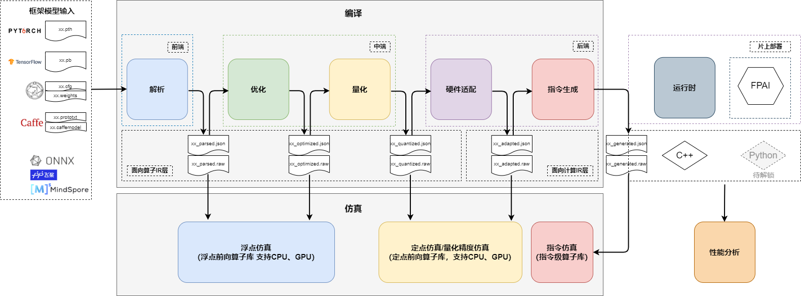
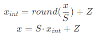

# Icraft Quantizer

## 目录

# Icraft Quantizer

## 一、整体介绍

### 1.1 Icraft编译流程中的量化

Icraft的整体架构组成主要分为三部分——编译、运行时和仿真测试。按功能分为多个组件，
各组件采用统一的自定义的中间层数据结构（Icraft IR），组件与组件之间的通信通过统一格式的json文件和raw文件。

编译部分的流程包括解析、优化、量化、适配和指令生成。
解析时将框架模型转换为Icraft IR表达的模型。
优化会针对模型的算子进行等价的合并与消除以减少计算量，不会改变模型结果与精度。
量化会将网络各层的输入输出以及权重参数都转换为定点值来表示，同时支持混合精度量化，
从而在保证网络精度的基础上，大幅减少功耗和内存占用以及数据传输延迟。
指令生成会将量化后的模型进行硬件适配与编译，生成最终在AI芯片上执行的指令序列。

### 1.2 量化功能概述

量化本质上是将浮点计算转化为定点计算以部署到支持定点计算的后端芯片上的过程。
为简化模型定点前向时的计算，模型参数从浮点映射为定点通常使用线性变换，也即线性量化，映射公式表示如下：

其中，x表示量化前浮点数，x\_int表示量化后定点数，S表示缩放因子，Z表示零点。
当采用对称量化方案时，零点便等于0。

在对称量化方案下，量化的过程便是确定缩放因子并将浮点数转变为定点数的过程。
目前Icraft量化提供KLD、EMS和NULL等算法获取合适的缩放因子，同时支持将浮点数映射为INT8和INT16两种定点数据类型。
Icraft量化还支持选择将浮点映射为定点时的粒度，也即按层量化/按通道量化，按层量化通常指该层的参数共享同一个缩放因子，
按通道量化指的是不同输出通道上的参数共享同一个缩放因子。

在将网络中所有参数定点化成INT8/INT16后，量化组件便将模型保存成INT8/INT16格式的json&raw文件，
最后便能使用量化分析工具来验证该定点网络模型的精度。
