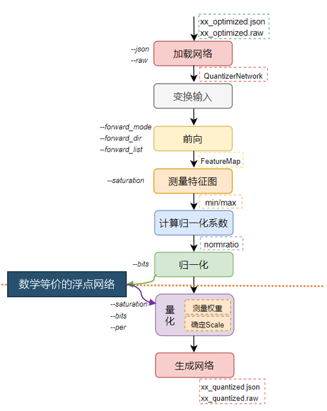
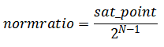
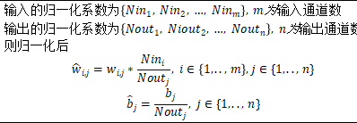
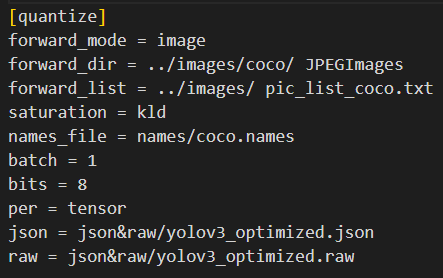
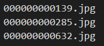
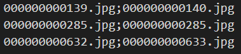
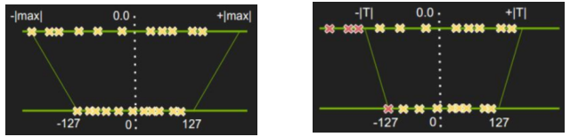
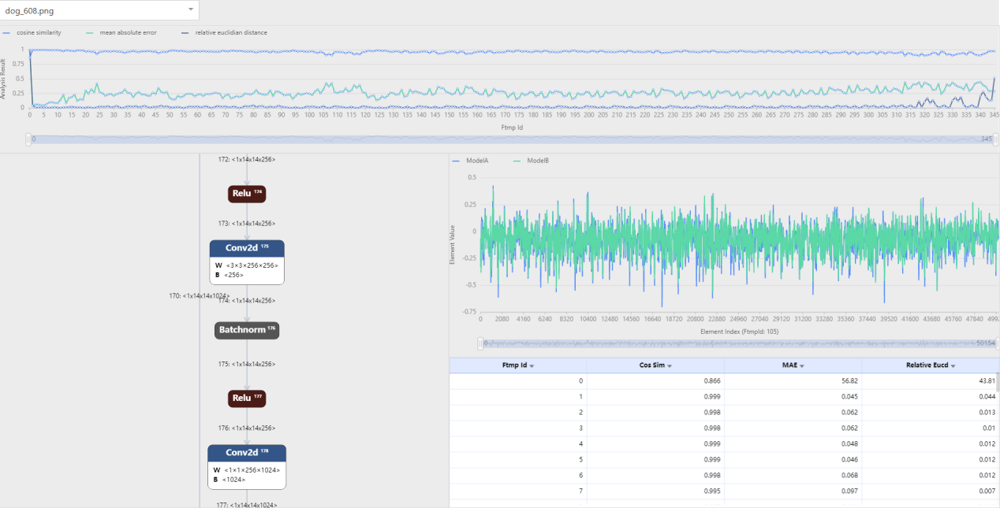

# ZHUGE Quantizer

## 目录

# ZHUGE Quantizer

## 一、诸葛量化流程

### 1.1 诸葛量化概述

诸葛是新一代AI核架构的名称，拥有强大的定点算力和浮点算力，因此诸葛量化支持将网络量化到INT8、BF16、FP16、TF32等数据类型。
相较于上一代布衣架构的量化而言，诸葛量化更灵活，精度更高，支持的量化配置更多。

### 1.2 诸葛量化流程

Icraft量化组件支持一键式的训练后量化，但其中包括多个重要步骤，因此对其分步介绍可以对量化流程有更直接的了解。
量化的流程图如下：



对输入的浮点网络进行量化主要经历了加载网络、前向校准（可选）、测量特征图（可选）、计算归一化系数（可选）、归一化（可选）、量化参数、生成网络等步骤。

上述步骤中，标记为“可选”的步骤只在INT8量化时执行，其余数据类型量化时自动跳过。

以下对每个步骤进行详细说明：

#### 1）准备浮点网络与校准集

Icraft量化的过程中会使用一定数量的校准集在浮点网络上进行推理，然后统计每层输入输出的数据范围作为量化
特征图时的参考，因此需首先保证浮点网络的推理结果正确，同时校准集应来自于实际测试环境中才能确保量化统计的
数据范围有实际意义。

#### 2）加载网络

从json&raw文件中加载浮点网络到内存中，在内存中表示为IR中定义的Network类型的对象。
使用该对象可以访问和改变网络中每一个算子的参数和属性等，可以方便的对网络进行归一化和量化等变换处理。

#### 3）前向校准

前向即对校准数据集在浮点网络上进行推断，从而获得每一层特征图的分布。

当校准集太大时，一次对所有图片进行前向会对电脑的可用内存造成很大的压力。因此当电脑的内存较小时，可以使用batch对校准集进行分批前向。
比如校准集中有100张图片，指定batch = 5则会对校准集测量5次，每次测量20张图片。量化组件会对多次测量的结果取平均，作为最终的测量结果。

#### 4）测量特征图

测量的过程即根据saturation指定的饱和方法确定每一个特征图的饱和点。

#### 5）计算归一化系数

根据测量确定的饱和点，计算每一个特征图的归一化系数。计算公式如下：



#### 6）归一化

在测量特征图和计算归一化系数后，需要对网络的参数进行归一化处理。

根据每个特征图的归一化系数对网络进行归一化，实际操作便是算子输入和输出的归一化系数要融合到网络参数中去，
以卷积为例介绍归一化系数融合的方法：



归一化后，网络和之前的网络是完全等价的浮点网络，只是每个特征图的动态范围是相同的。
归一化操作保证了所有特征图的动态范围恰好在量化能表达的范围内，简化了量化确定截位信息时对特征图scale的考虑。

需注意的是，只有INT8量化时才需进行前向校准。

#### 7）量化

量化首先要确定特征图和网络参数的scale，其中由于归一化后所有特征图的scale为1，
因此量化的过程主要是确定网络参数的scale。
在根据saturation指定的饱和方式统计出参数的饱和点后，便能根据要量化成何种数据格式计算得到scale（其中scale参数
需要根据硬件特性进行调整，将在算子介绍中进行说明），最后根据该scale将浮点数映射为定点数。

#### 8）生成网络

将量化后的网络序列化为中间层文件。

#### 9）精度测试与分析

在获得量化后的json&raw文件后，便能通过Icraft的仿真工具来验证该量化后的模型是否满足精度要求，若不满足
还可通过调节量化的配置参数再次量化，或者采用混合精度量化直到达到精度要求。后文将对精度评估工具和
量化调优手段进行详细介绍。

## 二、使用说明

量化组件（Icraft Quantizer）通过icraft quantize命令进行调用，后面可以跟配置文件，
也可以直接通过命令参数进行配置。
量化组件的参数可以在Icraft的toml配置文件中的[quantize]段进行配置，也可以直接在命令行通过直接配置，
还可以两者结合，命令行中配置的参数会覆盖toml文件中的对应参数。调用方式如下所示：

icraft quantize [<config file>] [–<key> <value>]

### 2.1 参数配置

量化组件提供给用户的接口为命令行接口（CLI），用户可以通过CLI选择前向方式、饱和方式、量化粒度和量化位数等。
具体的参数配置如表所示。

Table.量化参数列表

| 参数名字 | 数据格式 | 说明 |
| --- | --- | --- |
| json | string | 表示输入的中间层json文件路径 |
| raw | string | 表示输入的中间层raw文件路径 |
| jr\_path | string | 表示输出的中间文件存放的路径 |
| qdtype | string | 表示量化数据类型（int8/bf16/fp16/tf32） |
| forward\_dir | string（optional） | 表示校准集图片所在的文件夹，当qdtype=bf16/fp16/tf32时候为非必配项,其他情况下（包含配置了mix\_precision）则为必配项. |
| forward\_list | string（optional） | 表示校准集包含的图片列表，当qdtype=bf16/fp16/tf32时候为非必配项,其他情况下（包含配置了mix\_precision）则为必配项. |
| saturation | string（optional） | 表示统计饱和点的方法（kld/ems/null） ,默认为kld ，当qdtype=bf16/fp16/tf32时候为非必配项,其他情况下（包含配置了mix\_precision）则为必配项. |
| per | string（optional） | 表示按层还是按通道量化（tensor/channel）,默认为channel，当qdtype=bf16/fp16/tf32时候为非必配项,其他情况下（包含配置了mix\_precision）则为必配项. |
| batch | int（optional） | 将校准集分为几份，依次进行前向计算（电脑内存较小时使用），默认为1 |
| bin\_num | int（optional） | 表示统计饱和点时将数据分成多少个bin，默认4096 |
| ftmp\_csv | string（optional） | 表示ftmp\_csv的路径，从该ftmp\_csv中获取ftmp的饱和点时使用 |
| raw\_csv | string（optional） | 表示raw\_csv的路径，从该raw\_csv中获取weight的饱和点时使用 |
| decode\_dll | string（optional） | 表示调用的解码图片dll的路径，用户自定义读图方式的接入接口，默认为OpenCV三通道读图方式 |
| mix\_precision | string（optional） | 配置mix\_precision= “auto”：表示自动实现混合精度量化，并按默认混合方案进行混合精度配置； 配置mix\_precision= “xxx.csv”：表示根据用户自定义的位宽配置文件实现混合精度量化。 |
| smooth\_alpha | float（optional） | 表示smoothquant方法中的alpha系数，可调整特征图与参数间的放缩比例关系，建议选择（0，1）之间的数 |
| autoqset\_num | int（optional） | 表示从提供的数据集中自动挑选的校准集数量，默认为None，即不进行自动校准集选择，仅当输入大于等于1时候，开启自动校准集选择功能。 |
| quant\_autotune\_config | string（optional） | 表示自动调优配置项，进行不同模式下的量化自动调优；只有配置了mix\_precision= “auto”之后，配置的quant\_autotune\_config才会生效，详细信息见3.5 量化自动调优策略 |

### 2.2 校准集前向

#### 1）图片校准集

当校准集由图片组成时（以文件后缀为jpg/jpeg/png/bmp做区分），量化组件会使用OpenCV加载图片进行前向推理获得所有层的特征图，从而测量特征图的分布范围。
此时forward\_dir表示存放校准集的文件夹，forward\_list表示描述相对于forward\_dir的图片路径，每行表示一个图片路径。示例配置如下：



其中，pic\_list\_coco.txt如下所示：



当模型存在多输入时，pic\_list\_coco.txt如下所示，多输入之间用分号隔开。



#### 2）二进制文件校准集

当校准集由二进制文件组成时（文件后缀非image），量化组件会默认以float32类型读取二进制文件中的数据作为网络的输入，
进而前向推理获得各层特征图。当用户想要将图片转为二进制文件作为校准集时，需注意原图片保存数据均为uint8，需转换为float32。
forward\_dir和forward\_list的配置方法与上述一致。

#### 3）校准集自动选择

**单输入模型**

校准集自动选择功能可根据提供的校准集自动选择出指定数量的图片或二进制文件作为最终的校准集进行量化，通过autoqset\_num参数进行配置，输入大于1的数值时，功能开启。

forward\_dir和forward\_list的配置方法与上述一致，forward\_list无需写入全部内容，但需提供forward\_list路径，校准集自动选择会根据forward\_list路径生成后缀为“auto”的新forward\_list,并基于此进行后续量化。

**多输入模型**

校准集自动选择功能可根据提供的校准集自动选择出指定数量的图片或二进制文件作为最终的校准集进行量化，通过autoqset\_num参数进行配置，输入大于1的数值时，功能开启。

forward\_dir和forward\_list的配置方法与上述一致，但
**forward\_list需要写入全部内容，以表示多输入之间的关系**，
校准集自动选择会根据forward\_list路径生成后缀为“auto”的新forward\_list,并基于此进行后续量化。

**建议提供更大的数据集以供自动挑选（如500张图片），autoqset\_num参数配置建议大于10，量化组件会从提供的数据集中自动选择指定数量的输入作为最终的校准集进行量化**

**当autoqset\_num大于校准集数量时，会选择全量校准集进行量化**

```
[quantize]
forward_mode = "image"
saturation = "null"
forward_dir = "../vit-input/"
forward_list = "../image.txt"
qdtype = "int8"
json = "../jsonraw/vit_optimized.json"
raw = "../jsonraw/vit_optimized.raw"
jr_path = "../jsonraw/"
per = "tensor"
target = "buyi"
autoqset_num = 50
```

### 2.3 校准集分批测量

量化需要测量每个特征图的分布，从而确定合适的量化缩放因子。校准集的作用就是使用一部分图片代表整个测试集来测量每个特征图的分布范围，
因此理论上来讲，校准集中图片的数量越多越好。但是校准集越大，量化过程需要的内存或者时间也就越多。

**考虑到量化效果，建议校准集的容量不小于50张图片。**

在对校准集做前向时，默认会一次对forward\_list中指定的所有图片做前向进行测量，这会对电脑的可用内存造成很大的压力。当电脑内存比较小时，
可以使用batch对校准集分批测量。比如校准集中有50张图片，指定batch = 5则会对校准集测量5次，每次测量10张图片。量化组件会对多次测量的结果取平均，
作为最终的测量结果。

**注意：校准集的图片总量要能被batch参数整除！**

### 2.4 量化粒度

对权重进行量化，首先需要通过算法确定权重的饱和点，进而得到该权重的scale参数，然后所有浮点值便按照该scale映射为定点值。
在某些网络的权重参数中，不同通道的数据动态范围差异较大，只使用一个scale值难以反映这种差异，会导致量化误差较大，
因此可以通过更改量化粒度来实现不同通道对应不同的scale值。
以卷积为例，权重的数据排布格式为（h,w,ci,co），当per = tensor时所有权重对应1个scale值；per = channel时co个通道的数据对应co个scale值。

**一般来说，per\_channel量化的表现会优于per\_tensor**

### 2.5 饱和方式



非饱和量化，如上左图所示，会将浮点数绝对值的最大值|max|映射到定点数的最大值。而饱和量化，如右图所示，则是通过一些方法找到一个更加合适的阈值映射到定点数的最大值。
饱和的目的是去除特征图的奇异点，当浮点数据分布不够均匀时，会使量化的缩放因子偏大，由于定点数的单位精度远小于浮点数，就会让浮点数中的很多数值集中映射到定点数的某几个数字上，
严重影响了量化的精度和效果。

量化组件支持三种饱和方式：null（非饱和），kld（KL散度最小），ems（误差的平方和最小）。下面以kld为例简单进行介绍：

* `KLD`

当saturation = kld时，量化组件会采用KL散度最小的饱和的方式测量特征图和权重的分布。
P(x)表示浮点数据分布，Q(x)表示量化以后的定点数据分布，那么其KL散度为：


为了计算KL散度，需要分别统计浮点和定点的数据分布，以8位对称量化为例，其统计方法如下：

* 对校准数据集做前向，得到每层浮点数的数值分布，并统计|max|
* 将0~|max|分成N个bin，统计每层的特征图落到各个bin中的数目
* 遍历第128~N个bin，遍历间隔为128：
  :   + 以当前bin的中值作为阈值T做截断，将大于当前bin以外的bin的数目加到当前bin上，减少直接抹去这些数值带来的影响
      + 计算此时的概率分布P，每个bin的概率即其统计数目除以数值的总数
      + 创建一个新的编码，其长度为128，其元素值即P量化后的INT8数值
      + 因为Q分布只有128个编码，为了计算相对熵，将其扩展到和P相同的长度
      + 计算P和Q的相对熵
* 选择最小的相对熵对应的bin，其对应的阈值即为最终的饱和阈值

使用KLD的饱和方式时，可以通过bin\_num来指定划分bin的数目，默认bin\_num = 4096。
bin\_num越大，划分的精度越高，但是量化占用的内存或时间也会越多。

### 2.6 smoothquant功能

smoothquant针对transformer中的layernorm+matmul结构，认为layernorm的输出在通道维度上动态范围差异很大，导致量化困难，
因此通过将layernorm中的gamma和beta在不同通道上乘以不同的系数以降低输出的动态范围差异，同时该系数被融入matmul的参数中保证了matmul的输出结果不变。

smoothquant介绍了确定不同通道系数的方法，该方法以smooth\_alpha为参数以控制参数放缩的程度，根据不同网络特点可设置不同的smooth\_alpha参数，
toml配置示例如下：

```
[quantize]
saturation = "null"
forward_dir = "../vit-input/"
forward_list = "../image.txt"
qdtype = "int8"
json = "../jsonraw/vit_optimized.json"
raw = "../jsonraw/vit_optimized.raw"
jr_path = "../jsonraw/"
per = "tensor"
smooth_alpha = 0.5
```

需注意的是原作者的smoothquant方法中，layernorm和softmax均使用浮点计算，因此用户在使用该功能时若效果不及预期。

[参考链接](https://github.com/mit-han-lab/smoothquant)

## 三、混合量化配置

### 3.1 混合精度量化

当对网络的运行速度和精度都有较高要求时，即希望同时实现低位宽的速度和高位宽的精度，可以尝试使用混合精度量化。
混合精度量化通过采用特定策略选择网络中量化影响较大的算子，并使用更高位宽进行计算，旨在减少量化损失并提高网络的精度。
通过将关键算子使用高位宽进行计算，可以在一定程度上缓解量化引入的精度损失。
在混合精度量化中，位宽配置可以通过两种方式实现：

1、内置选取策略：
量化组件内置了一些策略，根据各层数据分布的差异，自动选择需要使用更高精度计算的层。

内置的策略包含lstm\_strategy、cosimilarity\_strategy以及variance\_strategy三种，lstm\_strategy是指lstm算子默认使用更高位宽，
cosimilarity\_strategy是指通过分析各层特征图的余弦相似度来确定量化敏感的层使用更高位宽，variance\_strategy是指通过分析各层特征图
的方差来确定哪些层使用更高位宽。位宽选择的逻辑是：如果当前配置qdtype=int8，则高位宽指的是fp16；
如果当前配置qdtype=bf16/fp16，则高位宽指的是tf32。

使用方式上均可以通过mix\_precision = “auto”开启，当mix\_precision=”auto”时布衣的默认策略是variance，
诸葛的默认策略是cosimilarity+lstm。在诸葛量化中也可以通过mix\_precision = “variance”来指定混合精度的策略。

**注意：当前variance策略下不支持qdtype=tf32的配置；qdtype=bf16/fp16/tf32时不支持在mix.csv中配置int8类型。**

2、用户自定义配置：
另一种方式是用户根据自己的需求自定义配置网络中各层算子使用的计算位宽，通过配置mix\_precision=”xx.csv”实现。

### 3.2 自定义量化配置

除了上述混合精度量化外，mix\_precision参数还支持用户自定义配置各层使用的量化算法、量化粒度以及量化范围。

#### 1）value\_range

由于硬件在实际前向推理过程中不能保存全精度的数据，因此可能存在卷积和矩阵乘算子的乘累加中间值溢出现象。
对于这种问题的解决办法是将对应卷积或矩阵乘算子的权重参数和输入特征图量化到更小的数据范围内以避免溢出，例如
在8bit量化下，可自由设置特征图和权重量化为7bit。

#### 2）per & saturation

在某些数据分布特殊的网络中，需要精细化地针对不同层设置不同的量化参数，包括量化算法kld/null/ems
以及量化粒度per\_tensor/per\_channel/per\_group，
其中per\_group=n表示针对被量化的tensor的最后一维分成n个组分别统计量化系数。

### 3.4 使用说明

#### 1）混合位宽

根据是否自定义位宽配置方案，使用接口上会有略微差异。

当使用mix\_precision=auto时，表示量化组件将根据内置策略自动分配各层算子的计算位宽，实现混合精度量化。

当使用mix\_precision=”xx.csv”时，表示量化组件将根据用户自定义的位宽配置方案实现混合精度量化。
在这种情况下，用户需要提供一个包含位宽配置信息的CSV文件。该文件内部需要包含以下内容，
其中op\_id需要与当前网络匹配，dtype仅支持int8、bf16、fp16、tf32、fp32；

| op\_id | type | dtype |
| --- | --- | --- |
| 1 | conv | int8 |
| 2 | relu | int8 |
| 3 | conv | bf16 |
| 4 | relu | fp16 |
| 5 | conv | int8 |
| ··· | ··· | ··· |

另外，在使用混合精度量化时，以下是一些建议：

1. 对输出层使用更高的计算位宽
2. 对量化前后余弦相似度低的算子使用更高的计算位宽

这些Tips旨在帮助优化混合精度量化的效果。根据具体的网络结构和任务需求，可以进一步调整和优化计算位宽的选择，以平衡精度和速度的需求。

#### 2）自定义value\_range&per&saturation

当需要解决乘累加溢出问题时，可通过配置下表中的value\_range\_in\_bits列，
其中6;7表示将第一个卷积的参数量化到6bit范围，输出特征图量化到7bit范围，其中value\_range
不得大于dtype列配置的数据范围。

当某些层的数据在通道间存在较大差异时可通过配置下表对应层的per来实现按通道量化，其中tensor;group=4表示该算子的参数按层量化，
输出特征图根据最后一维分成四组进行量化。
例如，在self attention层的输入中由于不同head间的数据差异较为明显，可通过配置group=head\_num来实现按组量化。
在连接不同transformer block的add算子上，输入输出使用per\_channel量化有较为明显的效果。

当某些算子对输入的饱和点较为敏感时，可通过配置下表的saturation来实现特定算子的特定量化算法，其中kld;null表示该层的参数使用kld算子，
输出特征图使用null算法。
例如，softmax的输入输出在选取kld时可能会导致较大值均被饱和从而放大输出误差，这时可设置为null以减少饱和的影响。

| op\_id | type | dtype | value\_range\_in\_bits | per | saturation |
| --- | --- | --- | --- | --- | --- |
| 1 | conv | int8 | 6;7 | channel;tensor | kld;kld |
| 2 | relu | int8 | 8;8 | tensor;channel | kld;kld |
| 3 | conv | bf16 | 14;14 | tensor;group=4 | null;null |
| 4 | relu | bf16 | 16;16 | tensor;group=4 | null;null |
| 5 | conv | int8 | 8;8 | tensor;tensor | ems;ems |
| ··· | ··· | ··· | … | … | … |

### 3.5 量化自动调优策略

除了上述内置的只针对精度位宽调优策略lstm\_strategy、cosimilarity\_strategy以及variance\_strategy之外，autotuning\_strategy（量化自动调优策略）是一种更加自动化的兼顾位宽、per & saturation的自动调优策略；
当配置mix\_precision= “auto”，且配置quant\_autotune\_config之后，则可以开启量化自动调优策略。

#### 1）quant\_autotune\_config

通过配置quant\_autotune\_config，量化组件读取其中的自动调优配置项，进行不同模式下的量化自动调优；

quantize中quant\_autotune\_config的配置示例如下：

```
[quantize]
forward_mode = "image"
saturation = "null"
forward_dir = "../vit-input/"
forward_list = "../image.txt"
qdtype = "int8"
json = "../jsonraw/vit_optimized.json"
raw = "../jsonraw/vit_optimized.raw"
jr_path = "../jsonraw/"
per = "tensor"
target = "buyi"
mix_precision= "auto"
quant_autotune_config = "./testcase/quant_autotune_config.toml"
```

注意只有配置了mix\_precision= “auto”之后，配置的quant\_autotune\_config才会生效。

其中quant\_autotune\_config.toml的配置示例如下：

```
[AutoTune]
priority = "accuracy" # accuracy  tradeoff performance
round_num = 5
float_cal = 0
#cos_targetvalue = 0.9
#dis_targetvalue = 0.05
#mae_targetvalue = 0.05
#mse_targetvalue = 0.05
metrics_targetvalue = 1
evalscript_path = "C:/Users/chendong/Desktop/AutoAnalysis/testcase/modelzoo_dev/pytorch/PointNet/3_deploy/modelzoo/PointNet/pyrt"
evalscript_cmd = "D:/ProgramData/anaconda3/envs/mmrotate/python.exe test1.py"
```

具体的参数配置如表所示。

Table.quant\_autotune\_config参数列表

| 参数名字 | 数据格式 | 说明 |
| --- | --- | --- |
| priority | string | 表示选择的调优模式，是非必配项；若未配置，默认设置accuracy；可配置为 accuracy、tradeoff、performance。 |
| threshold\_level | int | accuracy模式下的阈值等级,是非必配项；可配置为1 2 3；若未配置，默认为1，1表示将余弦相似度小于0.97的点都作为待调优的点，3则表示将余弦相似度小于0.99的点都作为待调优的点 |
| round\_num | int | 设置调优轮数,是非必配项；若未配置，默认设置50轮。 |
| float\_cal | int | 表示BY下是否开启FP32混合，是非必配项；默认配置为0，当配置为0，表示不允许BY下混合FP32,,配置为1则表示允许BY下混合FP32 |
| cos\_targetvalue | float | 表示期望量化网络输出与浮点网络输出的余弦相似度，是非必配项；有效范围0-1。 |
| dis\_targetvalue | float | 表示期望量化网络输出与浮点网络输出的相对欧氏距离，是非必配项；有效范围0-1。 |
| mae\_targetvalue | float | 表示期望量化网络输出与浮点网络输出的平均绝对误差，是非必配项；有效范围0-1。 |
| mse\_targetvalue | float | 表示期望量化网络输出与浮点网络输出的均方误差，是非必配项；有效范围0-1。 |
| metrics\_targetvalue | float | 表示期望量化网络的精度测试指标，metrics\_targetvalue是非必配项，若配置，则配置为实际模型的期望精度指标，例如yolov5期望map50是80，则配置为80；若配置了此项则必须配置evalscript\_path和evalscript\_cmd。 |
| evalscript\_path | string | 表示精度测试脚本存放路径 |
| evalscript\_cmd | string | 表示精度测试脚本执行的一系列命令 |
| skip\_comfirm | int | 非必配项；默认配置为0，当配置为0表示需要经过自动调优开始前的参数确认环节,配置为1则表示跳过自动调优开始前的参数确认环节 |

quant\_autotune\_config参数配置额外说明：

①cos\_targetvalue/dis\_targetvalue/mae\_targetvalue/mse\_targetvalue/metrics\_targetvalue,
这五个配置项可以都不配，若都不配，程序默认按照cos\_targetvalue=0.99作为调优判据；
若配置，则只能配置其中一项

②priority = “accuracy”

该模式下，根据逐层比较的结果每轮逐步放宽\_cos、\_dis、\_mse、\_mae的阈值，且扩大每轮选出点的比例，最终将阈值放大到配置threshold\_level对应的阈值，当threshold\_level=1：\_cos < 0.97 或者 \_dis>0.05 或者 \_mse > 0.05 或者 \_mae > 0.05；当threshold\_level=2：\_cos < 0.98 或者 \_dis>0.03 或者 \_mse > 0.03 或者 \_mae > 0.03；
当threshold\_level=3：\_cos < 0.99 或者 \_dis>0.01 或者 \_mse > 0.01 或者 \_mae > 0.01；将选点比例扩大到1，且只进行位宽调优或者conv结构调整。

位宽选择的逻辑是：

ZG下 如果当前配置qdtype=int8，则调整为BF16； 如果当前配置qdtype=bf16/fp16，则调整本层为fp16或者bf16或者tf32（调优工具会记录本层没有使用的精度类型，切换为对应未使用的16bit浮点类型，若fp16和bf16都使用过了，那么调整为tf32）。

BY下 如果当前配置qdtype=int8，则调整为int16；如果是int16,且配置了float\_cal=1，那么调整为FP32。另外int16下如果待调优层为卷积层（含有bias）则会拆分卷积的bias变为add算子。拆分卷积的优先级高于混合为FP32。

③priority = “tradeoff”

该模式下会基于余弦相似度，按照阈值0.8 0.85 0.9 0.95的顺序，查找量化前向与opt前向后ftmp的measure找到最靠前的第一个差的算子，且这个算子需要满足两个条件A:只能是有计算的算子和;B:该ftmp逐层前向的measure需要满足
\_cos < 0.97 或者 \_dis>0.03 或者 \_mse > 0.03 或者 \_mae > 0.03，如果找到的点不满足A或者B，那么继续找递归查找该算子的前面的满足要求的算子。直到找到至少一个。然后返回本轮查到待调优算子；

若找到的第一个算子满足A和B条件，那么继续向前找三层，把ftmp逐层前向的指标需要满足\_cos < 0.97 或者 \_dis>0.03 或者 \_mse > 0.03 或者 \_mae > 0.03的对应的算子都加入待调优列表中。

后续会按照从前向后的顺序依次修改对应算子的位宽:

ZG下 如果当前配置qdtype=int8，则调整为BF16； 如果当前配置qdtype=bf16/fp16，则调整本层为fp16或者bf16或者tf32（调优工具会记录本层没有使用的精度类型，切换为对应未使用的16bit浮点类型，若fp16和bf16都使用过了，那么调整为tf32）。

BY下 如果当前配置qdtype=int8，则调整为int16；如果是int16,且配置了float\_cal=1，那么调整为FP32。

④priority = “performance”

该模式下会基于余弦相似度，按照阈值0.8 0.85 0.9 0.95的顺序，查找量化前向与opt前向后，通过ftmp的measure找到最靠前的第一个差的算子，且这个算子需要满足两个条件A:只能是有计算的算子和,B:该ftmp逐层前向的指标需要满足
\_cos < 0.97 或者 \_dis > 0.03 或者 \_mse > 0.03 或者 \_mae > 0.03，如果找到的点不满足A或者B，那么继续找递归查找该算子的前面的满足要求的算子。直到找到至少一个。然后返回本轮查到待调优算子。

若找到的第一个算子满足A和B条件，那么继续向前找三层，把ftmp逐层前向的指标需要满足\_cos < 0.97 或者 \_dis>0.03 或者 \_mse > 0.03 或者 \_mae > 0.03的对应的算子都加入待调优列表中。

后续会按照从前向后的顺序依次修改对应算子的per和sat组合，且多次修改同一算子的per和sat无效之后转而修改精度；

ZG下 如果当前配置qdtype=int8，则调整为BF16； 如果当前配置qdtype=bf16/fp16，则调整本层为fp16或者bf16或者tf32（调优工具会记录本层没有使用的精度类型，切换为对应未使用的16bit浮点类型，若fp16和bf16都使用过了，那么调整为tf32）。

BY下 如果当前配置qdtype=int8，则调整为int16；如果是int16,且配置了float\_cal=1，那么调整为FP32。

⑤若希望通过测试每次量化后模型的某一精度测试指标作为调优判据，那么需要注意evalscript\_cmd需要配置为一个bat批处理文件（例如run.bat），bat批处理文件中是能够在evalscript\_path中可以从jr\_path中读取量化后阶段jsonraw并完成精度测试的若干条执行命令，
且要保证最终将想要作为判据指标的精度指标写入evalscript\_path下的metrics.txt文件中，例如yolov5期望map50是80，那么每次完成精度测试后得到的map50的值就需要写入metrics.txt第一行。

⑥自动调优的具体过程记录在模型编译目录下的.icraftlogsmodelmodel\_quantize\_autotuning.log中。

## 四、量化效果分析

### 4.1 精度损失分析指南

量化会造成网络精度的损失，主要和以下几个方面相关：

#### 1）量化位数

量化是使用较少位数的定点数的运算来表示浮点数的运算。一般来说，量化位数越高，量化的精度损失越少。
量化位数的支持一方面和量化组件有关，另一方面也取决于加速器对不同位数定点数的支持。
本量化组件支持诸葛架构，支持int8/bf16/fp16/tf32量化。
如果8位量化不能满足精度的需求，则可以尝试16位量化或混合精度量化

#### 2）校准集

量化的精度损失也和选择的校准集有关。校准集的选择最好能够很好地代表真实检测/识别图片的数据分布。
因此，校准集可以从测试集或者训练集中选择。
一般情况下，校准集越大，越可能获得较好的量化效果。因此，当量化损失过大时，可以考虑增加/更换校准集。

#### 3）饱和方法

饱和能够减少校准集特征图的奇异点带来的精度损失，因此相对于非饱和量化，使用饱和量化的方式能够提高量化效果。
本量化组件支持NULL、KLD和EMS的量化方式，当量化精度损失过大时，可以尝试更换饱和方式。

#### 4）网络参数

量化误差和网络参数的分布有关，不同的参数分布对量化损失的容忍度不同。
当所使用的网络无论采取何种方式都不能获得很好的量化效果时，可以考虑采用量化感知训练微调网络参数，
使得网络参数更适于量化。量化感知训练的具体使用方法见《QAT用户手册》。

### 4.2 量化误差可视化分析

Icraft-Show通过运行浮点模型和量化模型并对每层的输出进行统计分析，以图形化的界面展示每层数据的量化误差。
该工具使用余弦相似度、平均绝对误差和相对欧氏距离作为量化误差的评价标准。

该工具分析完毕后通过网页展示分析结果以及模型的各项信息，网页内容包括分析结果（网页上方），网络结构（网页左下），
每层FeatureMap的数据对比（网页右中），分析结果表（网页右下）。



该工具的具体使用方法见《Icraft-Show使用手册》。

## 五、算子量化方案

### 5.1 ZHUGE架构

方案未定，待补充

* `Add`

**add\_const**：该算子浮点前向是Y = a X + b C，

归一化后便是Yn = Xn \* (a \* Nx / Ny) + (b \* C \* Nx / Ny)，

令I = a \* Nx / Ny， J = b \* C \* Nx / Ny，

则Yn = Xn \* I + J，因为该算子使用VPE进行前向，则I和J需要被量化，

则Yn = (Xn \* Iq + Jq) \* S；S = Si = Sj，其中S是通过I和J计算得到的scale系数。

S满足硬件p\*2(-q)的格式，其中p数值范围[0,255], q数值范围[bits,2\*bits]。

**add\_ftmp**：
该浮点算子对应的公式是Z = a X + b Y，

归一化后便是Zn = Xn \* Nx \* a / Nz + Yn \* Ny \* b / Nz，

假定I = Nx \* a / Nz，J = Ny \* b / Nz，则上式变为Zn = Xn \* I + Yn \* J，
该算子需在VPE上计算，因此需将I和J两个值量化，

从而公式进一步转换为Zn = Xn\*Iq\*Si + Yn\*Jq\*Sj，又因为VPE中只有一次截位且位于乘加运算之后，

因此公式进一步转换为Zn = (Xn\*Iq + Yn\*Jq) \* S；S = Si = Sj，其中S是通过I和J计算得到的scale系数。

S满足硬件p\*2(-q)的格式，其中p数值范围[0,255], q数值范围[bits,2\*bits]。

* `AvgPool2d`
* `BatchNorm2d`

由于该算子的特性，不同通道间的数据可能差异较大，因此无论”per”参数配置如何，均使用按通道量化实现。

BatchNorm2d的浮点前向为Y = X \* W + B，主要是矩阵和向量的乘加计算，

量化前向公式如下：
Yq = Xq \* Wq \* (Sw \* Sx / Sy) + Bq \* (Sb / Sy)，

由于归一化之后Sx = Sy = 1，且该算子使用VPE进行计算，则
Yq = (Wq \* Xq + Bq) \* Sw , Sw = Sb

因此要求w\_scale等于b\_scale，
经验表明，w对结果的影响往往更大，因此选取w\_scale作为两者共同的scale

scale满足m\*2^(-n)的格式，其中m数值范围[0,255], n数值范围[bits,2\*bits]。

* `Concat`

**concat\_const**：设定输出的normratio等于输入的normratio，然后使用该normratio对const做归一化操作，
最后在量化阶段将该const近似为Int值。

**concat\_ftmp**：将输入的normratio在最后一维concat起来作为输出的normratio。

* `Conv2d`

**conv\_ftmp**：
该算子只支持两个ftmp的卷积运算，暂不支持bias，其浮点前向为Z = X \* Y，
则量化前向为Zq = (Xq \* Yq) \* (Nx \* Ny / Nz)，其中N表示ftmp的normratio，
算子中的cut\_scale表示(Nx \* Ny / Nz)。

如果是深度可分离卷积，则前向使用VPE实现，算子中的cut\_scale属性用来记录VPE中的截位信息，
假定cut\_scale = m\*2^(-n)，其中m对应VPE中的乘法，数值范围[0,255]，n的数值范围[bits, 2\*bits].

如果不是深度可分离卷积，则前向使用MPE+VPE实现，算子中的cut\_scale属性记录MPE和VPE中的两次截位。
假定cut\_scale = m\*2^(-n)，其中m对应VPE中的乘法，数值范围[0,255]，n对应两次截位，数值范围[bits, 2\*bits + 5]

通过调整Nz的数值保证cut\_scale满足上述的截位要求。

**conv\_const**：
统计normratio和归一化操作比较常规，无需赘述。
该算子的浮点前向为Z = X \* W + B，主要是矩阵和矩阵的乘加运算以及矩阵和向量的加法运算。

如果是深度可分离卷积，则只包括矩阵向量计算，前向使用VPE实现，前向计算公式同BatchNorm2d，w\_scale需等于b\_scale，这个共同的scale作为VPE中的截位。
至于如何确定这个共同的scale，优先采用w\_scale，当w\_scale接近零时才会采用b\_scale，当两者都接近零时
则认为scale数值不重要，采用默认值1。scale采用m\*2^(-n)表达，其中m的数值范围[0,255]，n的数值范围[bits, 2\*bits]。

如果不是深度可分离卷积，则包括矩阵矩阵运算以及矩阵向量运算，前向使用MPE+VPE实现，
量化前向公式为Yq = (Xq \* Wq) \* (Sx \* Sw / Sy)，Zq = (Yq + Bq) \* (Sy / Sz)，Sb = Sy。

由于做过归一化，因此Sx = Sz = 1,
w\_scale/b\_scale表示MPE中的第一次截位，b\_scale表示VPE中的第二次截位。
假定w\_scale=a\*2^(-b)，b\_scale=m\*2^(-n)，在优先将w\_scale的浮点值近似为a和b后，需保证
a = m、0 <= n-b <= 5以及bits <= n <= 2\*bits得到b\_scale的近似。

需注意的是，如果是按通道量化，由于硬件的限制，MPE的不同输出通道的截位需相等，因此会在前述截位信息的基础上，
再次调整各通道的w\_scale和b\_scale使得第一次截位相等。

* `ConvTranspose2d`

实现参考Conv2d

* `ELU` `GELU` `Hardsigmoid` `Hardswish`

只需统计输出的normratio，交给后端制作查找表

* `Input`
* `LayerNorm`

只完成了统计输出normratio，交由硬算子。
后续针对该算子的优化可能实现特征图的按通道统计normratio

* `Matmul`

**matmul\_ftmp**：
参考conv\_ftmp算子中非深度可分离卷积情况下的实现方式

**matmul\_const**：
参考conv\_const算子中非深度可分离卷积情况下的实现方式，但该算子暂不支持按通道量化

* `MaxPool2d`

直接把输入normratio传递给输出normratio

* `Mish`

只需统计输出的normratio，交给后端制作查找表

* `Multiply`

**mul\_ftmp**：
参考conv\_ftmp算子中深度可分离卷积情况下的实现方式

**mul\_const**：
参考conv\_const算子中深度可分离卷积情况下的实现方式，但该算子暂不支持按通道量化

* `Output`
* `Pad`

在归一化时，输入的normratio直接传递给输出，同时pad\_value使用该normratio进行归一化操作。
针对归一化后的pad\_value，将其转换为Int值并做饱和操作。

* `PixelShuffle`

只需统计输出的normratio

* `ReLU`

在量化中没有特殊操作，但在指令生成中需要获取前一个算子的b\_scale用在正半轴，将该b\_scale结合alpha系数
用在负半轴。

只需统计输出的normratio

* `Reshape`
* `Resize`
* `Sigmoid`

待补充关于减小查找表误差的内容

* `SiLU`

只需统计输出的normratio

* `Slice`
* `Softmax`
* `Split`

如果针对最后一维split，则输出的normratio也根据输入的normratio进行Split
如果针对的不是最后一维，则直接传递输入的normratio给输出。

* `Squeeze`
* `SwapOrder`
* `Tanh`

待补充关于减小查找表误差的内容

* `Transpose`
* `Upsample`

## 六、报错说明

### 6.1 错误码说明

**21000:**

* `缺少必须参数`

**21001:**

* `文件或路径不存在`

**21002:**

* `参数超出范围、格式错误`

**21003-21009:**

* `预留错误码`

**21010:**

* `Dll加载相关错误`

**21011:**

* `量化系数不符合要求相关错误`

**21012:**

* `算子输入与参数相关错误`

**21013:**

* `配置文件不符合要求错误`

**21014:**

* `文件读取错误`

**21015:**

* `TransInput相关错误`

## 七、索引

* [索引](../genindex.md)

目录