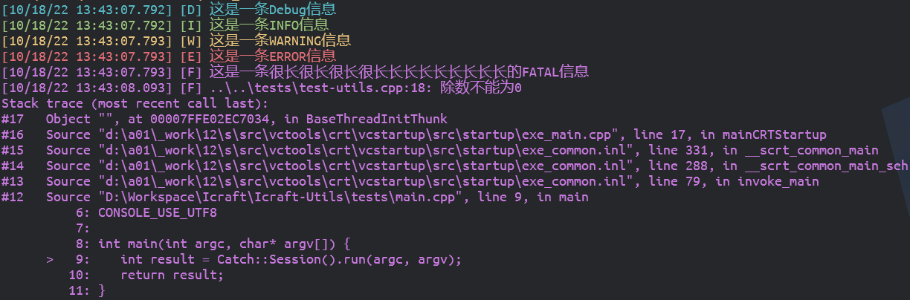
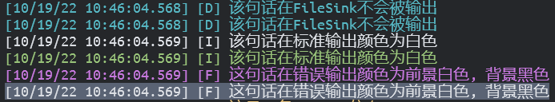

                  
  
# Icraft Utils

Icraft Utils为Icraft各组件提供了一些通用的功能，目前包含以下功能：

- 
日志记录

- 
进度条生成

## 一 背景

Icraft组件越来越多，很多组件都需要命令行参数、记录日志和生成进度条等功能。原来这些功能都是各个组件独自实现，没有做到代码的复用，不利于维护和调试。另外不同组件实现的风格不统一，这样不利于形成统一的用户界面。因此，Icraft-Utils中统一实现了以上功能，提供了统一的风格和接口，减少了大家的开发和维护压力。

## 二 安装

Icraft-Utils组件是一个纯头文件的C++库，因此只需要把它作为子模块，然后将其头文件路径添加到父模块的头文件搜索路径即可。

## 三 使用

## 3.1 日志记录

## 3.1.1 开箱即用的宏定义

Icraft-Utils定义了LOG(level)宏来提供开箱即用的日志功能。level的级别和默认颜色如下所示：

level

含义

颜色

- 
`DEBUG`

调试

蓝色

- 
`INFO`

信息

青色

- 
`WARNING`

警告

黄色

- 
`ERROR`

错误

红色

- 
`FATAL`

致命

品红

- 
`EXCEPT`

异常

N/A

备注

其中， `DEBUG` 到 `FATAL` 都输出到标准输出(stdout)，而 `EXCEPT` 则会抛出 `icraft::InternalError` 异常，需要用户捕获。

**使用示例1:**


```cpp
#include <icraft-utils/logging.hpp>
... ...
LOG(DEBUG) << "这是一条Debug信息";
LOG(INFO) << "这是一条INFO信息";
LOG(WARNING) << "这是一条WARNING信息";
LOG(ERROR) << "这是一条ERROR信息";
LOG(FATAL) << "这是一条很长很长很长很长长长长长长长长长的FATAL信息";

try {
   LOG(EXCEPT) << "除数不能为0";
}
catch (const std::exception& err) {
   LOG(FATAL) << err.what();
}
```


以上示例的输出效果如下图所示：



以上示例使用的是IO流式的方式来记录日志，Icraft-Utils的日志还支持采用format的方式来记录，只需要调用 `append` 方法。
另外，为了方便捕捉 `LOG(EXCEPT)` 抛出的异常，Icraft-Utils提供了 `ICRAFT_TRY` 的宏。

**使用示例2:**


```cpp
#include <icraft-utils/logging.hpp>
... ...
LOG(DEBUG).append("这是一条Debug信息");
LOG(INFO).append("这是一条{}信息", "INFO");
LOG(WARNING).append("这是一条").append("WARNING信息");
LOG(ERROR).append("这是一条") << "ERROR信息";
(LOG(FATAL) << "这是一条很长很长很长很长").append("长长长长长长长长的{}信息", "FATAL");

ICRAFT_TRY(
   LOG(EXCEPT).append("除数不能为{}", 0);
);
```


以上示例的输出和示例1完全相同。

## 3.1.2 正确配置以获取详细调用栈

如上所示， `LOG(EXCEPT)` 抛出的 `icraft::InternalError` 异常携带调用栈的信息，方便追溯问题所在的位置。但是默认情况下，Visual Studio和CMake的Relase模式不包含Debug信息，需要对编译和链接参数进行调整。

## Windows

当使用Visual Studio的编译器(cl)编译Windows平台的程序时，需要对工程属性做以下参数设置：

- 
C/C++: 设置 `Debug Information Format` 为 `/Zi`

- 
Linker/General: 设置 `Enable Incremental Linking` 为 `No`

- 
Linker/Debugging: 设置 `Generate Debug Info` 为 `Yes`

- 
Linker/Optimization: 设置 `References` 为 `/OPT:REF`, `Enable COMDAT Folding` 为 `/OPT:ICF`

如果使用CMake构建工程，可以在CMakeLists.txt添加以下代码:


```cpp
add_compile_options("$<$<C_COMPILER_ID:MSVC>:/Zi>")
add_compile_options("$<$<CXX_COMPILER_ID:MSVC>:/Zi>")
add_link_options("$<$<C_COMPILER_ID:MSVC>:/INCREMENTAL:NO>")
add_link_options("$<$<CXX_COMPILER_ID:MSVC>:/INCREMENTAL:NO>")
add_link_options("$<$<C_COMPILER_ID:MSVC>:/DEBUG>")
add_link_options("$<$<CXX_COMPILER_ID:MSVC>:/DEBUG>")
add_link_options("$<$<C_COMPILER_ID:MSVC>:/OPT:REF>")
add_link_options("$<$<CXX_COMPILER_ID:MSVC>:/OPT:REF>")
add_link_options("$<$<C_COMPILER_ID:MSVC>:/OPT:ICF>")
add_link_options("$<$<CXX_COMPILER_ID:MSVC>:/OPT:ICF>")
```


警告

以上代码在CMake v3.20上测试通过，低版本的CMake可能不兼容。

## Linux

当使用gcc/clang编译Linux的程序时，可以在编译选项中添加 `-g` 选项来生成Debug信息。
Linux下还需要 `libbfd` 来提供Debug信息的读取功能，在Ubuntu下，可以通过以下命令安装：


```bash
sudo apt install binutils-dev
```


由于 `libbfd` 是动态加载的，因此还需要依赖 `libdl` ，所以需要指定链接库： `-lbfd -dl`

## 3.1.2 自定义Logger

## 1. 基本用法

除了使用上文所介绍的 `LOG(level)` 宏来记录日志以外，用户还可以自建 `icraft::Logger` ([Class Logger](_cppapi/classicraft_1_1_logger.md#exhale-class-classicraft-1-1-logger))实例。 `icraft::Logger` 对象需要绑定一个或多个 `icraft::BasicSink` 的, 每个表示不同的输出通道。目前Icraft-Utils中实现的Sink有以下几个:

- 
`icraft::StdoutSink` ([Class StdoutSink](_cppapi/classicraft_1_1_stdout_sink.md#exhale-class-classicraft-1-1-stdout-sink)): 表示标准输出

- 
`icraft::StderrSink` ([Class StderrSink](_cppapi/classicraft_1_1_stderr_sink.md#exhale-class-classicraft-1-1-stderr-sink)): 表示错误输出

- 
`icraft::FileSink` ([Class FileSink](_cppapi/classicraft_1_1_file_sink.md#exhale-class-classicraft-1-1-file-sink)): 表示输出到文件

`icraft::Logger` 提供了 `debug` , `info` , `warn` , `error` , `fatal` 等方法来支持不同等级的日志输出，这些方法只支持format方式地使用。

**使用示例3:**


```cpp
//实例化标准输出的Sink
auto stdout_sink = icraft::StdoutSink();
//使用该Sink构造一个Logger
auto stdout_logger = icraft::Logger("stdout", stdout_sink);
//下面是不同等级的日志
stdout_logger.debug("这是一条Debug日志");
stdout_logger.info("这是一条{}日志", "Info");
stdout_logger.warn("stdout_logger的输出等级为{}", static_cast<int>(stdout_logger.level()));
stdout_logger.error("Logger只能使用format形式的写法");
stdout_logger.fatal("IO流的方式不被支持");
```


以上示例的输出效果如下图所示：


## 2. 一些设置

`icraft::BasicSink` 支持设置自己的输出格式、输出等级和输出颜色。而Logger也支持设置输出格式和输出等级 。

- 

**输出格式定义了日志信息的排版**

默认的格式字符串为

`%^[%D %T.%e] [%L] %v%$`

其表示的意义为：

`{颜色开始}[MM/DD/YY hh:mm:ss.ms] [日志等级(缩写)] 日志信息{颜色结束}`

具体的格式字符串请参考 [自定义格式](https://spdlog.docsforge.com/v1.x/3.custom-formatting/)。

- 
输出等级定义了日志输出的最低等级，高于或等于该等级的日志信息才能被输出。

- 
输出颜色可以定义在终端输出时每个等级的颜色，颜色的范围则是ANSI Color的标准8色。

**使用示例4:**


```cpp
//实例化标准输出的Sink
auto stdout_sink = icraft::StdoutSink();
//使用该Sink构造一个Logger
auto stdout_logger = icraft::Logger("stdout", stdout_sink);
//将该Sink的INFO等级的输出颜色改为白色
stdout_sink.setColor(LogLevel::INFO, LogColor::Foregroud(ColorName::WHITE));
//将该Sink的FATAL等级的输出颜色改为前景红色，背景黑色
stdout_sink.setColor(LogLevel::FATAL, LogColor(ColorName::WHITE, ColorName::BLACK));
//设置Logger的输出等级为INFO，高于等于该等级的日志才会被输出
stdout_logger.setLevel(LogLevel::INFO);
//DEBUG等级低于INFO，不会输出
stdout_logger.debug("该句话不会被输出");
//INFO等级被改为白色
stdout_logger.info("该句话颜色为白色");
//FATAL等级被改为前景白色，背景黑色
stdout_logger.fatal("这句话的颜色为前景{}, 背景{}", "白色", "黑色");
```


以上示例的输出效果如下图所示：


## 2. 多个Sink

`icraft::Logger` 可以绑定多个Sink，每个Sink可以单独设置输出格式，输出等级和输出颜色。

**使用示例5:**


```cpp
//实例化标准输出的Sink
auto stdout_sink = icraft::StdoutSink();
//实例化错误输出的Sink
auto stderr_sink = icraft::StderrSink();
//实例化FileSink
auto file_sink = icraft::FileSink("./logging.txt");
//前以上Sink构造一个Logger
auto multi_sink_logger = icraft::Logger("stdout", { stdout_sink, stderr_sink, file_sink });
//将该stdout_sink的INFO等级的输出颜色改为白色
stdout_sink.setColor(LogLevel::INFO, LogColor::Foregroud
(ColorName::WHITE));
//将该stderr_sink的FATAL等级的输出颜色改为前景红色，背景黑色
stderr_sink.setColor(LogLevel::FATAL, LogColor(ColorName::WHITE, ColorName::BLACK));
//修改file_sink的输出格式
file_sink.setPattern(">>>>>[%D %T] [%n]-[%L] %v<<<<<");
//设置file_sink的输出等级为INFO
file_sink.setLevel(LogLevel::INFO);
//DEBUG等级低于INFO，不会输出
multi_sink_logger.debug("该句话在FileSink不会被输出");
//INFO等级被改为白色
multi_sink_logger.info("该句话在标准输出颜色为白色");
//FATAL等级被改为前景白色，背景黑色
multi_sink_logger.fatal("这句话在错误输出颜色为前景{}, 背景{}", "白色", "黑色");
```


以上示例的输出效果如下图所示：



而日志文件 `logging.txt` 中内容为：


```bash
$ cat ./logging.txt
>>>>>[10/19/22 10:45:03] [stdout]-[I] 该句话在标准输出颜色为白色<<<<<
>>>>>[10/19/22 10:45:03] [stdout]-[F] 这句话在错误输出颜色为前景白色, 背景黑色<<<<<
```


## 3.2 进度条生成

`icraft::ProgressBar` 表示单个进度条，一个进度条的结构如下所示：


```
{prefix} {start} {fill} {lead} {remaining} {end} {percentage} [{elapsed}<{remaining}] {postfix}
      ^^^^^^^^^^^^^ Bar Width ^^^^^^^^^^^^^^^
```


进度条的进度是在[0, 100]的范围内的浮点数，当进度达到100时，表示进度完成。

用户可以调用 [Class ProgressBar](_cppapi/classicraft_1_1_progress_bar.md#exhale-class-classicraft-1-1-progress-bar) 的相应方法来设置相应的属性，进度的设置可以使用 `bar.setProgress(float)` 来直接指定进度值，也可以使用 `bar.tick(float)` 来指定进度前进了多少，或者使用 `bar.tick()` 来表示前进1。

**使用示例6:**


```cpp
//实例化进度条
     auto bar = ProgressBar();
//设置进度条前缀
bar.setPrefixText("Trying ");
//设置进度条后缀
bar.setPostfixText(" Done!");
//显示消耗时间
bar.showElapsedTime(true);
//显示剩余时间
bar.showRemainingTime(true);
auto progress = 0.0f;
while (true) {
   bar.setProgress(progress);
   progress += 0.25f;
   //进度过程中可以正常打印日志
   if(progress == 50) LOG(WARNING) << "当前进度已经过半";
   if (bar.isCompleted()) {
     break;
   }
   std::this_thread::sleep_for(std::chrono::milliseconds(5));
}
```


以上示例的输出效果如下图所示：


`icraft::DynamicProgressBars` 能够支持多个进度条的动态添加。

**使用示例7:**


```cpp
#include <icraft-utils/progress.hpp>
... ...
//实例化进度条1
ProgressBar bar1(ColorName::CYAN);
bar1.showElapsedTime(true);
bar1.showRemainingTime(true);
bar1.setPrefixText("Downloading ");
//实例化进度条2
ProgressBar bar2(ColorName::RED);
bar2.setPrefixText("Quantizing ");
//实例化进度条3
ProgressBar bar3(ColorName::BLUE);
bar3.setPrefixText("Running ");
//使用bar1和bar2构造动态进度条
DynamicProgressBars bars({ bar1, bar2 });
//设置进度条完成时就隐藏
//bars.hideBarWhenComplete(true);

auto job1 = [&bars]() {
     while (true) {
             bars[0].tick();
             if (bars[0].isCompleted()) {
                     bars[0].setPrefixText("Download Completed!");
                     bars[0].markAsCompleted();
                     break;
             }
             std::this_thread::sleep_for(std::chrono::milliseconds(50));
     }
};

auto job3 = [&bars](size_t i) {
   while (true) {
      bars[i].tick(2);
      if (bars[i].isCompleted()) {
         bars[i].setPostfixText(" <<< Done!");
         bars[i].markAsCompleted();
         break;
      }
      std::this_thread::sleep_for(std::chrono::milliseconds(30));
   }
};

auto job2 = [&bars, &bar3, &job3]() {
   for (int i = 0; i < 51; i++) {
      bars[1].setProgress((float)(i + 1) * 100 / 51);
      bars[1].setPostfixText(std::to_string(i + 1) + "/51");
      std::this_thread::sleep_for(std::chrono::milliseconds(100));
   }
   bars[1].markAsCompleted();
   //向动态进度条中添加bar3
   auto i = bars.append(bar3);
   std::thread third_job(job3, i);
   third_job.join();
};

std::thread first_job(job1);
std::thread second_job(job2);
first_job.join();
second_job.join();
std::cout << termcolor::bold << termcolor::green << "✔ All is over!!!" << std::endl;
std::cout << termcolor::reset;
```


以上示例的输出效果如下图所示：


如果把 `bars.hideBarWhenComplete(true);` 取消注释，则输出效果如下：


## 四 接口

## 五 索引

- 
[索引](genindex.md)

                