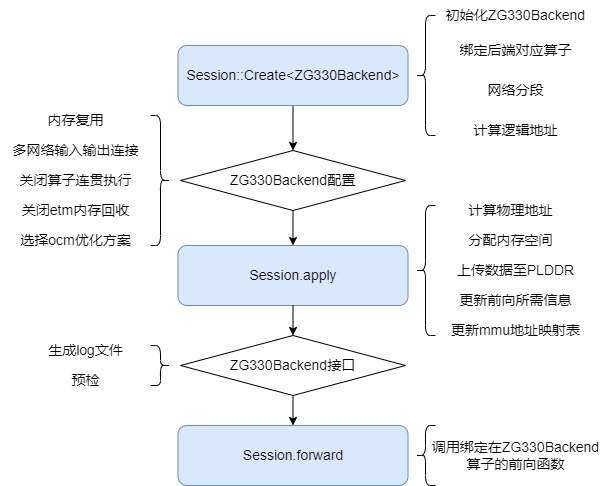

# Icraft ZG330Backend[#](#icraft-zg330backend "此标题的永久链接")

`ZG330Backend` 是Icraft运行时的后端之一，
负责处理指定诸葛架构330芯片为计算资源的算子。

ZG330Backend提供以下功能接口：

* `log` ：生成ZG330Backend对应的log，包含部署物理地址、内存复用/ocm优化后中间层信息等，log保存在 ${工作目录}/.icraft/logs/ 路径下
* `precheck` ： 对ZG330Backend进行预检，会检查内存中的指令以及权重数据是否正确上传至etm指定地址
* `userReuseSegment`：用户配置网络权重/指令/中间层数据段的memchunk，用于复用数据或内存空间，减少多网络部署对etm的使用量
* `userConnectNetwork` ：用户配置网络输入/输出数据段的memchunk，用于连接多网络在etm上的输入和输出
* `disableMergeHardOp`：关闭算子连贯执行模式，ZG330Backend默认是使用算子连贯执行模式
* `disableEtmOptimize`：关闭etm内存回收，ZG330Backend默认开启etm内存回收
* `ocmOptimize`：选择ocm优化方案，ZG330Backend默认使用OcmOpt::BEST\_SCORE，关闭ocm优化选择OcmOpt::None

提示

在实际使用场景中，ZG330Backend的使用依托于 `icraft::xrt::Session` ，
Session的构造过程中会完成ZG330Backend的初始化，
Session的apply部署时也会完成ZG330Backend的部署

ZG330Backend的工作流程具体如下：



---

ZG330Backend有一些重要的数据结构，部署或前向过程中可能会使用到：

* `ValueInfo` ：与icraft::xir::Value类的对应，包含ZG330Backend中一些补充信息
* `HardOpInfo` ：与icraft::xir::HardOp类的对应，包含ZG330Backend中一些补充信息
* `LogicSegment` ：逻辑分段类，在ZG330Backend初始化时生成，表示对应network\_view的各分段的逻辑地址相关数据
* `PhySegment` ：物理分段类，在ZG330Backend在apply部署后生成，表示对应network\_view的各分段的真实物理地址相关数据
* `ForwardInfo`：ZG330Backend前向所需要的信息，包含：

  + `value_map`：network\_view中包含的所有FTMP（即Value）信息
  + `hardop_map`：network\_view中包含的所有HardOp的信息
  + `idx_map`：network\_view中包含的所有算子的同步信息

提示

network\_view是原网络中所有以ZG330Backend为后端的算子集合.

## 一 新增功能说明[#](#id1 "此标题的永久链接")

诸葛后端的功能与布衣后端相比有了较多更新，这里着重说明两个不同架构的后端使用上的区别。

### 1.1 多网络输入输出连接[#](#id2 "此标题的永久链接")

BuyiBackend中多网络多输入/输出连接要求两个网络的输入/输出顺序是一致的，在ZG330Backend中没有该约束条件了，
可指定任意的输入/输出进行内存复用。使用示例详见本文档 `2.3.2 小节`

### 1.2 ocm优化[#](#ocm "此标题的永久链接")

BuyiBackend中无法选择ocm优化方案，是由编译得到的网络决定的。ZG330Backend中添加了ocm优化方案选择，
可在运行时配置关闭/开启ocm优化。使用示例详见本文档 `2.3.5 小节`

### 1.3 默认使用算子连贯执行、etm内存回收、ocm优化[#](#etmocm "此标题的永久链接")

BuyiBackend中默认是关闭算子连贯执行和etm内存回收，需要手动开启。
ZG330Backend中默认是使用算子连贯执行、etm内存回收、ocm优化，需手动关闭。使用示例详见本文档
`2.3.3`、 `2.3.4` 、 `2.3.5` 小节

### 1.4 前向时指定output tensor的数据存储地址[#](#output-tensor "此标题的永久链接")

使用ZG330Backend进行前向时，可指定前向结果output tensor的数据存储地址，主要应用于多次前向，输出存放至不同地址，
或者环形网络，输入输出地址相同的场景。使用示例详见 `XRT手册的 1.3.2 小节`。该功能在BuyiBackend中暂不支持。

### 1.5 可保存ocm上的数据[#](#id3 "此标题的永久链接")

ZG330Backend支持表达ocm上的tensor，因此，如果开了ocm优化，想保存在ocm上的中间层结果，
可以关闭算子连贯执行、设置session.setDumpOutputs(true)，即可保存所有中间层结果。使用示例详见 `XRT手册的 1.4.3 小节`。
该功能在BuyiBackend中不支持。

### 1.6 用户无需关心开关MMU[#](#mmu "此标题的永久链接")

BuyiBackend中默认开启MMU，但是对于复杂的网络使用情况（例如使用view拆分网络，对子网络进行合并算子和内存优化配置），
则建议使用非MMU模式，用户需要关心编译的网络与运行时MMU模式。
ZG330Backend中默认开启MMU，不提供关闭MMU的接口，用户无需关心MMU模式。

## 二 快速开始[#](#id4 "此标题的永久链接")

### 2.1 构造ZG330Device[#](#zg330device "此标题的永久链接")

ZG330Device是与ZG330backend绑定的设备，通过使用不同的url可以构造不同通信协议下的device，
主要包括axi、socket、mock三种，其中mock是模拟device，只包含内存分配功能，主要用在不上板生成快照文件的场景，
无法进行前向操作。

#### 2.1.1 构造ZG330Device[#](#id5 "此标题的永久链接")

##### `C++ 示例`[#](#c "此标题的永久链接")

```
1// 1.配置Device启动的url
2auto axi_url = "";
3auto socket_url = "socket://haps-zg330@192.168.124.24:5001";
4auto mock_url = "mock://zg330";
5// 2.打开设备
6Device device;
7device = Device::Open(socket_url);
```

##### `Python示例`[#](#python "此标题的永久链接")

```
 1# 1.导入必要的库
 2import xir
 3from xrt import *
 4from zg330backend import *
 5
 6# 2.配置Device启动的url，打开设备
 7axi_url = "";
 8socket_url = "socket://haps-zg330@192.168.124.24:5001"
 9mock_url = "mock://zg330";
10device = Device.Open(dev_url)
```

### 2.2 构造ZG330Backend[#](#zg330backend "此标题的永久链接")

构造ZG330Backend有两种方法：

* Session::Create时构造
* 直接构造ZG330Backend

#### 2.2.1 Session::Create时构造[#](#session-create "此标题的永久链接")

##### `C++ 示例`[#](#id6 "此标题的永久链接")

```
 1auto json_file = "./yolov5s_ZG.json";
 2auto raw_file = "./yolov5s_ZG.raw";
 3auto img_file = "./input.png";
 4
 5// 打开设备
 6auto host_device = HostDevice::Default();
 7auto zg330_device = Device::Open("socket://haps-zg330@192.168.124.24:5001");
 8
 9// 加载网络
10auto network = Network::CreateFromJsonFile(json_file);
11network.loadParamsFromFile(raw_file);
12
13// 创建Session1
14// 该方法会根据模板参数的顺序，自动创建Backend对象
15// 首先尝试将算子绑定到ZG330Backend上，如果不支持，则绑定到HostBackend上
16auto sess1 = Session::Create<ZG330Backend, HostBackend>(network, { zg330_device, host_device });
17
18// 获取sess1所有的Backends
19auto& backends = sess1->backends;
20auto zg330_backend = backends[0].cast<ZG330Backend>();
```

##### `Python示例`[#](#id7 "此标题的永久链接")

```
 1# 导入必要的库
 2import xir
 3from xrt import *
 4from host_backend import *
 5from zg330backend import *
 6
 7json_file = "./yolov5s_ZG.json"
 8raw_file = "./yolov5s_ZG.raw"
 9img_file = "./input.png"
10
11# 打开设备
12host_device = HostDevice.Default()
13zg330_device = Device::Open("socket://haps-zg330@192.168.124.24:5001")
14
15# 创建Session，按顺序传入想要绑定的后端类型
16sess1 = Session.Create([ZG330Backend, HostBackend], network.view(0), [ zg330_device, host_device ])
17sess1.apply()
18
19zg330_backend = ZG330Backend(sess.backends[0])
```

#### 2.2.2 直接构造ZG330Backend[#](#id8 "此标题的永久链接")

##### `C++ 示例`[#](#id9 "此标题的永久链接")

```
 1//打开设备
 2Device device;
 3device = Device::Open("socket://haps-zg330@192.168.124.24:5001");
 4
 5//加载网络
 6auto network = Network::CreateFromJsonFile("./yolov5s_ZG.json");
 7network.loadParamsFromFile("./yolov5s_ZG.raw");
 8
 9//初始化ZG330Backend
10icraft::xrt::Backend  backend = ZG330Backend::Init();
11backend.init(network, device);
12
13//类型转换
14auto zg330_backend = backend.cast<ZG330Backend>();
```

##### `Python示例`[#](#id10 "此标题的永久链接")

```
 1# 导入必要的库
 2import xir
 3from xrt import *
 4from zg330backend import *
 5
 6#打开设备
 7device = Device.Open("socket://haps-zg330@192.168.124.24:5001")
 8
 9#加载网络
10network = xir.Network.CreateFromJsonFile("./yolov5s_ZG.json")
11network.loadParamsFromFile("./yolov5s_ZG.raw")
12
13#构造backend
14backend = Backend.Create(ZG330Backend, network.view(0), device)
15#类型转换
16zg330_backend = ZG330Backend(backend)
```

重要

当网络部署完成后，只有通过Session的forward接口才能真正执行前向推理，ZG330Backend中不具备该能力。
如果使用者要搭建真正能前向运行的应用工程，请按照： **构建Session->初始化各个Backend->调用forward执行推理** 的流程进行搭建。

### 2.3 网络部署的功能配置[#](#id11 "此标题的永久链接")

`ZG330Backend` 提供了一些可以优化运行性能、以及调试的功能，
需要注意的是这些接口的配置时机，按照配置时机可分为

* apply部署前配置：userReuseSegment、userConnectNetwork、disableMergeHardOp、disableEtmOptimize、ocmOptimize
* apply部署后配置：precheck，log

#### 2.3.1 userReuseSegment 内存复用[#](#userreusesegment "此标题的永久链接")

内存复用的目的是复用数据或内存空间，减少网络部署对etm的使用量，
相同网络可以复用权重/指令/中间层数据段，不同网络只能复用中间层数据段。

##### `C++ 示例`[#](#id12 "此标题的永久链接")

```
 1// 1.打开设备
 2auto device = Device::Open("socket://haps-zg330@192.168.124.24:5001");
 3
 4// 2.加载网络
 5auto network = Network::CreateFromJsonFile("./yolov5s_ZG.json");
 6network.loadParamsFromFile("./yolov5s_ZG.raw");
 7
 8// 3.构建ZG330Backend
 9icraft::xrt::Backend backend1 = ZG330Backend::Init();
10icraft::xrt::Backend backend2 = ZG330Backend::Init();
11backend1.init(network, device);
12backend2.init(network, device);
13
14// 4.获得需要的内存空间大小
15      auto instr_bytesize = backend1->logic_segment_map.at(SegmentType::INSTR)->byte_size;
16      auto weight_bytesize = backend1->logic_segment_map.at(SegmentType::WEIGHT)->byte_size;
17      auto ftmp_bytesize = backend1->logic_segment_map.at(SegmentType::FTMP)->byte_size;
18
19// 5.分配内存，起始地址需要4096字节对齐
20      auto weight_chunk = device.defaultMemRegion().malloc(weight_bytesize, true, 4096);
21      auto instr_chunk = device.defaultMemRegion().malloc(instr_bytesize, true, 4096);
22      auto ftmp_chunk = device.defaultMemRegion().malloc(ftmp_bytesize, true, 4096);
23
24      // 6.同一个网络可以复用指令、权重
25      backend1.userReuseSegment(weight_chunk, SegmentType::WEIGHT);
26      backend2.userReuseSegment(weight_chunk, SegmentType::WEIGHT);
27      backend1.userReuseSegment(instr_chunk, SegmentType::INSTR);
28      backend2.userReuseSegment(instr_chunk, SegmentType::INSTR);
29      backend1.userReuseSegment(ftmp_chunk, SegmentType::FTMP);
30      backend2.userReuseSegment(ftmp_chunk, SegmentType::FTMP);
31
32// 7. 完成网络在设备上的部署
33      backend1.apply();
34      backend2.apply();
```

##### `Python示例`[#](#id13 "此标题的永久链接")

```
 1# 1.导入必要的库
 2import xir
 3from xrt import *
 4from zg330backend import *
 5
 6# 2.打开设备
 7device = Device.Open("socket://haps-zg330@192.168.124.24:5001")
 8
 9# 3.加载网络
10network = xir.Network.CreateFromJsonFile("./yolov5s_ZG.json")
11network.loadParamsFromFile("./yolov5s_ZG.raw")
12
13# 4.构造ZG330Backend
14backend1 = Backend.Create(ZG330Backend, network.view(0), device)
15backend2 = Backend.Create(ZG330Backend, network.view(0), device)
16zg330_backend1 = ZG330Backend(backend1)
17zg330_backend2 = ZG330Backend(backend2)
18
19# 5.获得需要的内存空间大小
20instr_bytesize = zg330_backend1.logic_segment_map[SegmentType.INSTR].byte_size
21weight_bytesize = zg330_backend1.logic_segment_map[SegmentType.WEIGHT].byte_size
22ftmp_bytesize = zg330_backend1.logic_segment_map[SegmentType.FTMP].byte_size
23
24# 6.分配内存，起始地址需要4096字节对齐
25weight_chunk = device.defaultMemRegion().malloc(weight_bytesize, True, 4096)
26instr_chunk = device.defaultMemRegion().malloc(instr_bytesize, True, 4096)
27ftmp_chunk = device.defaultMemRegion().malloc(ftmp_bytesize, True, 4096)
28
29      # 7.同一个网络可以复用指令、权重
30zg330_backend1.userReuseSegment(weight_chunk, SegmentType.WEIGHT)
31zg330_backend2.userReuseSegment(weight_chunk, SegmentType.WEIGHT)
32zg330_backend1.userReuseSegment(instr_chunk, SegmentType.INSTR)
33zg330_backend2.userReuseSegment(instr_chunk, SegmentType.INSTR)
34zg330_backend1.userReuseSegment(ftmp_chunk, SegmentType.FTMP)
35zg330_backend2.userReuseSegment(ftmp_chunk, SegmentType.FTMP)
36
37# 8. 完成网络在设备上的部署
38backend1.apply()
39backend2.apply()
```

#### 2.3.2 userConnectNetwork 多网络输入输出连接[#](#userconnectnetwork "此标题的永久链接")

多网络输入输出连接目的是复用多个网络在 `PL DDR` 上的数据结果，减少PL和PS之间拷贝的耗时，提高网络运行性能。

##### `C++ 示例`[#](#id14 "此标题的永久链接")

```
 1// 1.打开设备
 2auto device = Device::Open("socket://haps-zg330@192.168.124.24:5001");
 3
 4// 2.加载网络
 5auto network = Network::CreateFromJsonFile("./yolov5s_ZG.json");
 6network.loadParamsFromFile("./yolov5s_ZG.raw");
 7
 8// 3.构建ZG330Backend
 9icraft::xrt::Backend zg330_backend1 = ZG330Backend::Init();
10icraft::xrt::Backend zg330_backend2 = ZG330Backend::Init();
11zg330_backend1.init(network, device);
12zg330_backend2.init(network, device);
13
14// 4.分配需要复用的网络输入/输出的内存空间，进行内存复用
15auto output_id = 10;       //网络1输出value的id
16auto input_id = 1;         //网络2输入value的id
17     auto output_size = network.getValueById(output_id).storageBytes();
18//memchunk起始地址要求4096对齐
19     auto memchunk = zg330_device.defaultMemRegion().malloc(output_size, true, 4096);
20     zg330_backend1.userConnectNetwork(memchunk, output_id);
21     zg330_backend2.userConnectNetwork(memchunk, input_id);
22
23     // 5.完成网络在设备上的部署
24     zg330_backend1.apply();
25     zg330_backend2.apply();
```

##### `Python示例`[#](#id15 "此标题的永久链接")

```
 1# 1.导入必要的库
 2import xir
 3from xrt import *
 4from zg330backend import *
 5
 6# 2.打开设备
 7device = Device.Open("socket://haps-zg330@192.168.124.24:5001")
 8
 9# 3.加载网络
10network = xir.Network.CreateFromJsonFile("./yolov5s_ZG.json")
11network.loadParamsFromFile("./yolov5s_ZG.raw")
12
13# 4.构造ZG330Backend
14backend1 = Backend.Create(ZG330Backend, network.view(0), device)
15backend2 = Backend.Create(ZG330Backend, network.view(0), device)
16zg330_backend1 = ZG330Backend(backend1)
17zg330_backend2 = ZG330Backend(backend2)
18
19# 5.获得需要的内存空间大小
20instr_bytesize = zg330_backend1.logic_segment_map[SegmentType.INSTR].byte_size
21weight_bytesize = zg330_backend1.logic_segment_map[SegmentType.WEIGHT].byte_size
22ftmp_bytesize = zg330_backend1.logic_segment_map[SegmentType.FTMP].byte_size
23
24# 6.分配内存，起始地址需要4096字节对齐
25weight_chunk = device.defaultMemRegion().malloc(weight_bytesize, True, 4096)
26instr_chunk = device.defaultMemRegion().malloc(instr_bytesize, True, 4096)
27ftmp_chunk = device.defaultMemRegion().malloc(ftmp_bytesize, True, 4096)
28
29      # 7.同一个网络可以复用指令、权重
30zg330_backend1.userReuseSegment(weight_chunk, SegmentType.WEIGHT)
31zg330_backend2.userReuseSegment(weight_chunk, SegmentType.WEIGHT)
32zg330_backend1.userReuseSegment(instr_chunk, SegmentType.INSTR)
33zg330_backend2.userReuseSegment(instr_chunk, SegmentType.INSTR)
34zg330_backend1.userReuseSegment(ftmp_chunk, SegmentType.FTMP)
35zg330_backend2.userReuseSegment(ftmp_chunk, SegmentType.FTMP)
36
37# 8. 完成网络在设备上的部署
38backend1.apply()
39backend2.apply()
```

#### 2.3.3 disableMergeHardOp 关闭算子连贯执行模式[#](#disablemergehardop "此标题的永久链接")

ZG330Backend默认是使用算子连贯执行模式，该模式下连续在icore上运行的算子连贯执行，从而减少频繁同步带来的软件开销。
对于一些调试场景下，如需关闭，代码示例如下，省略的步骤详见其他章节的代码示例：

##### `C++ 示例`[#](#id16 "此标题的永久链接")

```
 1// 1.打开设备
 2
 3// 2.加载网络
 4
 5// 3.构建ZG330Backend
 6
 7// 4.关闭算子连贯执行
 8zg_backend.disableMergeHardOp();
 9
10      // 5.完成网络在设备上的部署
11zg_backend.apply();
```

##### `Python示例`[#](#id17 "此标题的永久链接")

```
 1# 1.导入必要的库
 2import xir
 3from xrt import *
 4from zg330backend import *
 5
 6# 2.打开设备
 7
 8# 3.加载网络
 9
10# 4.构造ZG330Backend
11
12# 5.关闭算子连贯执行
13zg_backend.disableMergeHardOp()
14
15# 6. 完成网络在设备上的部署
16zg_backend.apply()
```

#### 2.3.4 disableEtmOptimize 关闭etm内存回收[#](#disableetmoptimize-etm "此标题的永久链接")

ZG330Backend默认开启etm内存回收，网络中间层特征图的内存可以复用，从而减少对etm的使用量。
对于一些调试场景下，如需关闭，代码示例如下，省略的步骤详见其他章节的代码示例：

##### `C++ 示例`[#](#id18 "此标题的永久链接")

```
 1// 1.打开设备
 2
 3// 2.加载网络
 4
 5// 3.构建ZG330Backend
 6
 7// 4.关闭算子连贯执行
 8zg_backend.disableEtmOptimize();
 9
10     // 5.完成网络在设备上的部署
11zg_backend.apply()
```

##### `Python示例`[#](#id19 "此标题的永久链接")

```
 1# 1.导入必要的库
 2import xir
 3from xrt import *
 4from zg330backend import *
 5
 6# 2.打开设备
 7
 8# 3.加载网络
 9
10# 4.构造ZG330Backend
11
12# 5.关闭算子连贯执行
13zg_backend.disableEtmOptimize()
14
15# 6. 完成网络在设备上的部署
16zg_backend.apply()
```

#### 2.3.5 ocmOptimize ocm优化[#](#ocmoptimize-ocm "此标题的永久链接")

选择ocm优化方案，ZG330Backend默认使用OcmOpt::BEST\_SCORE，即开启ocm优化并选取方案一、方案二、方案三中评分最高的作为最后使用的方案，
开启ocm优化可以将满足条件的特征图存放在片上存储中，从而减小读写etm的带宽压力，提高模型在硬件上的运行效率。

##### `C++ 示例`[#](#id20 "此标题的永久链接")

```
 1// 1.打开设备
 2
 3// 2.加载网络
 4
 5// 3.构建ZG330Backend
 6
 7// 4.关闭算子连贯执行
 8zg_backend.ocmOptimize(OcmOpt::None);       //不做ocm优化
 9zg_backend.ocmOptimize(OcmOpt::OPTION1);    //方案一：全局评分法
10zg_backend.ocmOptimize(OcmOpt::OPTION2);    //方案二：局部最优动态规划法
11zg_backend.ocmOptimize(OcmOpt::OPTION3);    //方案三：顺序按评分踢出法
12zg_backend.ocmOptimize(OcmOpt::BEST_SCORE); //选取方案一、二、三中评分最优的方案
13
14     // 5.完成网络在设备上的部署
15zg_backend.apply()
```

##### `Python示例`[#](#id21 "此标题的永久链接")

```
 1# 1.导入必要的库
 2import xir
 3from xrt import *
 4from zg330backend import *
 5
 6# 2.打开设备
 7
 8# 3.加载网络
 9
10# 4.构造ZG330Backend
11
12# 5.关闭算子连贯执行
13zg_backend.ocmOptimize(OcmOpt.NONE);
14zg_backend.ocmOptimize(OcmOpt.OPTION1);
15zg_backend.ocmOptimize(OcmOpt.OPTION2);
16zg_backend.ocmOptimize(OcmOpt.OPTION3);
17zg_backend.ocmOptimize(OcmOpt.BEST_SCORE);
18
19# 6. 完成网络在设备上的部署
20zg_backend.apply()
```

## 三 数据结构[#](#id22 "此标题的永久链接")

### 3.1 ValueInfo[#](#valueinfo "此标题的永久链接")

`ValueInfo` 与icraft::xir::Value类的对应，包含ZG330Backend中一些补充信息。

`ValueInfo` 有以下属性：

* `Value value` ：获得对应的icraft::xir::value指针
* `bool real = true` ：若为true，表示对应的value在etm/ocm上真实分配了地址；若为false表示，其地址与fake\_from的value地址共用
* `bool is_ocm = false` ：若为true，表示对应的value数据存放在ocm上
* `bool is_host = false` ：若为true，表示对应的value数据存放在host端
* `std::vector<Value> real_to` ：real若为true, 可能包含与其共用etm为false的value
* `Value fake_from` ：real若为false，必定存在预期共用etm地址且为true的value
* `uint64_t logic_addr = 0` ：value在etm/ocm分配的逻辑字节地址
* `uint64_t phy_addr = 0` ：value在etm/ocm分配的真实物理字节地址
* `uint64_t byte_size = 0` ：value占据的字节大小
* `SegmentType segment = SegmentType::FTMP` ：value对应的分段类型

### 3.2 HardOpInfo[#](#hardopinfo "此标题的永久链接")

`HardOpInfo` 和icraft::xir::hardop对应, 包含ZG330Backend中一些补充信息。

`HardOpInfo` 有以下属性：

* `uint64_t weights_logic_addr = 0` ：对应HardOp的权重在etm上分配的逻辑字节地址
* `uint64_t weights_size = 0` ：对应HardOp的权重在etm上的字节大小
* `uint64_t instr_logic_addr = 0` ：对应HardOp的指令在etm上分配的逻辑字节地址
* `uint64_t instr_size = 0` ：对应HardOp的指令在etm上分配的逻辑字节大小
* `uint64_t weight_phy_addr` ：对应HardOp的权重在etm上的真实物理字节地址
* `uint64_t instr_phy_addr` ：对应HardOp的指令在etm上的真实物理字节地址
* `HardOp net_hardop` ：对应icraft::xir::HardOp类的指针
* `std::pair<int,int> sync_idx` ：对应HardOp的同步信息: <network\_view\_idx，layer\_count>
* `std::vector<int> merge_from` ：如果在算子连贯执行模式下，表示合并前的hardop op\_id集合

### 3.3 LogicSegment[#](#logicsegment "此标题的永久链接")

`LogicSegment` 逻辑分段类，在ZG330Backend初始化时生成，表示对应network\_view的各分段的逻辑地址相关数据。

`LogicSegment` 有以下属性：

* `std::unordered_map<int, ValueInfo> info_map` ：逻辑分段包含的valueInfo信息: <v\_id, valueInfo>
* `std::unordered_map<int, HardOpInfo> hardop_map` ：逻辑分段包含的hardOp信息: <op\_id, hardopInfo>
* `uint64_t logic_addr = 0` ：逻辑分段在etm的逻辑字节地址
* `uint64_t byte_size = 0` ：逻辑分段在etm的字节大小
* `SegmentType segment_type` ：逻辑分段的分段类型

### 3.4 MemChunkInfo[#](#memchunkinfo "此标题的永久链接")

`MemChunkInfo` 表示物理分段中分配的内存相关数据。`MemChunk` 没有构造函数，所有的 `MemChunk` 都是由 `MemRegion` 的 `malloc` 方法分配产生的。

`MemChunkInfo` 有以下属性：

* `MemChunk memChunk` ：在etm/ocm上申请的memchunk
* `bool user_used` ：若为true，表示对应的memchunk是用户申请的
* `std::unordered_map<int64_t, MemChunk> staged_chunk` ：用于输入/输出内存复用时无法直接复用同一块memchunk的情况

### 3.5 PhySegment[#](#physegment "此标题的永久链接")

`PhySegment` 物理分段类，在ZG330Backend在apply部署后生成，表示对应network\_view的各分段的真实物理地址相关数据。

`PhySegment` 有以下属性：

* `SegmentType segment_type` ：物理分段的分段类型
* `uint64_t byte_size = 0` ：物理分段在etm的字节大小
* `uint64_t phy_addr` ：物理分段在etm上的真实物理字节地址
* `std::map<int, ValueInfo> info_map` ：物理分段包含的valueInfo信息 <v\_id, valueInfo>
* `std::map<int, HardOpInfo> hardop_map` ：物理分段包含的hardOp信息 <op\_id, hardopInfo>
* `std::unordered_map<int64_t, MemChunkInfo> multi_chunk` ：输入、输出分段根据value在etm上申请的多段memchunk: <v\_id, MemChunkInfo>
* `MemChunkInfo single_chunk` ：权重、指令、中间层段在etm/ocm上申请的一段memchunk

### 3.6 ForwardInfo[#](#forwardinfo "此标题的永久链接")

`ForwardInfo` 包含ZG330Backend前向所需要的信息

`ForwardInfo` 有以下属性：

* `std::unordered_map<int, ValueInfo> value_map` ：network\_view包含的所有valueInfo的集合: <v\_id, ValueInfo>
* `std::unordered_map<int, HardOpInfo> hardop_map` ：network\_view包含的所有hardopInfo的集合 <op\_id, HardOpInfo>
* `std::map<int, std::pair<int, int>> idx_map` ：network\_view中所有op的同步信息集合: <op\_id, <sync\_idx,layer\_count>>
* `std::unordered_map<int64_t, MemChunkInfo> memchunk_map` ：network\_view中所有value对应的物理内存集合

### 3.7 ZG330Backend[#](#id23 "此标题的永久链接")

`ZG330Backend` 表示执行在诸葛架构330芯片的后端。
`ZG330Backend` 除了之前的接口外还有以下属性：

* `ForwardInfo forward_info` ：包含zg330backend的所有前向所需要信息
* `std::unordered_map<Segment, LogicSegment> logic_segment_map` ：包含zg330backend的所有逻辑分段信息: <segment\_type, logicSegment>
* `std::unordered_map<Segment, PhySegment> phy_segment_map` ：包含zg330backend的所有物理分段信息: <segment\_type, phySegment>
* `std::map<int64_t, ValueInfo> value_info` ：包含network\_view所有valueInfo的信息: <v\_id, ValueInfo>
* `int zg330backend_id = 0` ：当前zg330backend的id
* `bool is_applied_ = false` ：若为true, zg330backend已完成部署
* `bool is_mergeHardop = true`：若为true，zg330backend开启算子连贯执行模式
* `bool is_etmOptimize = true`：若为true, zg330backend开启中间层内存回收
* `OcmOpt ocmopt = OcmOpt::BEST_SCORE`：使用的ocm优化方案，如果是使用BEST\_SCORE，apply后更新为最后选择的方案

## Indices and tables[#](#indices-and-tables "此标题的永久链接")

* [索引](genindex.md)
* [模块索引](py-modindex.md)
* [搜索页面](search.md)
