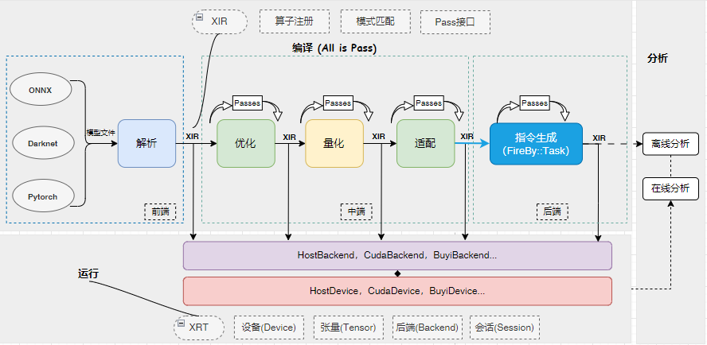

# 自定义算子

## 一 算子的意义

在Icraft XIR中，算子（Operation）是指表示计算或操作的最小单位。算子可以是任何一种计算，例如加法、乘法、卷积等。算子在XIR中被用来描述和表示计算图中的节点。

算子在XIR中有以下几个重要的属性：

* ID（ `op_id` ）：算子的ID用于标识和访问算子。
* 输入（ `inputs` ）：算子接收的输入数据，可以是其他算子的输出或者常量。
* 输出（ `outputs` ）：算子的计算结果，可以作为其他算子的输入。
* 属性：算子的附加信息，用于描述算子的特定属性，例如卷积的卷积核大小、步长等。

算子在XIR中以一种统一的方式进行定义和操作，这使得进行计算图的转换和优化变得更加方便和灵活。

以Conv2d为例，其序列化后的算子表达如下所示：

```
 1 "Conv2d": {
 2     "op_id": 5,                 // 算子ID
 3     "inputs": [...],            // 算子输入
 4     "outputs": [...],           // 算子输出
 5     "dilation_height": 1,       # 算子属性：膨胀高度
 6     "dilation_width": 1,        # 算子属性：膨胀宽度
 7     "groups": 1,                # 算子属性：分组数量
 8     "pad_bottom": 2,            # 算子属性：下方填充
 9     "pad_left": 3,              # 算子属性：左方填充
10     "pad_right": 2,             # 算子属性：右方填充
11     "pad_top": 3,               # 算子属性：上方填充
12     "padding_mode": "ZEROS",    # 算子属性：填充模式
13     "stride_height": 2,         # 算子属性：滑动高度
14     "stride_width": 2           # 算子属性：滑动宽度
15 }
```

在XIR中，一个算子的输入是其他算子的输出，一个算子的输出同时作为其他算子的输入，算子之间通过输入与输出之间的连接关系构成了有向无环图（DAG）。该DAG使用网络(Network)来表示。


如上图所示，一个网络了包含了算子以及算子之间的连接关系，网络中算子的排列顺序同时表示了其执行顺序，这就构成了一张计算图。

在XIR种，每一种算子表示了一种特定的计算过程，即输入到输出的映射关系。比如，Relu算子表示将输入中的每个小于0的数映射到0作为输出。同时，算子也是表示计算过程的最小单位，网络通过算子的排列组合和连接表达了更加复杂的计算过程。因此，如果一种计算过程无法使用现有的算子排列组合和连接来表达，那么可能需要添加新的算子。

## 二 算子的编译和运行



上图展示了Icraft的整个编译过程。

首先，算子的定义在XIR中注册。

然后，在编译过程中，算子在前端（解析器）中被创建。

接着，算子在优化、量化和指令生成等过程中被一系列Pass进行转换，有可能被改变了属性（参数），有可能被删除、也有可能被替换为其他算子。

然而，由于Icraft需要支持任意(阶段)的网络在支持的计算资源上运行，因此，每个算子都需要实现在支持的计算资源上前向的逻辑。

因此，要实现一个算子的编译和运行过程，需要实现算子的解析(创建)、算子的优化、量化等一些列转换以及算子在不同后端上的前向实现。

## 三 自定义算子

Icraft当前已经包含了丰富的算子库(详见 ops-reference)，可以满足大部分神经网络模型的编译需求。但在某些场景下， 可能需要用户自定义算子来实现特定的计算过程。如：

* **Icraft还未支持的算子，且无法通过其它算子组合实现**
* **使用多个算子组合无法取得最佳计算性能，而自定义算子时通过自定义该算子在后端的实现可以提高性能**

自定义算子功能允许用户自由地定义算子的输入输出和属性，以及在编译运行过程中的实现。比如，用户完成自定义算子的注册后，可以在前端解析中自定义框架算子到该算子的转换逻辑，可以在量化中自定义该算子的量化方式，还可以在各个后端中添加该算子的前向实现。

### 3.1 注册算子

自定义算子的第一步是利用XIR的API来注册该算子。下面以 `Eltwise` 算子为例，说明如何注册该算子。

我们定义 `Eltwise` 算子可以对两个相同大小的输入张量 `x` 和 `y` 按元素乘以不同的系数 `a` 和 `b` ，然后在进行加或减的操作，得到一个同样大小的输出张量 `z` ，即 \(z = ax + by\)，其中 `a` 和 `b` 都是标量。因此，该算子有两个输入、一个输出，以及一些必要的属性如下：

* `op_mode` : 操作模式，可选 `Add` 表示相加， `Sub` 表示相减。
* `a`: 左操作数的系数。
* `b`: 右操作数的系数。

首先，新建一个C++工程，添加一个名为”eltwise.cpp”的文件，文件内容如下：

```
 1 using namespace icraft::xir;
 2
 3 // 可以给一个自己喜欢的命名空间
 4 namespace whatever {
 5     enum class EltwiseMode {
 6         Add,
 7         Sub
 8     }
 9
10     class EltwiseNode : public OpNodeBase<EltwiseNode, OneResult> {
11     public:
12         EltwiseMode     op_mode;    // 按元素操作的模式
13         float           a;          // 左操作数的系数
14         float           b;          // 右操作数的系数
15
16         ICRAFT_DECLARE_ATTRS(EltwiseNode) {
17             ICRAFT_ATTR_FIELD(op_mode);
18             ICRAFT_ATTR_FIELD(a).set_default(1.0);
19             ICRAFT_ATTR_FIELD(b).set_default(1.0);
20         }
21     };
22
23     class Eltwise : public OpBase<Eltwise, EltwiseNode> {
24     public:
25         Eltwise() = default;
26
27         // 构造函数, 默认系数都为1
28         Eltwise(Value lhs, Value rhs, EltwiseMode op_mode, float a = 1.0, float b = 1.0) {
29             auto node = make_object<EltwiseNode>();
30             node->op_mode = op_mode;
31             node->a = a;
32             node->b = b;
33             data_ = std::move(node);
34             this->setInputs({ lhs, rhs });
35         };
36     };
37
38     // 注册算子，可以选择添加类型推断，也可以不添加
39     // 如果不添加，向网络中添加该算子前需要自己给出输出数据类型
40     ICRAFT_REGISTER_OP_NODE(EltwiseNode)
41     .set_tinfer<EltwiseNode, HostTarget>([](const auto* op) {
42         op->validate();
43         // 该算子输出的类型和输入相同
44         return Array<TensorType>{ op->inputs[0].tensorType() };
45     });
46 }
```

从上例可以看出，在XIR中，添加一个 `Eltwise` 算子需要定义 `EltwiseNode` 和 `Eltwise` 两个类：

* 其中 `EltwiseNode` 类型派生自 `OpNodeBase` , 表示该算子的容器类，即算子的属性真实存储在该类型中。用户需要在该类型中定义该算子的所有属性，属性的类型只可以为C++的POD类型，以及XIR中的ObjectRef类型及其子类；
* `Eltwise` 类型派生自 `OpBase` , 表示该算子的引用类，该类型实现了基于引用计数的内存管理，相当于算子的智能指针。

类型定义完成后，接着调用 `ICRAFT_REGISTER_OP_NODE` 宏来注册算子，该宏可以为被注册的算子添加一些反射机制，方便序列化等功能的实现。

在注册算子时，还可以调用 `set_tinfer` 方法为该算子添加类型推断，这样在构造算子时，只需要给定算子的输入(类型)，即可获取算子的输出(类型)。

用户注册自定义算子和Icraft XIR中注册内置的算子的方式是完全一致的，因此关于算子注册的详细信息，请参考《Icraft XIR 用户手册》的”算子”部分。

### 3.2 添加算子

算子注册完成后，需要添加到网络中去。根据不同的使用场景，自定义算子可以以不同的方式添加到网络：

* **Icraft的解析组件无法完成对框架模型的解析，因为框架模型上的算子及算子组合（模式）无法映射到Icraft的内置算子。此时用户可以通过解析组件的自定义接口，将框架上的算子及组合解析到自定义算子上。**
* **Icraft的解析组件能够将框架模型解析到Icraft的内置算子，但是某些内置算子及组合的实现无法满足性能指标。此时用户可以实现一些Pass，将内置算子及组合替换为自定义算子，并将这些Pass添加到优化组件的Pass调用列表。**

下面分别描述两种添加自定义算子到网络的方式：

#### 3.2.1 解析

解析组件提供了自定义接口，允许用户自己实现框架上某些算子序列（模式）到自定义算子的映射。

下面以 `Eltwise` 算子为例，描述如何通过解析组件的自定义接口将算子添加到网络：

```
 1auto parse_function = [](torch::jit::Module& module,
 2     std::vector<torch::jit::Node*> node_pattern,
 3     icraft::parser::Params& net_params, std::map<int, icraft::xir::Value>& value_map,
 4     std::map<std::string, std::any>& const_map, int& outftmp_index) {
 5     // 从node_pattern和value_map中获取算子输入的相关信息
 6     auto add_node = node_pattern[0];
 7     auto inputs = add_node->inputs();
 8     auto input1_name = inputs[0]->debugName();
 9     auto input1_id = std::any_cast<int>(net_params[input1_name]);
10     auto input1_value = value_map[input1_id];
11     auto input2_name = inputs[1]->debugName();
12     auto input2_id = std::any_cast<int>(net_params[input2_name]);
13     auto input2_value = value_map[input2_id];
14
15     // 构造自定义算子Eltwise
16     auto eltwise = whatever::Eltwise(input1_value, input2_value, whatever::EltwiseMode::Add);
17             auto ops = new std::vector<icraft::xir::Operation>();
18     ops->push_back(eltwise);
19             return ops;
20     };
21 //注册解析函数
22 ICRAFT_ADD_PATTERN_TO_PARSER("aten::add", "eltwise").set_parse(parse_function);
```

关于解析自定义的详细流程，请参考《Icraft 解析使用手册》。

#### 3.2.2 优化

Icraft中，优化主要负责对网络结构进行一系列转换，使得网络能够在目标平台上更加高效的运行。在转换中，算子可能会被添加、更改、删除和替换。

用户可以在优化阶段向网络中插入自定义算子，或者将网络中的一些算子替换成自定义算子。下面的示例展示了如何实现一个Pass，将网络中的Add算子替换为Eltwise。

```
 1 // 示例Pass，将Add替换为Eltwise
 2 static Pass ReplaceAddWitdhEltwise() {
 3     auto pass_func = [](Network network, const PassContext& pass_ctx) {
 4         // 创建模式，匹配Op
 5         auto add_p = IsOp<Add>();
 6
 7         // 重写网络，将匹配到的Add替换为Eltwise
 8         network.rewrite(add_p, [&](Network& network, const MatchGroup& result) {
 9             // 获取匹配到的Op
10             auto add = result.at(add_p);
11
12             // 获取add算子的两个输入
13             auto lhs = add->inputs[0];
14             auto rhs = add->inputs[1];
15
16             // 创建Eltwise算子
17             auto eltwise = whatever::Eltwise(lhs, rhs, whatever::EltwiseMode::Add);
18
19             // 替换算子
20             network.replaceOpKeepUses(add, eltwise);
21             });
22         return network;
23     };
24
25     return NetworkPass(pass_func, PassInfo("whatever.ReplaceAddWitdhEltwise"));
26 }
27 // 注册Pass
28 ICRAFT_REGISTER_PASS("whatever.ReplaceReluWitdhFlatten").set_creator(ReplaceAddWitdhEltwise);
```

关于更详细的如何通过模式匹配来实现Pass，请参考《Icraft XIR 用户手册》。
关于如何在优化组件中调用该Pass，请参考《Icraft 优化用户手册》。

#### 3.2.3 实现前向

智能计算平台中的硬件平台是FPAI的架构，其包含CPU、GPU、NPU和PL等计算资源。不同的计算资源对应着不同的后端。如果自定义算子想要利用某个计算资源完成前向，那么需要向相应的后端注册前向函数。

目前，Icraft中主要有 `HostBackend` 和 `BuyiBackend` 两个后端：

* `HostBackend` 对应着CPU和GPU等计算资源，支持所有的内置算子；
* `BuyiBackend` 对应着NPU和PL等计算资源， 只支持 `HardOp` 和 `Cast` 等利用NPU完成前向的算子。

备注

`HardOp` 和 `Cast` 也有 `HostBackend` 上的前向实现，但那是利用CPU来对NPU上的指令序列进行仿真。

一般情况下，即使自定义算子最终要在NPU或者PL完成前向，仍然建议注册 `HostBackend` 上的前向，该前向可以利用CPU模拟在NPU或者PL上的前向实现，以方便仿真。

以下示例展示了如何给 `Eltwise` 算子注册 `HostBackend` 上的前向实现：

```
 1 // 算子在目标后端上的初始化操作
 2 auto eltwise_init = [](const whatever::Eltwise& op, HostBackend backend) {
 3     ... ...
 4 };
 5
 6 // 算子在目标后端上的前向操作
 7 auto eltwise_forward = [](const whatever::Eltwise& op, const std::vector<Tensor>& inputs, HostBackend backend) {
 8
 9     ... ...
10
11     // 返回表示前向结果的Tensor列表
12     auto output_tensors = ... ...;
13     return output_tensors;
14 }
15
16 // 注册初始化函数和前向函数到后端
17 ICRAFT_ADD_OP_TO_BACKEND(whatever::Eltwise, HostBackend)
18                     .set_init(eltwise_init)
19                     .set_forward(eltwise_forward);
```

如何给 `Eltwise` 算子注册 `BuyiBackend` 上的前向实现，请参考下文《自定义硬算子》。

## 四 软算子和硬算子

一般情况下，我们称 **只在CPU或GPU等计算资源上完成前向的算子称为软算子**，而 **需要利用NPU或PL等计算资源来完成前向的算子称为硬算子**。软算子只需要在 `HostBackend` 上注册前向函数，而硬算子需要在 `BuyiBackend` 上注册前向函数，同时还需要在 `HostBackend` 注册前向函数以完成仿真。

### 4.1 自定义软算子

自定义软算子的流程完全如第三节《自定义算子》的描述：

1. 先根据需求注册算子
2. 根据场景选择在解析或优化时将自定义算子添加到网络
3. 将算子在CPU或GPU上的前向注册到 `HostBackend`

### 4.2 自定义硬算子

Icraft允许用户利用PL的资源来完成自定义算子的前向以优化计算性能，此时的自定义算子称为自定义硬算子。当用户认为 **仅使用CPU或GPU计算资源实现自定义算子的前向难以满足性能等技术指标时，可以利用PL的资源针对该算子设计专用的电路来加速计算过程**，从而获得理想的性能。

#### 4.2.1 系统架构


FPAI的系统架构如上图所示，其中GP和HP是处理器系统和PL系统交互的接口。GP口是处理器系统中总线的从设备接口，CPU可以通过GP口读写PL上的电路模块；HP口是访问PSDDR控制器的从设备接口，PL上的电路模块可以作为主设备通过该接口访问PS上的DDR；同时，PL上的电路模块也可以访问PLDDR。

自定义硬算子的本质是在PL上实现一个专用的电路模块来加速算子前向，该模块可以通过GP口将一些控制寄存器挂载到处理器系统的总线上，从而可以通过CPU来访问控制；如有需要，该模块还可以通过HP口读写PSDDR，实现与处理器系统的数据交互；同时，该模块还可以访问PLDDR，实现与NPU的数据交互。

实际上，处理器系统对NPU的控制也是通过GP口来实现的。因此在GP1和GP2的地址空间中，已经有一部分被占用了。目前的占用情况如下：

**GP0:**
GP0接口的地址空间范围为 `0x4000_0000 ~ 0x7FFF_FFFF`，当前已经占用的范围如下：

| 分支 | 基地址 | 用途 |
| --- | --- | --- |
| host\_ctrl\_upper | 0x4000\_0000 | 调整NPU工作时钟 |
| host\_ctrl\_lower | 0x4002\_0000 | NPU软核的一些状态寄存器 |
| ai\_ra | 0x4004\_0000 | NPU硬核的一些状态寄存器 |

自定义算子可以使用 `0x4008_0000 ~ 0x7FFF_FFFF` 范围的地址空间。

**GP1:**
GP1接口的地址空间范围为 `0x8000_0000 ~ 0xBFFF_FFFF`，当前已经占用的范围如下：

| 分支 | 基地址 | 用途 |
| --- | --- | --- |
| cdma\_ctrl | 0x8000\_0000 | CDMA相关寄存器 |
| image\_make | 0x8000\_0400 | ImageMake相关寄存器 |
| icore\_post | 0x8000\_0800 | IcorePostx相关寄存器 |
| cache | 0x8000\_0C00 | Cache相关寄存器 |

自定义算子可以使用 `0x800C_0000 ~ 0xBFFF_FFFF` 范围的地址空间。

备注

NPU和DMA在GP0和GP1上挂载的地址不是绝对的，但是占用的空间是确定的。

如右图所示，用户在设计硬件系统时可以将NPU和CDMA分别挂载到GP0或GP1的任意位置，NPU占用从起始位置开始的512KB的地址空间，CDMA以及其他模块占用起始位置开始的768K的地址空间。

#### 4.2.2 硬件流程

请参考《自定义硬算子FPGA设计流程》。

#### 4.2.3 软件流程

自定义硬算子的软件流程包含上文中自定义算子的流程，除此之外，自定义硬算子要根据加速模块的硬件实现来完成量化、排布和 `BuyiBackend` 上的前向接口。

##### 1. 量化

量化组件在对网络进行量化时会遍历每一个算子，求取该算子的输入输出以及参数的量化缩放因子等量化参数。

**如果在量化时，网络中包含自定义算子，即自定义算子要参与网络的量化，那么需要为该自定义算子实现量化接口。**

量化组件提供了 `BuyiNormratio` , `BuyiNormalize` 和 `BuyiQuantize` 三个接口来完成算子的量化过程。我们仍以 `Eltwise` 算子为例，为其实现量化接口如下：

```
 1 // 实现接口BuyiNormratio，确定该算子输入输出的归一化系数
 2 ICRAFT_IMPL_FUNCTOR(BuyiNormratio)<whatever::Eltwise> (
 3     [](const auto& op, icraft::qt::QuantizerLogger& logger){
 4         ... ...
 5     });
 6
 7 // 实现接口BuyiNormalize，对该算子的参数进行归一化
 8 ICRAFT_IMPL_FUNCTOR(BuyiNormalize)<whatever::Eltwise> (
 9     [](const auto& op, icraft::qt::QuantizerLogger& logger){
10         ... ...
11     });
12
13 // 实现接口BuyiQuantize，对该算子的参数进行量化
14 ICRAFT_IMPL_FUNCTOR(BuyiQuantize)<whatever::Eltwise> (
15     [](const auto& op, icraft::qt::QuantizerLogger& logger){
16         ... ...
17     });
```

如何具体地实现以上三个接口，请参考《Icraft量化用户手册》。

##### 2. 排布

在智能计算平台中，不同的NPU对数据的排布方式都有特定的要求。因此， **当自定义算子的输入为NPU的输出或自定义算子的输出给NPU作为输入时，需要格外注意数据排布的匹配**。

* 当自定义算子的输入为NPU的输出时，由于NPU的输出以特定的格式排布，因此实现自定义算子的前向时需要针对该排布格式进行设计。
* 当自定义算子的输出给NPU作为输入时，在实现自定算子的前向时，要将结果以NPU需要的格式进行保存。除此之外，还需要将算子输出的 `TensorType` 的描述，比如 `shape` 和 `layout` 等，设置成和其排布相匹配的值。

针对布衣架构，Icraft适配组件中提供了 `ByLayout` 接口来更改算子输出的描述。以 `Eltwise` 算子为例，实现该接口的方式如下：

```
 1 ICRAFT_IMPL_FUNCTOR(BYLayout)<whatever::Eltwise> ([](auto& op, auto& logger) {
 2     // 将Op转换为Eltwise
 3     auto eltwise = op.cast<whatever::Eltwise>();
 4     // 获取其输出TensorType
 5     auto ofm_dtype = eltwise->outputs[0].tensorType();
 6
 7     ... ...
 8
 9     // 设置合适的shape和layout
10     ofm_dtype.setShape(...);
11     ofm_dtype.setLayout(...);
12     ops.push_back(eltwise);
13     return ops;
14     });
```

关于布衣架构的NPU的数据排布要求，请参考:

* [布衣架构排布说明](others/layout.md)

##### 3. 前向

自定义硬算子需要把算子利用PL上的加速模块的前向过程注册到 `BuyiBackend` 上，这是因为硬算子需要 `BuyiDevice` 来读写加速模块的寄存器，控制加速模块完成算子前向。

以下示例展示了如何给 `Eltwise` 算子注册 `BuyiBackend` 上的前向实现：

```
 1 // 算子在目标后端上的初始化操作
 2 auto eltwise_init = [](const whatever::Eltwise& op, BuyiBackend backend) {
 3     // 获取BuyiBackend绑定的BuyiDevice
 4     auto buyi_device = backend->device.cast<BuyiDevice>();
 5
 6     // 利用BuyiDevice配置一些初始化寄存器
 7     buyi_device.writeReg(0x800C_0000, 1);
 8
 9     // 可能还有一些其他初始化操作
10     ... ...
11 };
12
13 // 算子在目标后端上的前向操作
14 auto eltwise_forward = [](const whatever::Eltwise& op, const std::vector<Tensor>& inputs, BuyiBackend backend) {
15     // 获取两个输入Tensor
16     auto lhs = inputs[0];
17     auto rhs = inputs[1];
18
19     // 获取算子的操作模式
20     auto op_mode = op->op_mode;
21
22     // 获取两个输入的起始地址
23     auto lhs_addr = lhs.data().addr();
24     auto rhs_addr = rhs.data().addr();
25
26     // 获取输出地址和大小
27     auto output = op->outputs[0];
28     auto output_dtype = output.tensorType();
29     auto output_addr = output->mtype.cast<ExternalMem>()->addr;
30     auto output_bytes = output_dtype.bytes();
31
32     // 配置操作模式寄存器，假设0代表Add, 1代表Sub
33     buyi_device.writeReg(0x800C0004, static_cast<int>(op_mode));
34
35     // 配置两个输入地址
36     buyi_device.writeReg(0x800C0008, lhs_addr);
37     buyi_device.writeReg(0x800C000C, hs_addr);
38
39     // 配置输出地址
40     buyi_device.writeReg(0x800C0010, output_addr);
41
42     // 启动计算
43     buyi_device.writeReg(0x800C0014, 1);
44
45     // 不断查询状态寄存器，确认是否完成计算
46     auto done = utils::WaitUntil([](){return buyi_device.readReg(0x800C0018) == 1;}, 1000ms);
47
48     // 如果在1000ms内完成计算，则构造输出Tensor返回，否则抛出异常
49     if(done){
50         auto mem_chunk = device.defaultMemRegion().malloc(MemPtr(output_addr), output_bytes);
51         auto ouput_tensor = Tensor(output_dtype, mem_chunk);
52         return { ouput_tensor };
53     } else{
54         throw ...
55     }
56 }
57
58 // 注册初始化函数和前向函数到后端
59 ICRAFT_ADD_OP_TO_BACKEND(whatever::Eltwise, BuyiBackend)
60                     .set_init(eltwise_init)
61                     .set_forward(eltwise_forward);
```

关于 `BuyiDevice` 的详细用法，请参考《Icraft XRT使用手册》。

## 四 自定义激活

在Icraft中， **如果一个算子只有一个输入和输出，而且输入和输出张量的元素是一一映射的关系，我们称这个算子为激活算子**，如Sigmoid、Tanh等算子。

在NPU中，激活算子可以使用查找表来实现，查找表会在指令生成中生成。如果 **用户的自定义算子是一个激活算子，也可以选择使用NPU中的查找表来实现前向，该过程称为自定义激活**。

自定义激活的流程和自定义软算子完全相同，只不过需要在定义算子时添加 `IsActivate` 的特质。

假设用户想自定义一个激活算子，名为 `CustomActivate` ，其注册的方式如下：

```
 1 using namespace icraft::xir;
 2
 3 // 可以给一个自己喜欢的命名空间
 4 namespace whatever {
 5     // 注意在OpNodeBase的模板参数中添加 IsActivate 的特质
 6     class CustomActivateNode : public OpNodeBase<CustomActivateNode, IsActivate> {
 7     };
 8
 9     class CustomActivate : public OpBase<CustomActivate, CustomActivateNode> {
10     public:
11         CustomActivate() = default;
12
13         // 构造函数
14         CustomActivate(Value input) {
15             auto node = make_object<CustomActivateNode>();
16             data_ = std::move(node);
17             this->addInput(input);
18         };
19     };
20
21     // 注册算子，可以选择添加类型推断，也可以不添加
22     // 如果不添加，向网络中添加该算子前需要自己给出输出数据类型
23     ICRAFT_REGISTER_OP_NODE(CustomActivateNode)
24     .set_tinfer<CustomActivateNode, HostTarget>([](const auto* op) {
25         op->validate();
26         // 该算子输出的类型和输入相同
27         return Array<TensorType>{ op->inputs[0].tensorType() };
28     });
29 }
```
