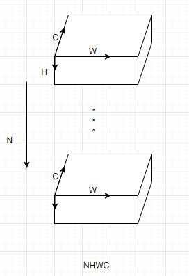
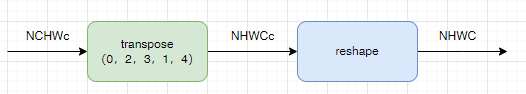

# 布衣架构排布说明

神经网络中数据是以张量的形式存在的，CNN网络的一些算子，比如卷积核池化等，给每个维度赋予了含义，即NHWC或者NCHW，但是在Transformer等其他网络的一些算子中，已经很难再找到对每个维度的明确定义了。张量是严格按照其维度来排布的，下图以NHWC为例，描述了框架下数据的排布：

## 排布的表达

Icraft XIR用 `Layout` 来描述数据排布形式， `Layout` 是对张量形状中每一维的注解，每个维度使用一个字母来表示。比如对于一个四维张量来说， `layout=NHWC` 说明了它的最后一维表示通道，这对于卷积等算子的实现是必不可少的。

Layout使用单个字符表示的坐标轴来解释张量的每一维是什么意义，目前有效的字符为 `NHWDCIO*nhwdcio` 。其中大写字母表示没被划分或划分后的Tile数量的坐标轴，小写字母表示做了划分后的单位坐标轴，后面跟数字表示单位长度，\*表示不关心的坐标轴。例如 `NCHWc32` ， `OIHWi32o32` ， `N**Cc4` 等都是有效的表达。

备注

NHWDCIO分别表示Batch、高度、宽度、深度、通道、输入(通道)、输出(通道)

## 软件排布和硬件排布

在Icraft中，软算子在CPU或GPU上计算，输入输出以及参数存储在PSDDR上，其排布方式称为软件排布；硬算子在NPU或PL上计算，输入输出及参数存储在PLDDR上，其排布方式称为硬件排布。

* 软件排布：对于CNN网络中的算子，Icraft仅支持框架下的NHWC形式的排布；对于非CNN的算子，Icraft支持的排布形式与框架保持一致，描述维\*\*\*C；
* 硬件排布：为了满足布衣架构的NPU对数据排布的要求，软件排布需要转为硬件排布：
  最里面一个维度C的数据拆分为两个维度，分别表示为Cc，其他维度保持不变。需要说明的是：当张量的数据精度为8bit时，c必须在{1，2，4，8，16，32}中取值；当张量的数据精度为16bit时，c必须在{1，2，4，8，16}中取值。

  同时，为了读取数据的便利，我们可以根据需要摆放C维度的位置，而c维度需要固定在最后一维。下图展示了C在不同位置的情况：

  

软件排布和硬件排布可以根据Layout参数来区分，即如果layout中同时存在C和c，且c为最后一维，表示硬件排布，如果只存在C，且C为最后一维，表示软件排布，其余为非法排布，示例如下：

| Layout | 排布类型 |
| --- | --- |
| NCHWc | 硬件排布 |
| NHWC | 软件排布 |
| NHWcC | 非法排布（c必须在最后一维） |
| NHWc | 非法排布（c和C须同时存在） |
| \*\*C\*c | 硬件排布 |
| \*\*c | 非法排布（c和C须同时存在） |
| \*\*C\*c\* | 非法排布（c必须在最后一维） |

## 排布转换

软件排布转硬件排布，以NHWC为例，相当于做如下操作

硬件排布转软件排布，以NHWC为例，相当于做如下操作

## 自定义算子的排布要求

* 自定义算子输入的排布，请参考参数layout来获取输入的排布形式，然后获取输入数据，进行前向计算；
* 自定义算子输出的排布，用户需要关注自定义算子的consumer，如果自定义算子的consumer为布衣架构上的硬算子，则要求自定义算子的输出必须排布为硬件排布，即将tensor最里面一维C拆分C\*c，C所在的位置没有特殊要求。如果自定义算子的consumer为软算子，则要求输出排布为软件排布。
